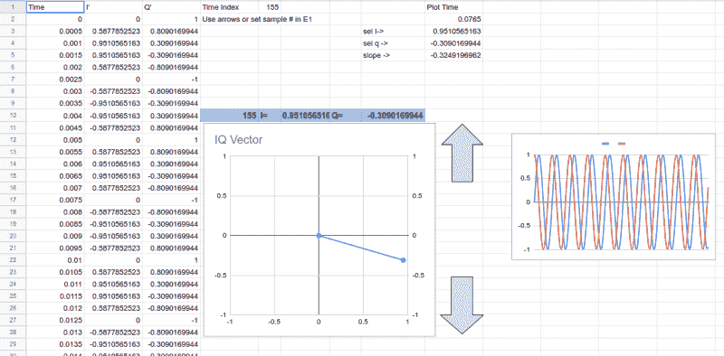
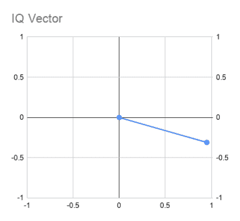

# DSP 电子表格:智商图

> 原文：<https://hackaday.com/2019/11/15/dsp-spreadsheet-iq-diagrams/>

在 DSP 电子表格的前几期文章中，我们讨论了信号的产生、混频和滤波。不过，如果你开始尝试使用 DSP，你会发现一个总是让人提不起兴趣的话题:智商信号。事实证明，这些并不像一开始看起来那么难，像往常一样，我们将在一个电子表格中解决它们。

智商代表什么？I 代表“同相”，Q 代表正交。按照惯例，I 信号是余弦波，Q 信号是正弦波。换句话说，I 和 Q 信号的相位相差 90 度。通过控制 I 和 Q 的幅度，您可以创建复杂的调制，或者相反，解调信号。下次我们会看到一个完整的电子表格。

现在，考虑一个频率为 f 的正弦波，它有相对相位φ。这只是一种奇特的说法，如果你选择一个点作为参考正弦波的“零”点(即使它实际上并不存在)，所讨论的波将从该点偏移。我们在上一期中看到，除了相位之外，正弦波和余弦波是相同的，可以这样建模:`y=A*cos(2πft+Φ)`。如果相位角(φ)为-90 度，则为正弦波。

## 实事求是地说…

实际上，改变信号的幅度很容易。频率有点难，但是我们也可以安排改变。不过，相位通常很难修改。然而，用一点三角学我们可以重写这个等式:`A*cos(2πft+Φ)=I*cos(2πft)-Q*sin(2πft)`

这是一个了不起的结果。通过选择正确的 I 和 Q 值，您可以获得余弦和正弦波，并创建任何您喜欢的任意正弦波。如果你不相信，看看这个电子表格上[的 Trig Identity 标签。](https://docs.google.com/spreadsheets/d/1r3wyZfLLbBT67eD3yslR7dTSdLF-yN6AAF18R8RSqOs/edit?usp=sharing)

## 电子表格时间

您可以设置 a 列中的参数。D 列是使用第一个公式生成的余弦波。然后，我们在 E 列和 f 列中生成零相位余弦和正弦波。最后，我们插入 I 和 Q 的值，并计算 I 列中的第二个等式。

计算 I 和 Q 值。当 E 列的余弦值为 1 时，F 列将为零。这意味着 D 列将包含 I 值。同样，当 F 列中的正弦值为 1 时，余弦值必须为零，同样，D 列的 Q 值为负值(因为要记住，Q 项被减去了)。

玩这个挺能说明问题的。尝试 0 度、45 度、90 度和 180 度的相位角。I 和 Q 值会发生什么变化？图表会发生什么变化？

在图中绘制 I 和 Q 的幅度很方便，其中 I 分量在 X 轴上，Q 在 Y 轴上。你可以将此视为一个向量——即在(X，Y) = (I，Q)处画一个点，然后画一个从图形原点到该点的箭头。信号的相位角将是 X 轴和箭头之间的角度。

### 一点三角函数

当您绘制一个像这样的向量时，请记住，如果您将 I 计为 X，将 Q 计为 Y，将向量的长度计为 r，则包含向量与 X 轴形成的角度(φ)的以下关系成立:

r =(x²+y²)^(1/2)

cos(Φ)=x/r

sin(φ)= y/r

您可能还会发现以下内容很有用:

tan(φ)= sin(φ)/cosφ= y/r

sin²(φ)+cos²(φ)= 1

## 思想实验

在本系列的下一期文章中，您将有更多的机会使用这些图表，但是现在，请考虑一下这个。如果 Q 总是为零，你会得到一条 I 大小的水平直线，如果我为零，你会得到一条 Q 大小的水平直线。

然而，对于正弦波，唯一的零点出现在频率的 1/2 处。对于余弦波，零点从时间零点开始，每隔 180 度重复一次。

复制电子表格并覆盖位置 I3 和 I4 的值。如果 I 和 Q 相同，你会得到一个 45 度或者 225 度的矢量。如果你使幅度相同，但符号不同，你将分裂其他象限。如果 I 大于 Q 或者反之会怎样？

如果您将 B 列和 C 列设置为正弦波，并在原始电子表格上使用箭头键(这需要一个简单的脚本；你也可以只插入一个索引到 E1)，你会看到向量随着正弦波的运动而旋转。如果 I 是正弦波，Q 是余弦波或者反之会怎么样？

## 你怎么去那里？

你如何把一个任意的信号转换成智商形式？最常见的方法是将其与参考余弦和正弦波混合，这是我们已经知道的方法。然而，还有其他方法，比如下面视频中的 Tayloe 探测器。

 [https://www.youtube.com/embed/JuuKF1RFvBM?version=3&rel=1&showsearch=0&showinfo=1&iv_load_policy=1&fs=1&hl=en-US&autohide=2&wmode=transparent](https://www.youtube.com/embed/JuuKF1RFvBM?version=3&rel=1&showsearch=0&showinfo=1&iv_load_policy=1&fs=1&hl=en-US&autohide=2&wmode=transparent)

下次我们将看到更多的传统方法，但你真的应该花时间来玩这些模型，并对信号如何分解成智商样本有一个好的感觉。