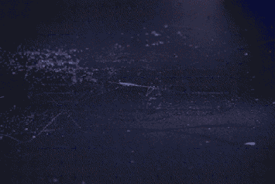

# E3D 教加法 3D 打印机如何做减法

> 原文：<https://hackaday.com/2020/08/18/e3d-teaches-additive-machines-how-to-subtract/>

我们可能会认为基于挤压的 3D 打印机已经达到了性能的顶峰。由于其余的工艺变量难以建模和控制，我们对挤出塑料工艺的尺寸精度只能有这么多期望。但是，如果我们混合机器，增加第二个加工过程，给最终的零件一个机械加工质量的光洁度呢？这正是 E3D 的人们在过去几年中一直在烹饪的东西:一个工具更换工作流程，[将铣削和 3D 打印混合到同一个过程中](https://e3d-online.com/blogs/news/asmbl)，以比单独的 3D 打印更紧密的尺寸精度生产光滑的零件。

被称为 ASMBL(逐层加/减加工)，该过程实际上是将两个互补的过程合并成一个工作流程来生产一个零件。在这里，普通的 3D 打印完成了生产零件整体形状的工作。但在每一层结束时，立铣刀进入工作区，用轻微的精加工处理来修整周边的缺陷，同时局部吸力带走碎屑。这种混合粗糙和精细制造过程来快速生产零件的概念是对被称为*近净成形制造的可靠工业过程的重新想象。*然而，不同于在大型制造设施的不同机器上进行的工业过程，E3D 的 ASMBL 在一台可以自动更换工具的机器上进行。结果是，你可以开始一个过程，然后几个小时后(和几百次刀具更换)回到一个有加工公差的成品零件。

你可能会问，这种奇怪的免费混合物有什么好处？好吧，首先，真正尖锐的外角，这是多年来躲避 3D 打印机爱好者的东西，现在是可能的。垂直表面上的层线几乎消失，孔的尺寸公差随着工艺精度的更严格控制(或清理)而增加！)产生尺寸更精确的零件…理论上。

但是，使用这种混合流程设置肯定有更多的方法可以探索，这就是您的用武之地。ASMBL 仍然处于早期开发阶段，但 E3D 已经采取了慷慨的措施，让你在他们的工作基础上进行构建，他们在网上发布了他们的 [Fusion 360 CAM 插件](https://github.com/AndyEveritt/ASMBL)、[的材料清单和铣刀](https://www.thingiverse.com/thing:4206827)的模型文件，甚至他们的[换刀运动系统](https://github.com/e3donline/Motion-System)的 STEP 文件。推动 3d 打印机生产更精细细节的未来可能只是一个参与的问题。

令人兴奋的是，当人们开始超越塑料时，3D 打印机设计师社区继续反思自己基础设施的能力。从通过降低价格点打开机会的[家酿换头解决方案](https://hackaday.com/2020/07/18/tool-changing-3d-printers-shouldnt-break-the-bank/)，到使机器更智能的[光学校准软件](https://hackaday.com/2020/06/14/dial-in-your-multi-headed-3d-printer-with-2020-machine-vision/)，到[脱离 Sharpie 辅助支持材料](https://hackaday.com/2020/05/27/improving-3d-printed-supports-with-a-marker/)，在混合工具和过程的生态系统中不缺乏新的想法。

休息之后，在他们的预告中看看 ASMBL 在 [2:29](https://www.youtube.com/watch?v=C7wYfaHT1g0&feature=youtu.be&t=149) 的表现。

 [https://www.youtube.com/embed/C7wYfaHT1g0?version=3&rel=1&showsearch=0&showinfo=1&iv_load_policy=1&fs=1&hl=en-US&autohide=2&start=149&wmode=transparent](https://www.youtube.com/embed/C7wYfaHT1g0?version=3&rel=1&showsearch=0&showinfo=1&iv_load_policy=1&fs=1&hl=en-US&autohide=2&start=149&wmode=transparent)

