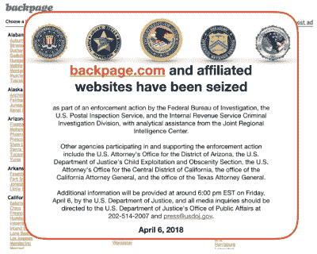

# 赢得它:信息时代的隐私、加密和监管

> 原文：<https://hackaday.com/2020/05/06/earn-it-privacy-encryption-and-policing-in-the-information-age/>

你可能听说过美国国会正在审议一项新法案，名为《挣得法案》。这就是“2020 年消除滥用和猖獗忽视互动技术法案”。(那是什么意思？这意味着有人真的希望他们的首字母拼出“赚到它”。)

“赚到它”是一项两党法案，声称要努力打击网上剥削儿童的行为。它也设法引起了 EFF、T2、施奈尔和各种新闻媒体的注意。压倒性的意见是,“赢得它”是一个可怕的想法，将使实现端到端加密成为不可能，并且违反了第一和第四修正案。一项旨在打击儿童色情和性交易的法案怎么会出现在 EFF 的黑名单上？很复杂。

首先，我们必须涵盖[通信礼仪法案](https://en.wikipedia.org/wiki/Communications_Decency_Act)，特别是第 230 条。让我们回到 1996 年。互联网是年轻的，但已经有火焰战争。[最近发生了两起重要的法院判决](https://www.publicknowledge.org/blog/what-section-230-is-and-does-yet-another-explanation-of-one-of-the-internets-most-important-laws/)，它们一起将互联网服务提供商置于一个奇怪的境地。

第一个判决 [Cubby 诉 CompuServe](https://en.wikipedia.org/wiki/Cubby,_Inc._v._CompuServe_Inc.) ，是 CompuServe 控制的一个论坛上的一个帖子的结果。Cubby，Inc .是他们认为是诽谤的目标，他们对 CompuServe 托管这些材料提起诉讼。法院在一项即决判决中认定，由于 CompuServe 不知道他们论坛的内容，他们是作为一个经销商行事，不对论坛的内容负责。这就相当于一家书店对他们的书籍内容不负任何责任。

另一个判决，Stratton Oakmont 诉 Prodigy，走了一条不同的路。这个案件也考验了服务提供商的责任。在这个案例中，因为 Prodigy 对公告栏的发布行使了“编辑控制权”,它被裁定为出版商，而不仅仅是分销商。作为出版商，Prodigy 对其服务中允许发布的内容负责。

这两个决定意味着服务提供商要承担更多监管用户内容的责任。简单地允许每个帖子可能是更安全的立场，但可以预见的是，这会给大多数最终用户带来可怕的体验。国会议员克里斯·考克斯和罗恩·怀登一起开始制定一项条款来保护服务提供商，同时仍然允许他们监管他们平台上允许的内容。他们的工作成为 1996 年电信法案第五章的修正案。虽然第五章《通信体面法案》的大部分内容被认为违宪，但第 230 条至今仍是一项重要的法律。

## 创造了互联网的 26 个词

第 230 节被称为“创造互联网的 26 个单词”。这一常识性措施首次被写入法律:“交互式计算机服务的提供者或用户不得被视为另一信息内容提供者提供的任何信息的发布者或发言人。”法令接着说，提供者不能因为“出于善意自愿采取的任何行动”而对警方不良材料负责。第 230 条可以理解为对 Stratton Oakmont 诉 Prodigy 案的直接回应。

这些保护措施确实有局限性。有两大类法律明显不受第 230 条的影响:知识产权法和联邦刑法。知识产权在《数字千年版权法》( DMCA)中有所涉及，这些年来我们已经在 Hackaday 上写了很多。

第 230 条为面临州一级起诉的服务提供商提供了强有力的辩护。这是有意为之的，因为各州的法律差异很大。互联网业务从根本上不同于实体企业，第 230 条保护在线服务不受各州突发奇想的影响。

这里有一点很重要:即使没有 230 条款的保护，服务提供商也可能有意地以经销商而不是出版商的身份经营。我们稍后将回到这个观点。

## 背面

第 230 节故事的下一章是[倒页](https://en.wikipedia.org/wiki/Backpage)。Backpage 最初是一个互联网分类广告部门，但很快就成为了 230 条款争夺的焦点。Backpage 是一个无法无天的地方，用户公开为卖淫和其他相关服务做广告。一些最糟糕的故事包括[绑架和奴役](https://www.reuters.com/article/us-wisconsin-trafficking-idUSKCN1RR2DP)和[强迫未成年人卖淫](https://www.reuters.com/article/us-florida-humantrafficking-idUSKCN1S62IK)。

几个州起诉 Backpage 故意允许非法服务广告，很多时候涉及人口贩运和未成年妓女。第 230 条是他们在这些案件中成功辩护的重要部分。Backpage 通过两次独立的努力最终被关闭。第一个是州法院裁定 Backpage“实质性地促进了广告的内容”，这超出了第 230 条规定的受保护的编辑活动。Backpage 高管承认“合谋为卖淫提供便利”

第二个努力是一个联邦案件，指控 Backpage 州际卖淫犯罪。该案件的州际性质将管辖权完全置于联邦手中，由于它涉及联邦刑法，第 230 条并不适用。

## SESTA

这种情况导致国会在 2017 年重新讨论 230 条款问题，并产生了[“停止启用性贩运者法案”](https://www.congress.gov/bill/115th-congress/senate-bill/1693) (SESTA)。SESTA 对第 230 节引入了一个新的“例外”。根据 SESTA，第 230 条不再保护服务免受州刑事起诉，如果起诉的目标是根据某些联邦法律也是非法的罪行。SESTA 遭到了 EFF 等互联网自由团体以及自由主义者的反对。

不难看出 SESTA 的缺点:一个流量超过版主的网站将很难跟上额外的版主负担。从理论上讲，恶意活动可以用非法内容淹没经过审核的服务，任何未经审核的此类内容都可能被用于刑事或民事诉讼。

另一方面，这已经是第 230 条下的情况，但有一个额外的限制，即它必须是一个联邦刑事案件。SESTA 将这些案件纳入州一级的起诉和民事案件。(这一额外的责任目前正受到法院基于宪法理由的质疑。)

## 赢得它

现在，相关的历史已经被涵盖，我们终于可以讨论挣得它，该法案目前正在国会审议。在我们讨论利益相关方提出的关切之前，让我们先来看一下[法案本身的文本](https://www.congress.gov/bill/116th-congress/senate-bill/3398/text)。首先，成立了全国防止网上儿童性剥削委员会，这是一个由 19 名成员组成的常设委员会。该委员会的三名成员来自联邦机构:司法部、国土安全部和美国联邦贸易委员会各派一名代表。其他 16 个席位由参议院和众议院的多数党和少数党领袖选出。国会任命的代表进一步列出了资格，从执法到消费者隐私。这里的意图似乎是让委员会代表广泛的意见。

该委员会的任务是制定和维护一套旨在打击在线剥削的“最佳做法”。有趣的是，这 19 个成员中至少有 14 个必须批准最终指南才能成为正式建议。一旦指导方针达成一致，议案将被提交到参众两院。只有当两个机构都将最佳实践投票通过成为法律后，它们才会生效。

到目前为止，该法案似乎是合理的。当政客们表现出对技术和互联网缺乏理解时，我们理所当然地会抱怨，尤其是当他们制定的法律因此变得有味道或毫无意义时。一个专家小组编写最佳实践可能是一个受欢迎的变化。另一方面，该小组的构成非常倾向于执法人员和政府代表。更多的安全和隐私专家将会受到欢迎。

执行《赚到它》是潜在的问题所在。第六节。“赢得豁免权”是第 230 条豁免权的又一个例外。这与 SESTA 的案文非常相似，因为如果索赔或指控违反了关于对未成年人进行性剥削的联邦法律，民事案件和州刑事案件都不在 230 保护范围内。

只有当服务提供商证明他们遵守了公布的最佳做法，他们才仍然享有第 230 条适用于儿童剥削的豁免权。这就是欧洲足联和其他机构的担忧发挥作用的地方。根据现任美国司法部长威廉·巴尔的现有声明，许多人得出结论，最佳实践文件将包括加密后门条款，以及其他糟糕的想法。

对该法案的一些批评是基于该法案的草案版本。该法案的当前文本明显优于草案，特别是因为众议院和参议院必须首先批准任何准则，才能成为有约束力的。

我见过的与 EARN IT 相关的最可怕的预测之一是，它将是商业服务中端到端加密的死亡。我很难想出一个端到端加密可以用于包含编辑操作的服务的例子。如上所述，不需要第 230 条来允许消息服务充当发行人而不是发行人。基于现有的判例法，电报和信号应该没什么好担心的。

## 最后的想法

我准备加入抨击“挣得它”的合唱。希望对围绕该法案的历史和问题进行更细致入微的审视能有所启发。我想记录一个问题:我坚决反对强行加入加密后门。如果这项法案通过，并且随后出现的“最佳实践”文件包含了这样一个条款，我将会带头反对它。

SESTA 和 EARN IT 的最大衍生产品是它带来的额外民事责任。这种变化将如何在民事案件中发挥作用还有待观察——仅由于法律费用，它可能会使较小的公司和非营利组织破产。由于这种责任，许多服务将实现已发布的指南，其中一些指南可能会产生负面后果。也就是说，这位作者的观点是，在这一点上，关于挣得它的狂热警告是不值得的。

* * *

#### 来自埃利奥特·威廉姆斯的编者按

对于这些“最佳实践”规则将包含的尚未公开的需求，我们并不都赞同 Jonathan 的乐观观点。也许应该先敲定法律的实际内容？在公众压力下，该法案被重写，要求国会批准最佳实践，但现在仍然很难判断任何人都批准了什么，对我来说，它仍然像一个特洛伊木马。

虽然我不能否认立法自第一稿以来有所改进，或对乔纳森对法律的严格解读有很大争议，但现在无法解读“最佳做法”，我们只能看看法案发起人的意图和起草委员会的结构。这个由 19 个成员组成的委员会中有许多团体支持不负责任地削弱加密技术，他们过去曾试图通过此类立法，但都以失败告终。

即使该委员会在保护加密方面态度强硬，司法部长巴尔对该委员会的建议拥有否决权，也很难想象该委员会能够提出“最佳实践”,而不解决他在要求编辑监督的幌子下引入后门的长期目标。该法律的最佳版本将永远无法提交国会批准。如果我们幸运的话，国会将会打击坏的部分，但是我们不想指望运气好。

在我看来，如果有人必须在加密和隐私方面赢得美国人民的信任，那就是那些支持“赢得它”立法的人。通过模糊最终将成为法律的实际内容，我不认为他们有。民主建立在透明的基础上。“最佳做法”是法律的一部分，应在法律表决前确立。

但这也是我们提出这个问题的部分原因。请接受教育，在评论中讨论，如果你觉得有动力，给你的国会议员写信。感谢乔纳森写了一篇很棒的背景介绍。