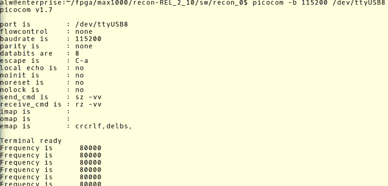
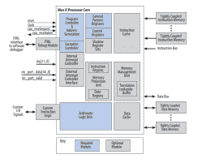
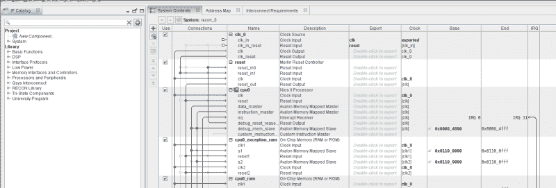

# 带 MAX1000 的简易 FPGA CPU

> 原文：<https://hackaday.com/2018/10/05/easy-fpga-cpu-with-max1000/>

好吧，我们承认。我们喜欢 FPGAs，因为它让我们想起了小时候的 100 合 1 设备。但事实是，许多项目都有 CPU。但是，当您将 CPU 和 FPGA 结合在一起时，会有一个真正的甜蜜点。英特尔(或者 Altera，如果你喜欢的话)有 NIOS II CPU 内核，但这很难配置，对不对？也许不会，这要归功于 GitHub 上的一个项目。他收集了一些基本的定义和库，以便在 [MAX1000](https://hackaday.com/2018/01/27/arrows-30-fpga-board-reviewed/) 和其他一些主板上轻松使用 NIOS II。MAX1000 是一款非常好的主板，价格大约为 30 美元，因此这是一种非常便宜的进入“片上系统”(SOC)开发的方式。

[杰夫]在一篇博客文章中做了更详细的介绍，但是这个想法非常简单。我们试了一下，效果很好，尽管我们发现有些事情很难做到，所以请继续阅读，看看我们是如何做到的。

SoC 开发背后的思想是你定义你的 CPU 配置，然后你的硬件设备。然后，您编写软件来与这些定制的硬件设备对话，当然，还要编写实际的应用程序代码。所以你不仅仅是写一个程序，你还定义了程序运行的 CPU 和与之对话的硬件。

这个项目中有几个现成的 I/O 设备，但是真正的乐趣在于编写自己的程序。英特尔工具拥有 C 编译器和您需要的一切。你也可以从头开始做任何事情，但是这些工具让你更容易开始。

## 完蛋

你需要做的第一件事是打开一个 NIOS 外壳。在我们的机器上，这是由名为`nios2_command_shell.sh`的`nios2eds`目录中的脚本处理的。我们运行的是 Linux，但[jeff]使用的是 Windows 下的 Cygwin。这只是运行一个系统 shell，但是设置了路径和其他环境变量，以便您可以使用这些工具。

项目文件——名为`recon`——位于几个子目录中，这些子目录是您解压归档文件的根目录。正如您可能猜到的那样,`hw`目录中有 Verilog 和其他与硬件相关的项目。`sw`目录包含库和头文件，当然还有你在 CPU 中运行的程序。

如果你习惯于发送代码到，比方说，一个 Arduino 或者一个 PIC，这将会有一点不同。您仍然可以生成代码。但是，NIOS CPU 的硬件配置不是发送给 CPU，而是与代码捆绑成一个单一的配置文件，你可以用标准的英特尔程序员进行编程。

## 让它工作

这里的关键是一系列的 Makefiles。如果你只输入`make`，你应该会得到一些帮助文本。然而，除非 make 默认使用`bash`,否则这不起作用——在 Linux 上通常不是这样。然而，只要在有问题的 Makefile 文件的顶部附近添加下面一行，事情就会变得更好:

```

SHELL:=/bin/bash

```

或者不要求助。我们尝试的其他方法都很有效。如果您不想修复它，下面是一个已修复的 Linux 安装的帮助:

[](https://hackaday.com/wp-content/uploads/2018/08/help1.png)

有五个步骤:

1.  为 CPU 创建板支持包(BSP)
2.  生成库
3.  准备你的源代码，或者使用一个例子
4.  生成应用程序
5.  创建一个 POF 文件

POF 文件正是英特尔编程软件用来在主板上刻录非易失性配置存储器的文件。如果你学过入门教程，你应该知道如何将这个文件烧录到 FPGA 中。

博客上有更多的细节，但这里是示例频率计数器的基本命令行，都是从 sw/recon_0 目录发出的:

```
# step 1
make new_bsp
# step 2
make generate_lib
# step 3
make generate_example
# step 4 
make app APP_NAME=frequency_counter
# step 5
make pof APP_NAME=frequency_counter BOARD_NAME=max1000
```

对 FPGA 编程后，您应该会看到 USB 串行端口枚举。使用一个设置为 115，200 波特的终端程序，你会看到软件计算一个内部时钟。

[](https://hackaday.com/wp-content/uploads/2018/08/term1.png)

## 软件事物

[](https://hackaday.com/wp-content/uploads/2018/08/nios.png)NIOS II 是一个非常健壮的 CPU，有很好的 C 编译器实现。查看组件框图，了解事情是如何安排的。然而，由于您主要是用 C 语言编程，您可能不太关心实际的布局，而更关心板支持包(BSP)和相关的库。

软件是什么样子的？好问题。有两个文件。一个是有点像 Arduino 的 main:

```

#include &lt;system.h&gt;
#include &lt;sys/alt_sys_init.h&gt;
#include &lt;sys/alt_irq.h&gt;

void setup();
void loop();

int main(void)
{
/* Altera sepcific */
   alt_irq_init(0);
   alt_sys_init();

   setup();

   while(1)
     {
     loop();
     }
}

```

[主代码](https://github.com/jefflieu/recon/blob/master/sw/examples/frequency_counter/src/app.cpp)稍微长一点，但是展示了如何像 Arduino 一样设置库。这里有几行:

```

/////////////////////////////////////////////////////////////////////////////////////////////////
// Bind Serial Object to UART_0 component by assigning the base address
Serial.bind(UART_0_BASE);

/////////////////////////////////////////////////////////////////////////////////////////////////
// Setup serial object with baudrate 115200
Serial.begin(115200);

/////////////////////////////////////////////////////////////////////////////////////////////////
// Setup mode of Pins, we have INPUT, OUTPUT and OUTPWM modes
pinMode(0,OUTPUT);
pinMode(PWM_PIN,OUTPWM);
setPWMPeriod(1000);
analogWrite(PWM_PIN, 200);

. . .

/*
* ISR that handles IO IRQ
*/
void io_isr(void* freqCntr)
{
///////////////////////////////////////////////
//Read back which pin is interrupted
   u32 pin = recon_io_rd32(IRQ_STATUS);
///////////////////////////////////////////////
//Clear Interrupt
   recon_io_wr32(IRQ_STATUS,pin);
///////////////////////////////////////////////
// On each interrupt, we increment the counter
   (*((u32*)freqCntr))++;
}

```

## 下一步

对于几个快速命令行来说还不错。当然，真正的考验是在你进行定制的时候，但是这应该会给你一个很好的开始。如果您查看`hw`和`sw`目录中的`cmn`(公共)子目录，您可以看到现有的 I/O 设备是如何创建和控制的。这应该很容易让你开始。有一个称为 Avalon 的标准，用于说明如何与 NIOS 核心接口。示例 I/O 设备[使用最简单的方法](https://github.com/jefflieu/recon/blob/master/hw/cmn/io/recon_io.v)，但是如果你需要的话，还有[更复杂的设置](https://www.intel.com/content/dam/altera-www/global/en_US/pdfs/literature/manual/mnl_avalon_spec.pdf)比如内存映射。

如果您想尝试更改板支持包，可以向 Makefile 发送`edit_bsp`命令。不过，你需要做一些调查，因为有很多选择。

此外，尽管 Quartus 项目文件在`hw`子文件夹中，但重新生成 NIOS II 核心并不简单。特别是，我们必须采取以下步骤来正确升级和构建一切:

1.  在 Quartus 中打开 recon_0.qpf 文件
2.  打开打开平台设计器的 recon_0.qsys 文件
3.  转到平台设计器中的工具|选项
4.  将 IP 搜索路径设置为 hw/cmn 目录
5.  在平台设计器中保存您的工作
6.  回到 Quartus，编译你的设计
7.  复制。从 output_files 目录到 release 目录生成的 sof 文件(您可能希望首先备份旧的 sof 文件)

只要确保在完成构建应用程序的五个步骤后，从`sw`目录中选择正确的`pof`文件，而不是`hw`目录中空白 CPU 的`pof`。别问我们是怎么知道的。

您应该只需要设置一次目录。当然，在平台设计器中也有许多诱人的东西可以尝试，包括向 NIOS 添加自定义操作码。

[](https://hackaday.com/wp-content/uploads/2018/08/plat.png)

如果你更喜欢 GUI 方法或者你开始使用工具做你自己的扩展，你可以跟随官方教程。你可能也会发现[官方页面](https://www.intel.com/content/www/us/en/programmable/products/processors/support.html)很有用。还有一个视频，你可以在下面看到。

 [https://www.youtube.com/embed/0k4AZmdW9Sk?version=3&rel=1&showsearch=0&showinfo=1&iv_load_policy=1&fs=1&hl=en-US&autohide=2&wmode=transparent](https://www.youtube.com/embed/0k4AZmdW9Sk?version=3&rel=1&showsearch=0&showinfo=1&iv_load_policy=1&fs=1&hl=en-US&autohide=2&wmode=transparent)


如果你需要更多关于 FPGA 编码的快速入门，请查看我们在 Hackaday.io 上的 [FPGA 训练营](https://hackaday.com/2018/08/06/learn-fpga-fast-with-hackadays-fpga-boot-camp/)。它不使用 MAX10 部分，但一般原则仍然适用，而且教程是硬件中立的，直到最后一次训练营。如果你对使用[max 10 模拟输入](https://blog.jayvee-store.com/2017/12/26/max1000-adc-example/)感兴趣，同一网站也有一个`recon_0`设置。