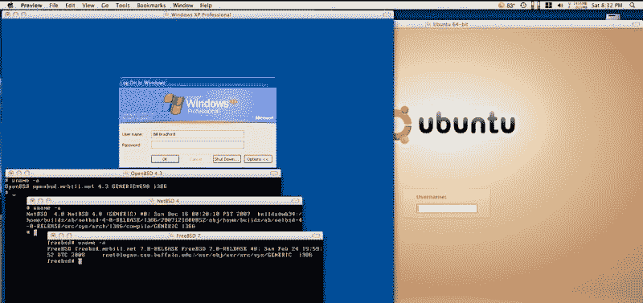

# 简易便携式串行端口

> 原文：<https://hackaday.com/2018/09/14/easy-portable-serial-ports/>

现代操作系统让我们——尤其是作为程序员——远离了如此多的工作。取决于你追溯到多远，程序员必须管理他们自己的字体，他们自己在大容量存储器上的分配空间，甚至他们自己的内存分配。然而，每一年，事情似乎变得越来越容易。那么为什么开一个简单的串口就这么烦人呢？当然，这并不难，但是在每一个操作系统上，这似乎都是痛苦的——可能是为了更灵活。如果你想要便携性，那就更糟了。我需要编写一些从 FPGA 的嵌入式逻辑分析仪中读取数据的 C 代码，我对不得不编写更多的串行端口代码感到恼火。我有自己的 shim 库，但它没有经过很好的测试，也不那么灵活——它能满足我的需要，但我想要更好的东西。我从 Sigrok 得到的[串行库。你知道](https://sigrok.org/wiki/Libserialport) [Sigrok](https://hackaday.com/2017/07/29/everything-you-need-to-know-about-logic-probes/) 吗？逻辑分析仪软件。

你可能会反驳说串行端口已经过时了，所以没有人愿意用现代系统来支持它。虽然物理串行端口可能是生命支持系统，但并不缺少通过 USB 连接的设备，看起来像是串行端口。因此，当我与 FPGA 板上的 FTDI 芯片交谈时，你也可以与 Arduino 或 USB 电压表或任何东西交谈。

我猜 Sigrok 开发人员和我有同样的问题，他们花时间编写了一个很好的 API，并将其移植到主要平台。虽然 Sigrok 使用它，但他们将它作为一个独立的项目来维护，这正是我所需要的。算是吧。我这么说是因为 Ubuntu 安装的版本太旧了，我需要最新版本的一些功能，但是——像往常一样——互联网来帮忙了。一个快速 Git 命令和四行构建指令，我们就可以开始了。

## 入门指南

由于我使用的是 Linux，页面上的构建说明运行良好。安装目录是/usr/local，所以我删除了 libserialport-dev 包，以确保我没有弄错。

该库提供了一个头文件 libserialport.h。该文件定义了一个不透明的 sp_port 类型。由于你不知道它的大小，你只能创建一个指向它的指针。你可以通过调用 [sp_get_port_by_name](https://sigrok.org/api/libserialport/unstable/a00005.html#ga7305ea2c122ab87dbf2aece6cdeeefaa) 得到填充的指针。你也可以让图书馆[给你一个可用端口列表](https://sigrok.org/api/libserialport/unstable/a00005.html#ga8be8a4eb43331e5760f640f9f83e080c)。一旦你有了港口，你就可以[打开它。有简单的调用](https://sigrok.org/api/libserialport/unstable/a00006.html#ga9cf16388bd19214f8f46ba289267c557)[设置大部分东西](https://sigrok.org/api/libserialport/unstable/a00007.html)，但是你通常只需要调用 [sp_set_baudrate](https://sigrok.org/api/libserialport/unstable/a00007.html#ga8019df9512a702c356b52532ec260b97) 。

还有一些简单的调用，用于执行[阻塞和非阻塞读写](https://sigrok.org/api/libserialport/unstable/a00008.html)，并判断是否有字符等待读取。

## 我的例子

我最终编写了大约 50 行代码，用两个命令 ping 分析器，并将数据提取到终端。你可以在下面找到。它只是又快又脏——我没有试图优化读取或任何东西。

我怀疑你会实现我的代码，因为你没有逻辑分析仪。不过，我最终会在另一篇文章中分享这一点。但是，如果您真的想尝试一下，您可以轻松地编写一个 Arduino 代码，从串行端口获取两个字节，然后转储 4096 个字节。

当然，这不是我的最终代码，但它显示了编写一些可移植的代码来使用串行端口是多么容易。

```

// WordPress loves to eat angle brackets, so if the 3 includes below are blank
// they are: stdio.h stdlib.h and libserialport.h
#include <stdio.h>
#include <stdlib.h>
#include <libserialport.h>

#define BAUD 9600
// Commands to LA
#define USERCMD_RESET 0
#define USERCMD_RUN 1

int main(int argc, char *argv[])
{
  struct sp_port *port;
  int err;
  int i,cmd;
  int count=4096;
// We need a serial port name
  if (argc<2)
    {
    fprintf(stderr,"Usage la port\n");
    exit(1);
    }
// Open serial port
  err=sp_get_port_by_name(argv[1],&port);
  if (err==SP_OK)
  err=sp_open(port,SP_MODE_READ_WRITE);
  if (err!=SP_OK)
    {
    fprintf(stderr,"Can't open port %s\n",argv[1]);
    exit(2);
    }
// set Baud rate
  sp_set_baudrate(port,BAUD);

// write reset
  cmd=USERCMD_RESET;
  sp_blocking_write(port,&cmd,1,100);
// write run
  cmd=USERCMD_RUN;
  sp_blocking_write(port,&cmd,1,100);
// read data 
  for (i=0;i<count;i++) 
    {
    int waiting;
    int c=0;
    do 
      {
      waiting=sp_input_waiting(port);
      } while (waiting<=0);
// sort of inefficient -- could read a bunch of bytes at once
// could even block for all of them at once
    sp_nonblocking_read(port,(void *)&c,1);
    if (i%16==0) putchar('\n');
    printf(&quot;%02X &quot;,c);
    }
  putchar('\n');
  sp_close(port);
  return 0;
}

```

## 便携性和支持

[](https://hackaday.com/wp-content/uploads/2018/08/2519260957_817d2085cd_b.jpg)

该库可以在 Linux、Mac、FreeBSD、Windows 和 Android 上运行。没有准将 64 或 VAX 的支持，但我们可以让它滑动。这也是有据可查的。你可能想知道这有什么大不了的。好吧，让我们绕个小弯。请记住，您可能有一个最喜欢的库，它对您隐藏了很多这方面的内容，这很好。也许它甚至是跨平台的，在这一点上，这也很好。但是我说的是使用操作系统的本地 API。

[ ](https://hackaday.com/wp-content/uploads/2018/08/port-87491_640.jpg) Linux 大量借鉴 Unix，所以它认为串口可能只是调制解调器或电传打字机。这意味着串行端口有几十个模糊的选项，大多是古怪的 termios 结构。所有东西都是一个文件，所以打开端口没有那么大的压力。你必须决定是否要设置像 O_NOCTTY 和 O_NDELAY 这样奇怪的位。哦，你可能想通过设置 FNDELAY 位(通过另一个 API 调用)来告诉端口如果没有数据可用就不要挂起。加上设置波特率。

我不会用所有精确的代码来烦你，但是如果你真的想知道涉及到什么，这里有一个[很好的参考](https://www.cmrr.umn.edu/~strupp/serial.html#2_5_2)。请记住，打开端口的良性代码只是冰山一角。至少一直读到第三章。

Windows 也好不到哪里去。实际的 API 接口与 Linux 代码类似，但并不相同。您几乎可以用通常的方式创建一个文件。但是，然后你得到一个设备控制块(DCB ),并把它全部填入来配置端口。想要暂停吗？那是另一个电话。对于非阻塞 I/O，有一个完全不同的 API，尽管您有一些选择。还有 EscapeCommFunction 来做其他奇怪的事情。

这些都没那么难，事实上，Windows 更容易一点，只是因为它不太灵活。但是只使用一个可移植的开源库是非常容易的。

## 前进

下次你想用任何一种可以调用库的语言与 PC 进行串行对话时，你应该考虑一下这个。即使你不需要可移植性，它也是一个足够令人愉快的 API，如果你做移植或者你只是开始一个不同的项目，你也不必改变。

如果不喜欢，还有其他选择。快速搜索发现了一个支持 Windows、Linux 和 Mac 的 C++库。一些流行的库，如 Boost for C++也有串口处理程序。这是一个非常简单的[C 语言库](https://www.teuniz.net/RS-232/)。毫无疑问还有其他人，我想这些评论也会发现一些珍宝。

照片鸣谢:由[Bill Bradford][CC-By 2.0](https://creativecommons.org/licenses/by/2.0/legalcode)创作的《与 VMWare 同乐》。