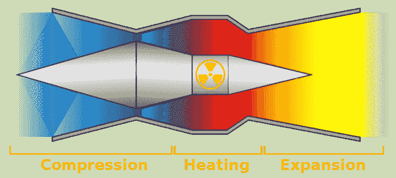
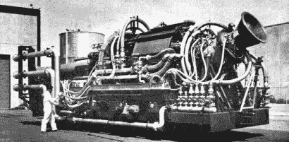
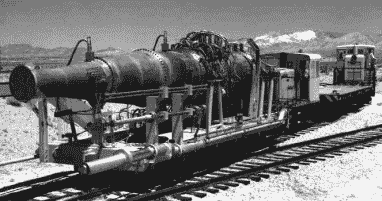
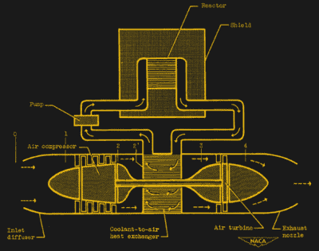

# 冷战的回声:核动力导弹以前曾经被尝试过

> 原文：<https://hackaday.com/2019/08/20/echos-of-the-cold-war-nuclear-powered-missiles-have-been-tried-before/>

8 月 8 日，一个实验性核装置在俄罗斯尼奥科萨的一个军事试验设施爆炸。据报道，在 30 公里外的 Severodvinsk 市，辐射水平在几个小时内达到峰值，是正常水平的 20 倍。关于事件严重性的谣言开始流传，关于附近村庄居民被迫疏散的相互矛盾的报道让一些媒体将此与苏联处理切尔诺贝利灾难的情况相提并论。

今天，围绕着在尼奥诺萨设施发生的事情，仍然存在着更多的疑问。目前还不清楚有多少人在爆炸中丧生或受伤，也不清楚俄罗斯政府在沿海地区环境清理方面的下一步行动。国家核机构 Rosatom 给出的异常模糊的解释称，爆炸“发生在与液体推进系统中同位素动力源的工程和技术支持相关的工作期间”，这几乎没有缓解人们的担忧。

全球情报机构的共识是，这次试验很可能是俄罗斯开发 9M730 Burevestnik 核动力巡航导弹计划的一部分。更广为人知的是其北约名称 SSC-X-9 Skyfall，这种导弹据说提供了几乎无限的飞行范围和续航能力。理论上，这种导弹可以无限期地保持在空中，随时准备转向预定目标。有效的无限射程也意味着它可以采取任何不可预测的或迂回的路线来最好地避开目标国家的防空。同时以接近高超音速的速度飞行，这使得拦截异常困难。

这种令人难以置信的说法听起来像是武力恫吓，甚至可能是科幻小说中的东西。但事实上，核动力导弹的基本技术是在近 60 年前开发并成功测试的。让我们来看看这个冷战的遗迹，并找出俄罗斯可能如何努力解决导致它被放弃的一些问题。

## 核冲压发动机

超远程武器运载系统的明显战术优势导致美国在第二次世界大战后的几十年里试验了几种核推进系统。其中一个名为“冥王星计划”的项目的目标是开发一种发动机，使无人驾驶飞机的航程超过 100，000 英里(160，935 公里)。

在 Theodore Merkle 博士的指导下，冥王星项目集中研究了核冲压发动机的概念。理论上，这是一个巧妙而简单的想法:让空气通过一个未屏蔽的核反应堆，由此产生的能量转移导致空气迅速加热和膨胀。核冲压发动机不需要液体燃料；只要反应堆产生足够的热量，它就会无限期运行。

核冲压发动机仍然有着传统液体燃料版本的弱点，即需要在进入的空气被压缩并被进气口的几何形状预热到足以发挥作用之前将其加速到大约 3 马赫。但由于增加了捆绑式火箭助推器来提高运载工具的速度，这在太空时代的黎明并不被视为一个巨大的工程挑战。

更大的问题是建造一个反应堆核心，它不仅要足够小和轻，以适应发动机的内部，而且还要能够承受冲压发动机运行所需的高温。反应堆基本上是在一个连续的接近熔化的状态下运行，只有空气流动来保持其内部结构足够冷，以防止它从边缘翻倒并自燃。

当然，这意味着让飞机减速或停止发动机是一个冒险的提议。一旦引擎被启动，它只会有两种可能的结果:在和平时期，它会坠入远离文明的海洋(相对无害，取决于你如何看待它)，如果第三次世界大战爆发，它会全速撞向敌人的目标。

## 在任何速度下都不安全

尽管开发和测试这样的发动机存在明显的危险，但冥王星项目实际上制造了两个功能原型，并在地面上成功运行。第一台发动机叫做托里-IIA，于 1961 年 5 月 14 日首次点火。它只运行了几秒钟，而且太大了，实际上无法用于预期目的，但它证明了这个概念是可行的。在这一成功的基础上，后续发动机的尺寸和重量达到了飞行要求。托里-IIC 发动机在 1964 年的试运行中运行了长达 5 分钟。核冲压发动机正式准备飞行。

  Tory-IIA  Tory-IIC

但事实证明，该项目从未超过这一点。虽然该发动机的最终第一台主机超音速低空导弹(SLAM)的计划正在进行中，但与洲际弹道导弹(ICBMs)相比，对该技术成本和实用性的担忧导致它在托里-IIC 测试后不久被取消。至少，这是官方终止核冲压发动机研究的原因。

该计划的批评者认为，这样的发动机不仅对发射它的机组人员是危险的，而且对任何在它的飞行路线下的人都是危险的。未受屏蔽的反应堆发出的辐射已经够糟糕了，但是核冲压发动机在飞行时也会在其排气中喷出裂变碎片。即使它的巡逻区域被限制在北极圈内的高纬度地区，它仍然会令人不安地靠近像格陵兰和加拿大这样的友好国家。

1958 年，当托里-IIA 项目还在建设中时，原子能联合委员会请默克尔博士就冥王星项目的状况作证。在接受质询时，他承认，他认为为飞行准备发动机的地勤人员面临的辐射风险是可控的，并证实他们在发动机排气中检测到了裂变产物。但他说，即使按照他的团队最悲观的估计，核冲压飞机运行的速度和高度意味着几乎没有辐射会实际到达地面。然而，如果车辆发生碰撞，他不能保证安全。

## 现代进化

在这种背景下，我们可以看到，俄罗斯在尼奥科萨测试核冲压发动机的理论有一个明显的问题。Rosatom 的声明特别提到了“液体推进”，这与我们所知道的冥王星项目期间进行的研究不一致。更重要的是，消耗液体推进剂的发动机不可能达到核发动机承诺的范围和续航目标。那么他们到底在研究什么呢？

暂且忽略官方声明故意误导或可能误译的可能性，提及液体推进可能是一种暗示，即俄罗斯工程师正试图通过增加液体冷却来解决经典核冲压发动机的最关键问题。在这种情况下，反应堆不是物理上位于发动机内部，而是通过一个闭环热交换器连接，其中充满了一种即使在极端温度下也能保持液态的物质，如熔盐或金属。

Diagram of an Indirect Air Cycle turbojet

美国在飞机核推进(ANP)计划期间对这种被称为“间接空气循环”的想法进行了试验。从 1946 年运行到 1961 年，ANP 最终被肯尼迪总统取消，表面上是因为同样的原因冥王星计划被搁置:与洲际弹道导弹相比，巨大的成本和复杂性。虽然该计划从未生产出实用的飞机发动机，但它确实导致了世界上第一个可运行的熔盐反应堆(MSR)的诞生。

为核冲压发动机配备熔盐或金属冷却系统将允许热量从屏蔽反应堆转移到发动机。这不仅会让操作和发射人员的系统更加安全，还会消除裂变产物在废气中释放的风险，因为空气不会穿过核心本身。

理论上，它还可以允许更深的节流能力和安全关闭程序，假设液体冷却剂可以重新导向外部散热器，以帮助控制低空速下的核心温度。当然，缺点是这样的引擎会复杂得多。但这也可能意味着历史好奇心和可行的推进系统之间的区别。

## 理论和推测

当俄罗斯总统弗拉基米尔·普京去年承认其存在时，他说“天崩”导弹的开发已经足够深入，一些早期的测试飞行已经完成。有传言称，该武器可能在 2020 年代中期全面投入使用，与 Avangard 高超音速滑翔飞行器的部署相吻合，这似乎是一个合理的假设，即其推进系统将进行积极的测试。但事实上，除了克里姆林宫，没有人真正知道 8 月 8 日在尼奥科萨设施发生了什么；如果历史有所启示，我们可能永远也不会了解整个故事。

有可能他们正在测试一些核冲压发动机的进化版本，但也有可能爆炸涉及波塞冬，俄罗斯自 2015 年以来一直在开发的核动力鱼雷。一些人甚至认为该事件涉及下一代放射性同位素热电发电机(RTG)，[一种为深空探测器和漫游车设计的小型核动力源](https://hackaday.com/2019/02/08/the-deep-space-energy-crisis-could-soon-be-over/)。

目前，我们所知道的是，工程师们已经失去了生命，由于放射性物质的释放，公民们面临着被赶出家园的风险，而俄罗斯政府并没有主动提供关于真实情况的信息。即使技术本身是尖端的，它的发展肯定展示了冷战时代政治的所有最糟糕的特征。