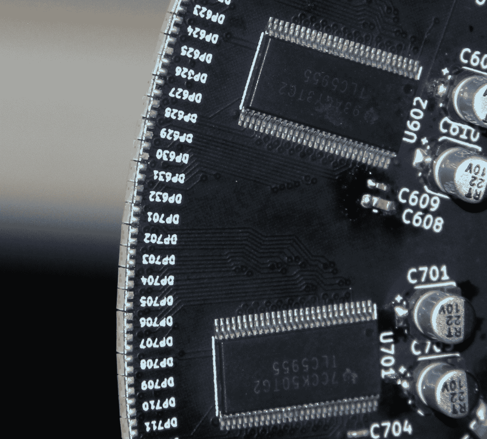

# 边缘安装的发光二极管使这个球形视点看起来很棒

> 原文：<https://hackaday.com/2020/12/18/edge-mounted-leds-make-this-spherical-pov-look-fantastic/>

正如我们所看到的那样，我们仍然喜欢视觉展示项目的良好持续性。运动和光线的结合创造了固体表面的幻觉，这很有意思，而且 POV 构建的机电方面总是很有趣。[这款高分辨率球形视点显示器](https://danfoisy.github.io/flicker/)可以按下所有这些按钮，甚至更多。

由于显而易见的原因，它的创造者[Dan Foisy]将其称为“闪烁”，这种 POV 显示器在分辨率和图像质量方面有一套非常明确的目标，加上支持动画图像的需要，所有这些都在球形外形中。这些目标决定了显示器的最终形式——一个垂直旋转的 PCB 圆盘。该轴具有用于功率分配的普通滑环和用于位置反馈的编码器。不过，PCB 才是有趣的地方。

 【丹】选择使用 FPGA 对图像进行切片和切割，这些图像从 Raspberry Pi 的 HDMI 端口传输到 LED 驱动器。led 本身非常光滑——他发现了引线间距为 1.6 毫米的部件，这使它们非常适合安装在 PCB 的边缘，而不是两侧。KiCAD 脚本将 256 个 led 及其支持组件的布局过程自动化，使其尽可能均匀，以避免不平衡问题。

下面的视频显示了闪烁的效果——有一些问题像素，但总体来说，显示效果非常令人惊叹。我们之前已经见过一些其他的[球形视点显示器](https://hackaday.com/2015/12/24/pov-globe-display-spins-up-full-color-tupac/)，但是没有一个看起来像这个一样好。

 [https://www.youtube.com/embed/NmsA6GMSGeg?version=3&rel=1&showsearch=0&showinfo=1&iv_load_policy=1&fs=1&hl=en-US&autohide=2&wmode=transparent](https://www.youtube.com/embed/NmsA6GMSGeg?version=3&rel=1&showsearch=0&showinfo=1&iv_load_policy=1&fs=1&hl=en-US&autohide=2&wmode=transparent)

