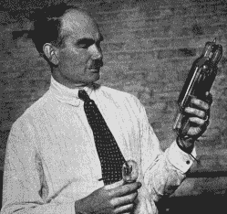
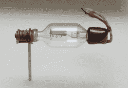
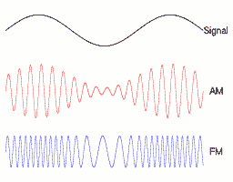
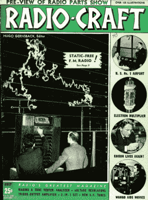

# 埃德温·阿姆斯特朗的调频广播之战

> 原文：<https://hackaday.com/2018/07/24/edwin-armstrongs-battle-for-fm-radio/>

你可能至少有一台收音机可以接收调频电台。尽管调频现在越来越少使用互联网和卫星选项，但它仍然比老的调幅广播波段更受欢迎。FM 是一个发明家的发明，你可能听说过埃德温·阿姆斯特朗，但你可能不知道整个故事。它可以制作一种以广播为主题的肥皂剧。这是一个创新的故事，但也是一个个人虚荣、企业贪婪、固执、婚姻问题，甚至自杀的故事。唯一缺少的是一个失踪已久的同卵双胞胎兄弟，以将其变成一部完整的电视剧。

## 早期

阿姆斯壮在纽约长大，由于一场让他抽搐的疾病，他不得不在家接受教育，他有点不合群。他投身于对电气和机械装置的兴趣。1909 年，他被哥伦比亚大学录取，那里的教授注意到他非常专注于自己感兴趣的事情，但对其他研究漠不关心。他也被认为是对实际结果比对理论更感兴趣的人。他在 1913 年获得了电气工程学位。

与许多大学毕业生不同，阿姆斯特朗没有去大公司工作。相反，他在哥伦比亚大学建立了一个自筹资金的独立实验室。这听起来不错，因为这意味着他将拥有那里发明的任何东西的专利。但事实证明这是一把双刃剑。

## 管子和恶棍

 每一个好故事都需要一两个反派，这个也不例外。第一个是[李德·福里斯特](https://hackaday.com/2017/11/02/silicon-valley-was-built-on-tubes-of-glass/)，发明三极管的人。历史对德·福里斯特的描述并不友好，其中的一些原因是因为他与阿姆斯特朗的互动。然而，还有更多。

从技术上讲，托马斯·爱迪生发明真空管是灯泡实验的一个分支。他知道电子正从灯丝流走，并放入一个电极——我们称之为极板——来收集它们。不过，他并不知道该如何处理这个设备。

1904 年，约翰·弗莱明意识到这种装置就像一个止回阀，允许电流向一个方向流动，但不允许电流向另一个方向流动，并演示了如何将其用作整流器。这就是为什么世界上有些地方的人们把管道叫做弗莱明阀门。

 德·福里斯特在混合物中加入的是在灯丝和盘子之间放一个网格。他实际上是试图建立一个使用电离气体的无线电探测器，并在 1907 年就一个双终端设备申请了专利。网格最初是在玻璃管的外面，效果不好。一旦它被移动到管内，它允许网格上的小信号在板处被放大。德·福里斯特称这种电子管为三极管。有几个原因使它不能很好地工作，尤其是德·福里斯特错误地认为在管子里留一点气体对它的工作是必不可少的。我们现在知道，你想要更少的汽油，而不是更多。

这一切都符合历史上的说法，即德·福里斯特并没有完全理解管子。他只是在尝试不同的东西，看看什么会起作用——不总是一件坏事，尤其是在那些其他人用类似的方法工作的日子里。据说他甚至说:

> 到目前为止，我还没有完全令人满意的理论，高频振荡的确切方式影响如此明显的电离气体的行为。

如果他只是一个实用的发明家，那也不会让他成为一个恶棍。然而，当持有弗莱明专利的马可尼起诉说三极管侵权时，德·福里斯特采取的立场是两种设备完全不同。当然，他们不是。法院支持马可尼，尽管由于电网是一项可申请专利的改进，所以双方同意交换权利。

我们认为旷日持久的知识产权官司是一个现代问题。也许这是真的，事情越是变化，就越是一成不变。

## 回到阿姆斯特朗

阿姆斯特朗从小就在试验充满气体的低质量三极管。他决心以科学的方式了解这个装置是如何工作的。在哥伦比亚大学时，他做了全面的研究，发现使用正反馈可以产生更高的放大效果——足以驱动扬声器而不是耳机。这是再生接收器的基础。信号被放大了许多倍，每次都变得更强。此外，阿姆斯特朗还了解到，如果你增加反馈，你会得到持续的振荡。对于无线电来说，这将是一个巨大的突破，因为它有一个可靠的方法来产生电子无线电波。

阿姆斯特朗在 1913 年申请了专利。李·德·福里斯特不出所料地对阿姆斯特朗的工作打了几年折扣。1915 年，他出人意料地为同样的发明申请了专利，声称他拥有优先权，因为他在 1912 年写了一本实验笔记本。然而，由于第一次世界大战的介入，事情进展缓慢。

再生接收器一直被出售，直到阿姆斯特朗的另一项发明取代了它们。再生仍然很受黑客的欢迎，因为它们的零件数量通常很少。如果你想更多地了解它们是如何工作的，可以看看 Stan 对一个基于 FET 的晶体管的视频分析，这个晶体管和电子管没有太大的不同。

 [https://www.youtube.com/embed/JEuUK_DsNVk?version=3&rel=1&showsearch=0&showinfo=1&iv_load_policy=1&fs=1&hl=en-US&autohide=2&wmode=transparent](https://www.youtube.com/embed/JEuUK_DsNVk?version=3&rel=1&showsearch=0&showinfo=1&iv_load_policy=1&fs=1&hl=en-US&autohide=2&wmode=transparent)

## 战争时期

在战争期间，阿姆斯特朗还开发了超外差接收机:一种即使在今天也很常见的架构，其中感兴趣的频率被转换为单个中频，以便在检测之前进行放大和滤波。

到 1919 年，阿姆斯特朗已在德·福里斯特专利案的两条战线上出庭。为了支付律师费，他已经授权几家公司为业余爱好者和实验者制造再生接收器。他也在找一家大公司购买版权。西屋公司最终获得了再生和超外差专利。到 1928 年，法院实际上决定由一个名叫莱维的法国人首先发明超外差。

## 再生专利

关于再生的法律战线是完全不同的。法院和专利局都判定德·福里斯特的专利无效。然而，阿姆斯特朗并不想满足于德·福里斯特提供的补偿。这使得德·福里斯特可以就此案提起上诉，通过两次上诉至最高法院，他最终胜诉。

这一举动震惊了当时大多数从事无线电业务的人。阿姆斯特朗试图归还他从 IRE(无线电工程师协会)获得的一项奖励，该协会拒绝接受归还，公开声明他们拒绝接受法院的裁决。

虽然阿姆斯特朗在法庭上表现不佳，但他确实有一点运气。在处理法律方面的事情时，他偶然发现了一种对再生的改进，叫做超级再生。这项专利使他净赚了 20 万美元和 8 万股 RCA 股票，使他成为最大的股东。也请记住，20 万美元在 1922 年是一笔财富。RCA 最终从未真正使用这种技术生产过收音机，因为超外差技术被证明要优越得多。

## 这就把我们带到了 FM…

如果你忘了，所有这些导致了调频收音机的发明。AM 无线电非常容易受到噪声和衰落的影响，因为这些噪声和衰落表现为振幅的变化，即 AM 中的 A。在 20 世纪 20 年代，阿姆斯特朗试图想办法改进调幅广播。调频——调制频率而不是振幅——在很大程度上被摒弃了，因为约翰·卡森对调频的不完全分析表明，调频不会改善调幅的质量。

到 1928 年，阿姆斯特朗开始与调频工作，尽管它的诽谤者，关键是使用更宽的带宽。阿姆斯特朗在 1933 年申请了专利。此时，RCA 对他的专利有优先拒绝权，但他们对复杂且与现有设备不兼容的系统不以为然。

阿姆斯特朗去了像通用电气和齐尼思这样的小型无线电公司。他还让联邦通信委员会为这种新型无线电分配了一个频段，在 42 到 50 兆赫的范围内有 40 个频道。你可能会注意到，这不是今天的调频波段。这将在接下来的故事中扮演一个角色。网上有很多这个乐队的旧调频收音机的照片。奇怪的是，这个乐队取代了另一个试图做“更好”的电台，叫做 [Apex 电台](https://hackaday.com/2018/07/31/retrotechtacular-apex-radio-the-forgotten-hifi/)——我们将在不久的将来讨论这个话题。

## 百万美元问题

 起初，RCA 将 FM 视为对他们现有业务的威胁，并竭尽全力阻止 Armstrong 向公众展示该系统。尽管如此，阿姆斯特朗确实让 FCC 对 FM 产生了兴趣，甚至建立了自己的 FM 电台 W2XMN 来帮助推动事情的发展。

第一次广播是在 1939 年。当时世界上只有 25 台调频收音机，所以听众不是很多。

RCA 最后想进入 FM 游戏，但是他们不想付给阿姆斯特朗版税。1940 年，他们出价整整一百万美元向他购买非独家但免版税的许可证。阿姆斯特朗认为，对其他只支付销售额 2%的公司来说，这不公平。他拒绝了，这将成为一个致命的，最终毫无意义的决定。

在右边，你可以看到一本 1940 年的杂志封面。这张照片展示了一个百万伏的电弧，它完全破坏了调幅信号，但一点也没有干扰调频收音机。

## 波段调整

由于第二次世界大战，在新的频段上，只有相对较少的调频接收机和电台在使用。我之所以说比较，是因为与数百万台调幅收音机相比，最终将有近 40 万台接收机投入使用。

50 MHz 左右的信号会受到传播效应的影响，从而导致干扰。RCA 激烈游说移动 FM 波段，阿姆斯特朗极力反对。在他看来，RCA 只是想扰乱现有的调频电台和接收器，也许是因为他不愿意接受他们的百万美元报价。

既然你知道现在的 FM 波段是 88 到 108 MHz，那你大概就能猜到 1945 年哪一方赢了。然而，阿姆斯特朗坚信 FM 是未来，他甚至雇佣了一家公关公司来宣传 FM 的优越性。

RCA 最终会开发他们声称不侵权的 FM 专利，甚至鼓励其他公司停止向阿姆斯特朗支付版税。他提起了诉讼，但 RCA 能够将此案拖延数年。

## 痛苦的结局

这个故事中两个明显的反面角色是德·福里斯特和 RCA 的大卫·沙诺夫。然而，还有第三个恶棍:法院。不断卷入与一家大公司的法律纠纷会对你的钱包和心理健康造成损害。

面临破产，阿姆斯壮找到他的妻子马里恩(顺便说一句，她曾是大卫·沙诺夫的秘书)，要回他给她的钱，让她为他们的退休做准备。她拒绝了，1954 年他用火钳打了她。不出所料，她离开了他。

阿姆斯特朗住在纽约河畔别墅 13 楼的一套公寓里。他的妻子走了，三个仆人结束了一天的工作，阿姆斯特朗卸下了空调，穿上了一套漂亮的西装、帽子、大衣和手套。然后在写了两页纸的纸条后，他走出窗户，在三楼的阳台上摔死了。《纽约时报》报道称，他对妻子的去世感到心碎，并后悔伤害了她。

具有讽刺意味的是，阿姆斯特朗拒绝了百万美元。在他死后，马里恩与 RCA 达成了 100 万美元的和解。她还参与了其他诉讼案件，为他的专利辩护，并从其他制造商那里获得侵权赔偿。20 世纪 50 年代末，通用电气将立体声添加到调频中后，调频开始真正腾飞。

这是一个多产发明家的悲惨结局，他创造了许多我们今天仍在使用的技术。很难说像这样的故事中的坏人是真的像他们表现出来的那样坏，还是只是无法展现他们在故事中的一面。另一方面，历史是由胜利者书写的，阿姆斯特朗肯定不是胜利者。这一定意味着什么。

然而，当我写这篇文章时，有一件事确实打动了我。包括美国在内的世界大部分国家都采用了“先申请”优先的专利制度。我一直认为这对我们黑客来说是不好的，因为我们不太可能很快申请专利，因此，更有可能被一家每天发布数十项专利披露的大公司击败。但是在这个案例中，第一次申请可能会完全改变阿姆斯特朗的生活。这也提醒我，即使我们大多数人不经常申请专利，也许我们应该考虑一下。也许大公司会控制所有即将到来的创新，因为——不像阿姆斯特朗——我们在放任它们。

照片致谢:

格雷戈里·麦克斯韦的三极管管 [GFDL 1.2](https://www.gnu.org/licenses/old-licenses/fdl-1.2.html)

狂战士的 AM/FM 动画 [CC BY-SA 2.5](https://creativecommons.org/licenses/by-sa/2.5)