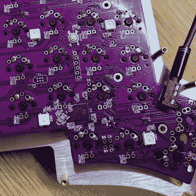

# 因此，键盘构建问题变得非常清楚

> 原文：<https://hackaday.com/2020/07/23/ergo-keyboard-build-issue-becomes-crystal-clear/>

在恼人的手部疼痛发作和破旧、糊状开关的感觉之间的某个地方，[sinbeard]对键盘的不满达到了顶点。他决定是时候换一种更符合人体工程学的东西了，并决定建造一个 Iris——一个小的分裂 keeb，有一个正交(非交错)的按键排列。

Iris 是开源的，使用板载控制器，所以你可以制造电路板，进行大量 SMD 焊接，或者获得一对 PCB，所有这些都已经完成。[【sin beard】用](https://canderson.dev/2020/07/10/iris-rev-build.html)走了后一条路，但是在开始组装之前还有大量的焊接和组装工作要做，比如 TRRS 插孔，旋转编码器，当然还有所有的开关。当涉及到构建键盘时，这是一个让人们尝试的好方法。

一切都按计划进行，直到要刷新固件时，它没有响应。值得注意的是，这两个 Iris PCBs 是相同的，并且都是完全填充的。这有好有坏。

很遗憾，您需要担心的是两个板载微控制器及其晶体，而不是一个。这很好，因为两侧都有一个 USB 端口，所以您可以插入您喜欢的一侧，如果您必须进行故障诊断，这将非常方便。

当一边的 underglow 亮了，而另一边没有亮的时候，[sinbeard]就把 ISP 程序员抓了出来。但是最后，他通过盯着板子发现了问题——水晶上的一个凹痕。一个便宜的替换零件和一点热空气返工行动是所有需要得到这个虹膜开花。

想做一个键盘但是还需要几个键？检查一下[dactyl](https://hackaday.com/2019/06/03/building-an-ergonomic-keyboard/)和[ergo DOX](https://hackaday.com/2020/05/06/inputs-of-interest-im-building-an-ergodox/)。