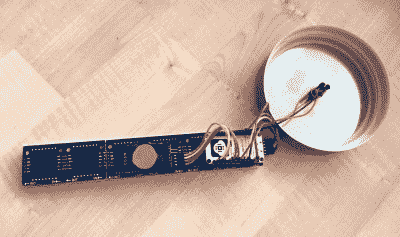

# ESP8266 时钟把时间放在一个罐子里

> 原文：<https://hackaday.com/2018/10/06/esp8266-clock-puts-time-in-a-jar/>

具有讽刺意味的是，随着模块化电子元件的广泛使用，构建最新小工具的最困难部分可能最终只能找到一个像样的外壳。项目箱只能让你到此为止，老实说，它们并不完全是世界上最有吸引力的东西。但如果你愿意跳出框框思考(懂吗？)有一些非传统的选择可能符合要求。

 以这个[由【赞加比】制作的 ESP8266 时钟为例，它被放在一个玻璃意大利面罐子](https://www.instructables.com/id/ESP8266-LED-Matrix-Clock/)里。通过添加一些窗口着色膜让 LED 显示屏发光，最终结果几乎可以作为现代艺术通过。即使你不需要在家里安装一个额外的时钟，这个相同的一般原则也可以用于创建一个看起来光滑的滚动条，用于各种信息，从天气到服务器正常运行时间，只需对代码进行一些调整。

罐子里有六个 8×8 MAX7219 LED 矩阵模块，它们粘在一起形成一个长条，背面用双面胶粘住一个 NodeMCU 板。还有一个 DS3231 RTC 模块，因此时钟可以保持中途体面的时间，但取决于你愿意从 NTP 下拉当前时间的积极程度，这可能需要也可能不需要。一个简单的桶形插孔穿过罐子的金属盖，代表着内部与外界的唯一物理连接。

在下一次迭代中，[ZaNgAbY]正在考虑添加一个温度和湿度传感器，以及一个可以根据环境光调节 LED 显示屏亮度的光传感器。虽然环境传感器必须放在盖子的外面，如果有任何希望从它们那里获得有用的读数，透明玻璃将允许他把光传感器放在时钟内部。

信不信由你，这不是我们第一次看到有人给他们的电子产品泡菜待遇。我们之前已经主持过[一个在梅森罐](https://hackaday.com/2015/05/09/raspberry-preserve-a-bittorrent-sync-client-in-a-mason-jar/)中“保存”文件的服务器，以及[一个在玻璃下华丽展示的 iPod】。](https://hackaday.com/2012/04/10/a-jukebox-in-a-bell-jar/)

 [https://www.youtube.com/embed/Ogvjw2kz6-Q?version=3&rel=1&showsearch=0&showinfo=1&iv_load_policy=1&fs=1&hl=en-US&autohide=2&wmode=transparent](https://www.youtube.com/embed/Ogvjw2kz6-Q?version=3&rel=1&showsearch=0&showinfo=1&iv_load_policy=1&fs=1&hl=en-US&autohide=2&wmode=transparent)

【感谢 Baldpower 的提示。]