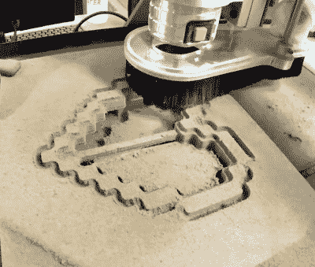

# ESP8266 塞尔达之心回应推文

> 原文：<https://hackaday.com/2018/07/25/esp8266-zelda-heart-responds-to-tweets/>

这可能还不足以让你成为时代英雄，但这件海联互动艺术作品仍将是你游戏室的一个有价值的补充。[Jeremy Cook]写信告诉我们他是如何组装这款 8 位心形显示器的，并详细介绍了硬件和软件方面的内容，您可以根据自己的需要修改他的设计。

 如果有必要的话，你可以用手*切割形状，但是如果你没有 CNC，那么下一个最好的办法就是 3D 打印表壳。不过，根据你的床有多大，你可能不得不把它打印成两部分。无论你用哪种方式制作这个盒子，你都需要从一块丙烯酸材料中切出一个形状来制作面部。*

在任何情况下，一旦这些部分被切下，[杰瑞米]添加一个 Wemos D1 迷你，一个电源，和一些红色 LED 灯条。他提供了一个线路图，但这是相当简单的东西。通过几个 2N2222 晶体管，他直接从 ESP8266 的数字引脚控制 LED 灯条。

软件端设置为通过 IFTTT 由 Adafruit.io 控制。当 IFTTT 在 Twitter 上看到其中一个关键词时，它会向 Adafruit.io 传递一条消息，ada fruit . io 最终会与 ESP8266 对话并让心脏运行。该软件支持三种状态(开、关和半开)，如果您正在寻找一些灵感，它提供了一个在 ESP8266 上实现基本物联网的好例子。

这个黑客似乎非常适合我们去年报道的塞尔达家庭自动化项目。