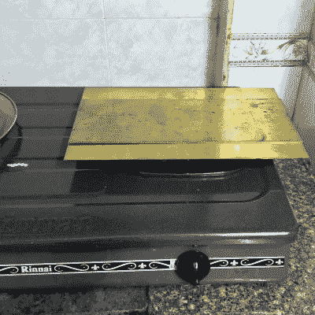
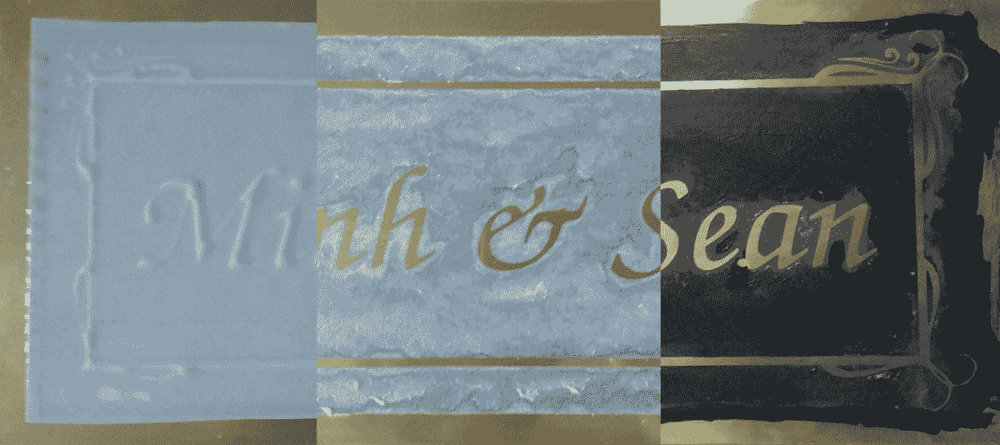
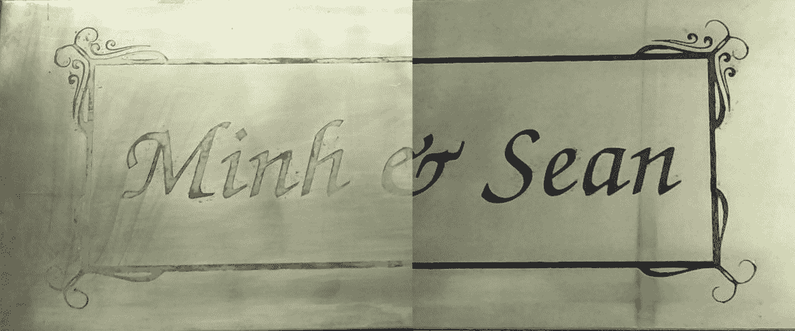

# 蚀刻大型黄铜片比你想象的要难

> 原文：<https://hackaday.com/2019/06/19/etching-large-brass-sheets-is-harder-than-you-think/>

我最喜欢的一种看待工程的方式是，杯子不是半空或半满的，而是需要的两倍大。尽管这个想法很有用，但它也意味着我很少在我的项目的美学方面投入任何努力——我学习或完成我需要的东西，将组件拆下并回收，然后继续前进。我的项目很少是永久性的，定制案例往往是不可重用的，所以我跳过了这些工作和费用。

虽然偶尔，我需要做一个礼物。在这种情况下，形式和功能都成为优先事项。谢天谢地，闪光的并不都是金子——在过去的一年里，我一直在学习蚀刻通常被归类为“黄铜”的铜合金。我们之前已经介绍过一些真正优秀的[蚀刻黄铜片](http://hackaday.com/2018/02/17/the-fine-art-of-acid-etching-brass/)，我受到启发，尝试在不牺牲分辨率的情况下蚀刻更大的金属片(A4 和更大)。我以为这就像蚀刻电路一样。事实上，我经历了几个月的失败尝试，才制作出一个还算过得去的东西！

虽然我仍在努力完善我的技术，但同时我已经学到了足够的东西来做一个报告。如果你觉得生活中需要更多华丽的黄铜标志，请继续阅读。

在亚洲，黄铜是一种非常常见的装饰材料，我可以根据需要以每公斤 9 美元的价格轻松买到各种形式的黄铜。我首先购买了大约 10 公斤的黄铜片、棒和箔，以找出什么是实用的。

第一个教训是，廉价的黄铜防水板，一种 0.2 毫米厚的成卷铝箔，在蚀刻过程中破裂了。锌的反应速度比铜快得多，留下一堆又脆又难看的铜。当我使用更厚的黄铜时，这个问题消失了，通常是 1 毫米到 2 毫米厚，来自中国或台湾，两者都被证明是高质量的。

## 不怎么热

第二个教训是，即使相对较薄的黄铜箔(约 0.2 毫米)也比同等尺寸的 PCB 散热更多。我通常使用墨粉转移法蚀刻电路，大致如这里详述的[。我发现一个熨斗通常不能加热黄铜足够熔化墨粉。我尝试了两种方法来解决这个问题:切换到无热过程和使用高功率加热。](http://hackaday.com/2016/09/12/take-your-pcbs-from-good-to-great-toner-transfer/)

我尝试了三种无热工艺。首先，我简单地买了 UV 光刻胶片，并试图将它们粘在黄铜上。我很快发现我的光致抗蚀剂片很糟糕，几乎不可能避免在光致抗蚀剂和黄铜之间到处形成气泡，即使在水下涂上[光致抗蚀剂](http://instructables.com/id/Photoresist-Dry-Film-a-New-Method-of-Applying-It-t/)。

As a test run, I tried to make a sign for our front door. This was (sadly) the best of many tries with photoresist film.

我推理在光刻胶上画不会有那个问题，但是找不到任何本地的光刻胶颜料来源。结果我买了一些紫外线固化丙烯酸树脂(美甲沙龙用的那种)。不幸的是，固化过程并没有产生一个可用的抗蚀剂:屏蔽紫外线的区域仍然足够硬化，以至于我无法用溶剂适当地清洁黄铜片。尽管如此，我怀疑使用光致抗蚀剂的更好方法，如油漆或喷涂，会产生更好的效果。

我确实发现，紫外线固化丙烯酸树脂固化后作为抗蚀剂效果非常好，尽管它需要一些耐心和一种讨厌的溶剂才能去除。它的一个优点是在紫外线很低的环境下工作时间长。当我有一个可接受的工作流程时，我最终用它来润色。

作为避免高温过程的最后一次尝试，我尝试将大约 15%的二甲苯和 85%的甲醇(二甲苯和水不混溶)的混合物应用到打印纸上，以使墨粉足够粘在黄铜上，按压它，并在浸泡在水中并取出之前让它干燥。碳粉确实变得很粘，有点粘，但我发现它不像加热时那样粘在黄铜上。同时使用有机溶剂和加热对我来说是不安全的，所以我也放弃了这条路。

## 扔进火里

放弃低温过程后，我专注于将黄铜片加热到足够高的温度，以可靠地转移墨粉，而不会严重烧伤自己。除了非常小的黄铜片之外，熨斗或文件层压机不够强大，我对蚀刻大型面板以绘画和用作标志、厨房用具、面板艺术或家具部件感兴趣。

根据以前的经验，我知道 t 恤衫的热压效果相当好——我在钢铁和大型 PCB 板上试过——只需要在衣服边缘做一些润色。然而，热压机现在在我家里没有空间，而且它们也不便宜。谢天谢地，经过一点点的准备和练习，我的煤气炉工作得很好。

关键是把一个 2 毫米厚的大黄铜片放在我的炉子上，然后把较小的那块放在上面，这样压力就可以施加到那块上面的任何一点，而不会有把热金属片从炉子上弹到我身上的危险。在不加热的情况下练习几次是值得的，这样可以确保你的设置像你想象的那样稳定和安全。

我把黄铜加热到能熔化墨粉，但不会烧纸的温度，然后关掉炉子。由于更大的底部纸张像散热器一样，我将纸张碳粉面朝下放在纸张上，在上面放一块棉布，并用擀面杖均匀施压。然后我又把它加热，关掉炉子，重复这个过程，得到一个均匀的结合。

我本可以用我的电炉来加热黄铜，但是煤气炉被证明是快速有效的。

不管怎样，这里有相当多的热金属——类似于把饼干从烤箱中拿出来放在异常厚的烤盘上。它不是灼热的，但是足够热，并且有足够的热量可以让你痛不欲生。你可能需要穿合适的衣服和鞋子。我更喜欢在手边准备一个装满水的容器、烤箱手套和灭火器。

## 润色；补妆

以上的结果是，我可以将墨粉转移到更大更厚的金属片上。可能任何大于 A3 尺寸的都需要改进方法。无论如何，碳粉覆盖范围中有一些小瑕疵。对于一条赛道来说，这是可以的，但在这里它会显著影响外观。

为了修复这些错误，首先我清除了大部分的纸张，这样所有需要蚀刻的区域都完全暴露出来。然后，我用紫外线固化丙烯酸指甲油来纠正任何碳粉明显不结合的地方。我在一个没有紫外线光源的房间里工作，所以我不必担心工作时间。一旦我满意地完成了校正，我就把黄铜片放在太阳底下晒两分钟。接下来，我把黑色的水基丙烯酸涂料涂在这块材料上，然后迅速擦干净，晾干。这里的想法是，仍然有足够的纸纤维粘附在碳粉上，丙烯酸涂料会浸泡一点，并为碳粉覆盖的区域提供额外的保护。同时，它把暴露的黄铜区域擦干净了。这显著地减少了由少量蚀刻剂滑过墨粉引起的麻点。

Left: Sign after removal from stove with water applied. Center: Detergent applied and paper rubbed off. Right: Acrylic paint applied to reinforce etch resist. Note the error on the ‘a’, corrected with UV cure acrylic.

最后，我用胶带封住边缘，以及任何大面积均匀的碳粉，以最大限度地防止蚀刻剂。我可以看到胶带和丙烯酸都有助于将蚀刻剂保持在有用的区域内。我小心翼翼地用海绵蘸了大约 20 分钟的氯化铁。盐酸需要警方文件才能在我的地区购买，早期使用电子蚀刻的实验产生了不令人满意的结果。

蚀刻后，我在户外用二甲苯去除墨粉，背后有一个大风扇。撇开安全不谈，我对哪种有机溶剂的气味最难闻有强烈的看法，而二甲苯是最难闻的。

## 回到黑色

我尝试了两种绘画方法:第一种是使用亚麻子油为基础的灯黑——字面上是花式油画中使用的黑色颜料。这起初产生了最好的结果，但是花费了极其长的时间，当涉及到精细细节时被证明是不切实际的，并且对磨蚀性黄铜抛光具有差的机械抗性。至少也要一周才能干。

另一种方法是用水基丙烯酸涂料大致正确地涂抹标志，让其部分干燥，然后用非常细的砂纸轻轻打磨标志。油漆会倾向于留在你蚀刻的凹槽里。你不停地涂、打磨、再涂，直到你蚀刻的图案被完全涂上。然后你重新擦亮招牌，希望它还在原处。

遗憾的是，我找不到一家卖珐琅油画颜料的商店(想到了画塑料模型的那种颜料)。那可能会好得多。我也考虑过使用黑色蜡笔或密封蜡，然后加热标牌，让它流入蚀刻的凹槽。

最后一步，你可以考虑用清漆保护你的作品，尽管这并不是绝对必要的。我发现油漆保持得很好，足以承受黄铜清洁剂的轻微抛光。现在你可以轻率地用黄铜制造一切，就像在矮人要塞里一样。

我认为一个公平的结论是，在我应用的所有方法中，调色剂转移产生了最好的结果，但是使用 UV 固化蚀刻抗蚀剂应该可以得到显著的改善。墨粉转移的最大问题是抗蚀剂不能完全防止蚀刻剂与黄铜发生反应，尤其是在工件边缘附近。我认为这可以通过在 UV 固化蚀刻抗蚀剂上喷涂或油漆来解决，或者甚至是质量不太可疑的薄膜。

顺便说一下，我后来用这个过程制作的礼物是为一个朋友的婚礼准备的，在仪式的前一天，结果相当不错。几个月的修补带来了幸运的结果，但进展仍在继续。