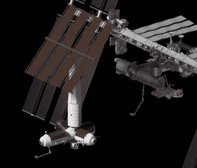

# 扩建并最终取代国际空间站

> 原文：<https://hackaday.com/2020/03/03/expanding-and-eventually-replacing-the-international-space-station/>

在国际空间站(ISS)上，人类已经设法在近 20 年的时间里在低地球轨道上保持不间断的立足点。有些人读到这些话时，已经让国际空间站在他们头上绕了一辈子，他们是出生在一个真正的太空文明中的第一代人。

但俗话说，上去的终究要下来。国际空间站的高度太低，无法无限期地留在轨道上，其核心模块的运行时间已经超过了最初的设计寿命。尽管对相关国家来说这是一个艰难的决定，但在不久的将来，这个耗资 1500 亿美元的轨道前哨站将不得不被放弃。

对于这一天还有多远，自然会有一些争论。美国宇航局正式计划支持该站至少到 2024 年，延长到 2028 年或 2030 年被认为是非常可能的。政治紧张局势使得俄罗斯航天局 Roscosmos 很难做出类似的承诺，但预计他们将继续载人和维护他们的部分，只要美国航天局也这样做。之后，Roscosmos 可能会尝试从国际空间站回收一些模块，以便在未来的空间站上使用。

在即将退役之际，任何新的国际空间站模块都需要在极短的时间内设计和发射。随着美国国家航空航天局的努力和预算目前集中在月球和更远的地方，该机构最近转向私营企业，寻求他们如何最大限度地利用剩余时间的建议。不幸的是，几家参与开发商业空间站模块的公司已经退出，但至少有一个合作伙伴似乎仍然打算坚持到底:Axiom。

该公司的管理层由前宇航员和太空专业人士组成，包括美国宇航局前国际空间站经理迈克尔·苏弗雷迪尼和管理员查尔斯·博尔登，该公司对如何在低地球轨道上取得成功的理解超过了平均水平。大约一个月前，这一操作经验有助于确保美国宇航局选择 Axiom，在 2024 年前为空间站的美国一侧开发一个新的可居住模块。

虽然该协议从技术上来说只涵盖了一个模块，但 Axiom 并没有回避他们的计划。一旦第一个模块安装并运行，他们计划获得美国宇航局的批准，发射几个新的模块分支。最终，他们希望国际空间站的“翅膀”可以分离，并在 2020 年成为独立的商业空间站。

## 谜题的第一部分

作为最近宣布的与美国宇航局协议的一部分，Axiom 将建造的模块将被称为“Axiom Node One”，或 AxN1。它将是现有的*和谐*和*宁静*节点所用设计的稍大版本。这些圆柱形节点不仅提供了生活和工作环境，也是扩展空间站的重要连接点。每一个都有六个通用停泊机制(CBM)端口，可以临时用于 SpaceX Dragon 等再补给航天器，也可以作为另一个模块的永久挂载点。然而，它们不能用于载人飞船，如俄罗斯的联盟号或波音 CST-100 Starliner，因为这些车辆使用主动对接端口，在紧急情况下可以更快地断开连接。

AxN1 节点还计划包括一个所谓的“地球天文台”模块，设想为空间站现有圆顶的一个更大版本。这个观察台不是一个简单的窗口，它的深度足以让宇航员进入并在里面活动。在飞行过程中，天文台将被连接到 AxN1 的前部 CBM 端口，连接后，空间站的机械臂将把它移动到节点的最低点(面向地球)CBM 端口。

但是在安装之前，需要稍微重新安排一下。计划是将 AxN1 停泊在*和谐*模式的前面，但那是目前安装第二个加压交配适配器(PMA-2)的地方。Axiom [最近发布的这段视频显示了他们如何提议将他们的模块连接到 ISS](https://www.axiomspace.com/post/axiom-space-international-space-station-assembly-sequence) ，但它从 PMA-2 已经被移除并且看不见开始(视频中在*和声*顶部看到的 PMA 实际上是 PMA-3)。

 <https://hackaday.com/wp-content/uploads/2020/03/axiomspace-attaching-modules-to-ISS.mp4?_=1>

AxN1 being installed on the ISS[https://hackaday.com/wp-content/uploads/2020/03/axiomspace-attaching-modules-to-ISS.mp4](https://hackaday.com/wp-content/uploads/2020/03/axiomspace-attaching-modules-to-ISS.mp4)

该设备将 CBM 转换为载人飞船的对接端口，这显然是空间站运行所需的能力。因此，PMA-2 将需要在 AxN1 到来之前被转移，只是现在还不清楚它会去哪里。

## 收拾行李搬出去

假设 AxN1 一切按计划进行，ISS 计划得到预期的扩展，该公司计划在 2025 年发射他们的第二个模块。被称为“Axiom 居住模块一”或 AxH1，这个模块将只在两端有端口，并将大部分内部空间用于船员住宿。渲染图像显示 AxH1 的内部提供高科技奢侈品，与 2001 年的*太空* *奥德赛*没有什么不同，尽管出于实际原因，最终模块似乎可能会有更实用的外观。第二年，“Axiom 研究和制造工厂”(AxRMF)将加入这对模块。

Axiom’s completed station separates from the ISS.

如果这看起来像是启动和安装新空间站模块的极快速度，那是因为它确实如此。等到 AxN1 和 AxH1 安装完毕，国际空间站可能只需要两三年就要退役了。如果该公司有任何机会利用现有的车站基础设施作为跳板，帮助建立自己的自我维持部分，他们需要快速行动。

在这个假想的 Axiom 商业空间站脱离国际空间站并独立运行之前，它需要电力。Axiom 模块的概念图显示，它们都将以集成的太阳能电池板为特色，以支持基本功能，但在空间站上进行任何有用的科学或制造都需要更多的能量，而他们无法提供。还需要有一种方法让空间站散发所有由飞船上的人和设备产生的热量。

因此，长期计划是增加一个可扩展的模块，它带有自己的大型光伏阵列和热辐射器，一旦国际空间站离开，它将接管这个模块。由于该阵列可能会在 Axiom 段分离之前部署，它将安装在 AxN1 的天顶(面向太空)端口上，并垂直延伸，因此不会干扰空间站的太阳能电池板“翅膀”。

## 对轨道业务开放

Axiom 的计划有很多步骤需要非常快速地进行，成功还远不能保证。但假设一切顺利，没有人抢先一步，到 2030 年，该公司应该会自豪地拥有世界上第一个商业空间站。这将是一项非凡的技术成就，也是太空民主化的一个历史性时刻。但是一个商业前哨站要想有意义，显然需要有顾客。那么谁付钱呢？

The view is phenomenal, but it’s certainly not cheap.

船员舱看起来像是受科幻小说的启发，还有一个足够大的观景台，可供多人自由漂浮在里面，毫无疑问，Axiom 已经盯上了太空旅游。如果像马克·舒托沃尔斯和理查·盖瑞特这样的人愿意花数千万美元在国际空间站呆上几天，这个目的地拥有船舶机舱的所有舒适和奢华，一个真正的“太空酒店”的潜在票价可能是巨大的。

但是很少有人能负担得起这样的机会，其中只有一小部分人愿意真正坐上火箭去旅行。毫无疑问，一些更富有的科技企业家会愿意预订在船上短暂停留，但仅此一项不足以支付建造和运营空间站的费用。

有点讽刺的是，在可预见的未来，Axiom 最大的客户可能会是 NASA。国际空间站的退役并不意味着低地球轨道科学的终结，它只是意味着必须在其他地方完成这项工作。所有那些 NASA 自己进行或为其他机构协调的研究都需要一个新家，而 Axiom 站可能就是它的归宿。

该机构目前每年花费 30-40 亿美元维护和支持国际空间站，约占其年度载人航天预算的一半。如果 2030 年后，即使其中的一小部分可以被指定用于购买商业空间站的时间，那么像 Axiom 这样的商业运营商将至少有一个可以指望的重量级客户。