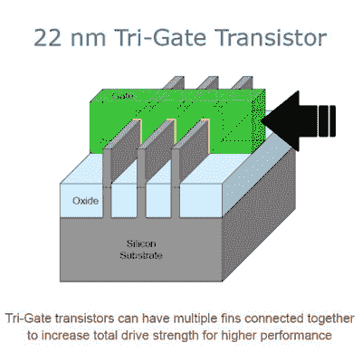

# 从 AMD 和 Intel 那里提取一个门

> 原文：<https://hackaday.com/2020/12/01/extracting-a-gate-from-amd-and-intel/>

英特尔和 AMD 之间的竞争在过去几年中不断升温，因为英特尔发布了采用 14 纳米++工艺制造的芯片，而 AMD 一直在使用 TMSC 的 7 纳米工艺。在这两家半导体巨头发生冲突之后，一场关于 14 纳米++和 7 纳米孰优孰劣的辩论已经展开，人们对这些数字实际上衡量了什么有些困惑。不要轻信这些数字的表面价值，[der8auer]决定[从英特尔和 AMD 的最新产品中提取一个晶体管](https://www.youtube.com/watch?v=1kQUXpZpLXI&ab_channel=der8auer)来尝试揭示一些东西。

很多困惑来自于 FinFET 工艺的转变。虽然旧的平面晶体管可以被认为主要是二维结构，但 FinFET 是三维的。这意味着整个垂直鳍可以作为一个门，大大减少泄漏。[德尔 8 奥尔]追求的就是这个鳍或门。在每个芯片上，从 L1 高速缓存中选择一个薄片，因为高速缓存往往是相当同质的部分，其晶体管相当指示芯片的其余部分。从铂气体与芯片表面的聚焦离子束相交开始，[der8auer]在几个小时内建立了一个小的铂沉积。当他稍后以某个角度切割晶片时，这些沉积物会保护晶片，形成 100 微米长的薄片。为了让扫描电子显微镜正确成像，它需要更薄(大约 200 到 300 纳米)。

最终，[der8auer]最终能够测量这两个芯片的栅极高度、宽度、间距和其他方面。这个项目中的工程和分析数量惊人，我们喜欢深入研究构成我们使用的处理器的实际门。如果您想深入了解处理器的内部，但也许是在更宏观的层面上，为什么不了解一下 20 世纪 70 年代被遗忘的英特尔芯片呢？

 [https://www.youtube.com/embed/1kQUXpZpLXI?version=3&rel=1&showsearch=0&showinfo=1&iv_load_policy=1&fs=1&hl=en-US&autohide=2&wmode=transparent](https://www.youtube.com/embed/1kQUXpZpLXI?version=3&rel=1&showsearch=0&showinfo=1&iv_load_policy=1&fs=1&hl=en-US&autohide=2&wmode=transparent)

感谢[paulvdh]发送此邮件！