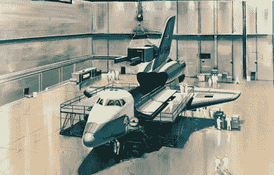
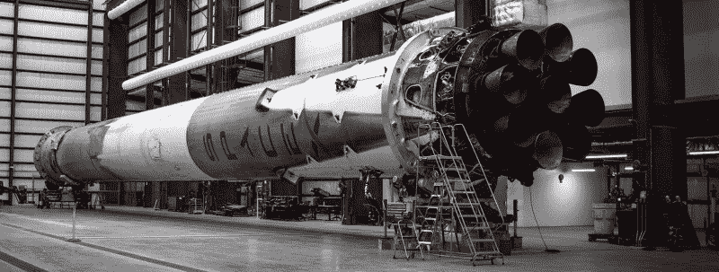
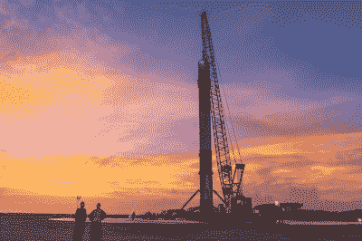

# 猎鹰 9 号打破了航天飞机的反光记录，但仍有很长的路要走

> 原文：<https://hackaday.com/2020/07/27/falcon-9-beats-shuttles-reflight-record-but-still-has-a-long-way-to-go/>

简而言之，任何可重复使用的助推器的目标都是降低将有效载荷送入太空的成本。人们经常把它与商业航空相提并论:如果你不得不在每次飞行后扔掉飞机，没人能买得起机票。事实上，飞机可以加油，并一再飞行，让运营商摊销其高昂的前期成本。

理论上，这同样适用于轨道火箭。有了足够的飞行经验，你就能弄清楚飞行器的哪些部分需要更换或修理，以及更换或修理的频率。假设燃料足够便宜，并且翻新的成本不超过建造一个新的成本，最终助推器将会收回成本。你只需要一个稳定的付费客户流，鉴于我们对太空基础设施的依赖程度，这几乎不是一个挑战。

但是有一个问题。为了让客机的类比真正发挥作用，无论火箭在任务之间需要什么样的检查和维修，都必须尽快完成。如果你一年只能飞几次，重复使用带来的成本节约就没那么有吸引力了。真正实现太空无障碍的关键不仅仅是建造一个可重复使用的火箭，而是实现快速重复使用。

这正是 SpaceX 目前的处境。多年来，他们已经掌握了猎鹰 9 号第一级的着陆，他们甚至证明了回收的助推器可以安全地重新用于其他飞行。但是翻新的过程仍然相当漫长。虽然他们的最新发射正式打破了之前由航天飞机*亚特兰蒂斯*创下的太空交通工具最快返航记录，但如果 SpaceX 要像飞机一样驾驶他们的火箭，还有很多工作要做。

## 不是的太空卡车

当它被开发时，美国宇航局设想航天飞机是一种“太空卡车”，可以每周飞往低地球轨道执行任务。科学家和工程师们不需要等待数年，就有机会飞行他们的有效载荷，只需将它绑在下一次预定的航天飞机飞行的后面。巨大的货舱确保了无论谁想乘坐都有足够的空间。美国宇航局希望完全跳过客机的类比，将他们的可重复使用的航天器与长途运输进行比较。

Flight preparation as imagined by early Shuttle concept art.

但是当然，这从来没有发生过。航天飞机是一种极其复杂的交通工具，可以说是人类有史以来制造的最复杂的机器；据说，即使在 30 年计划结束时，工程师们仍然在每次飞行后学到一些新的东西。由于系统中有如此多的组件，很难预测每个轨道飞行器返回地球后需要什么样的维修，这使得飞行之间的翻新过程比 NASA 预期的要昂贵和耗时得多。

最后，通常需要几个月的时间来准备每架航天飞机的下一次任务。有一种预期是，随着地面团队获得对飞行器的经验，飞行之间的时间将会减少，但实际上，情况恰恰相反。同一轨道飞行器的两次飞行之间最快的往返是在 1985 年，在新建造的*亚特兰蒂斯*的第一次和第二次飞行之间，STS-51-J 和 STS-61-B 任务之间间隔了 54 天

随着项目的进行，特别是在 1986 年“挑战者号”和“T2 号”不幸失事后，美国国家航空航天局不断变化的安全文化要求对这个国家唯一的载人航天器进行更加严格的检查。有翼轨道飞行器的固有缺陷是部分原因，因为在许多故障模式下，机组人员生还的机会被认为是不太可能的。失败真的不是航天飞机的一些系统的选项；要么他们工作完美，要么七名宇航员几乎肯定会死亡。所以他们慢慢来。

## 回归基础

尽管猎鹰 9 号是世界上最现代化的火箭之一，但与航天飞机相比，它的设计非常简单。没有带翼轨道飞行器，没有固体推进剂助推器。虽然它的第一级有九个引擎，但它们比航天飞机上使用的三个巨大的 RS-25 引擎小得多，也不复杂。除了增加硬件以促进其推进着陆之外，猎鹰 9 号可以被视为回归太空时代的“经典”火箭设计，但受益于现代建造技术。

尽管如此，猎鹰 9 号第一阶段大约九分钟的亚轨道太空往返之旅并不是愉快的巡航。即使有这样一个相对简单的助推器，也需要做大量的工作来确保它为下一次飞行做好准备。虽然 SpaceX 公司对之前发射的第一级返回飞行投入了多少资金和精力异乎寻常地守口如瓶，但我们确实知道他们平均需要几个月才能完成这项工作。

A recovered Falcon 9 being prepared for its next flight.

话虽如此，但步伐肯定在加快。2017 年，检查、翻新和验证第一个重复使用的助推器只花了不到一年的时间。相比之下，最近将韩国的 ANASIS-II 卫星送入轨道的猎鹰 9 号就是在前 51 天[将美国送回载人航天的同一枚火箭。在保持了 35 年的记录后，航天飞机正式失去了历史上最快速可重复使用的航天器的头衔。](https://hackaday.com/2020/06/01/nasas-long-delayed-return-to-human-spaceflight/)

## 崇高的目标

猎鹰 9 号可能已经在自己的游戏中击败了航天飞机，但 SpaceX 仍然必须大大加快步伐，如果他们要达到埃隆·马斯克所说的 2019 年目标，即在着陆后 24 小时内重新发射第一级助推器。

> 我们打算在不迟于明年的 24 小时内演示同一个猎鹰 9 号运载火箭的两次轨道发射。我认为，在一天之内两次发射相同的轨道级火箭将是非常了不起的。

我们现在已经过了 2020 年的一半，SpaceX 仍然没有达到那种发射节奏。下一次发射重复使用的猎鹰 9 号可能会打破他们刚刚创造的 51 天记录，但只是几天而已。正如美国宇航局低估了每周发射航天飞机任务的难度一样，SpaceX 完全有可能，甚至可能永远不会实现他们在 24 小时内发射两次的目标。甚至可以说，对于每天飞往近地轨道的航班，没有足够的行业需求。

The first recovered Falcon 9 in 2015.

但这并不意味着没有改进的余地。在 2015 年猎鹰 9 号首次成功着陆的短短几周内，SpaceX 对飞行的助推器进行了彻底的检查，将其返回发射台，并[点燃了所有九个引擎以测试它们的性能](https://spaceflight101.com/returned-falcon-9-booster-fires-up-for-static-fire-test/)。

没有尝试实际发射助推器，但这从来不是重点。在将公司的未来寄托在可重复使用的概念上之前，他们想回答一个简单的问题:实际上是否有可能给一枚刚刚将有效载荷送入轨道返回的火箭加油并重新点火。

显然，他们对测试结果很满意。这是证明猎鹰 9 号可以安全重复使用的重要一步，并为 SpaceX 仍在完善的着陆后检查和翻新过程奠定了基础。现在的挑战是简化流程，这样他们就可以像第一次尝试时那样缩短周转时间。这将意味着在美国宇航局失败的地方再次取得成功，但 SpaceX 最近似乎在这方面越来越好。