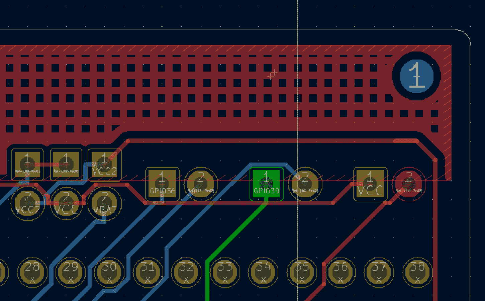
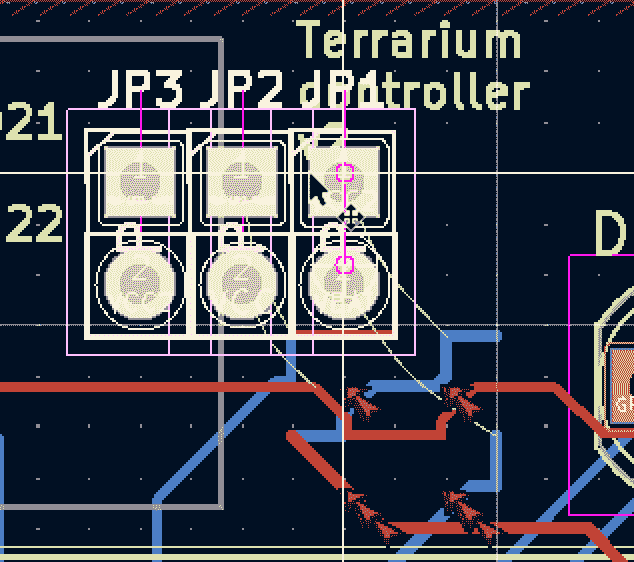

# 感受 KiCad 6 的电力

> 原文：<https://hackaday.com/2021/02/04/feeling-the-kicad-6-electricity/>

2018 年，当 KiCad 版现代化了尊者 4。x 系列，它有助于推动 KiCad 成为我们今天所知的开源 EDA 领域中稳定而高效的一员。它通过简单和复杂的电路板设计为用户提供支持，就像一个手柄被磨损成完美手柄的工具，它已经变得熟悉和舒适。对于那些没有生活在夜间构建的出血边缘的 KiCad 用户来说，版本 6 的时间就要到了可能并不明显，但是随着我们 2021 年的开始，它很快就要来临了。本月早些时候[Peter Dalmaris]发布了第 6 版变化的预览，我们不得不承认，这将是一个非常重要的版本。

不要误会，这篇博文可能是 KiCad 新特性的预览，但是这篇博文本身的覆盖面很广。我们还没有花时间玩这个版本，所以我们不能保证完整性，但打印长度近 100 页，很难想象[彼得]遗漏了什么！我们浏览了这篇文章，从中提取了一些精选的内容用于复制，但是如果你和我们一样兴奋的话，显然要看看出处。

## 没有像(0，0)这样的地方

The mythical hatched fill

从基础开始，KiCad 6 终于要带来可配置的坐标系了！我们发现，对于新用户来说，一个重要的绊脚石是默认的 KiCad 坐标从左上角开始，而不是像大多数 Cad 和绘图工具那样从左下角开始。

版本 6 将允许用户重新定位原点以及翻转任一轴，允许最大的序数自由度。很明显这并不需要太多就能让我们兴奋起来，不是吗？

## 主要是圆形痕迹和填充区域

KiCad 中另一个历史上缺失的特征是曲线轨迹。V6 移动了一部分，允许轨迹有圆角。这并没有完全达到 70 年代的时髦曲线，但这是朝着正确方向的进步。

类似地，填充区域的方式也有了新的变化。现在有了第二种选择，而不是被迫填充固体；阴影填充！我们说越多越好！下一站；红心，星星和马蹄铁？

## 与团体聚会

A flock of grouped components in layout

这可能看起来微不足道，但任何在布局过程中仔细安排过组件组的人都应该理解这一点；项目可以分组！总是可以选择多个元素并将它们拖到一起，但是一旦选择改变，分组就丢失了。在 KiCad 6 中，组件可以被显式地分组，允许你一次性地、永久地移动那些讨厌的标题。

## 信号总线

即使在使用版本 5 多年后，KiCad 原理图中的信号总线看起来就像一只丑陋的小鸭子，用法如此笨拙，以至于不值得使用。[Peter]的概述告诉了我们一些我们在“增强的总线处理”标题下不知道的关于旧工具的新东西。例如，旧版本 5 允许用户以文本方式指定网络名称以通过总线连接，而不是强制使用总线入口连接和单独的网络标签。

版本 6 使总线变得更加强大。现在可以指定共享一条总线的更复杂、更不统一的网络名称，并且上下文菜单中有图形挂钩，允许您从总线“展开”单个网络，而无需第 5 版中所需的猜测。另外，在版本 6 中，总线的视觉风格可以改变。我们很高兴开始一起得到我们的信号！

## 这不是所有的人

咻，多长的名单啊！这只是 KiCad 6 改进的一小部分，或者说是[Peter]的精彩文章的一部分。

值得注意的是，这篇文章是基于 5.99 版本的每夜构建。在正式发布之前，特性和功能会有所变化，但是如果有什么吸引你的话，一切都可以在每夜的构建中公开试用。