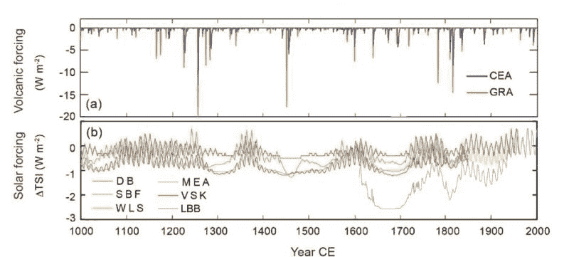
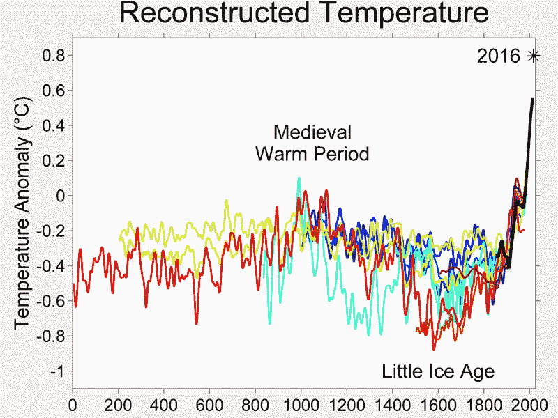
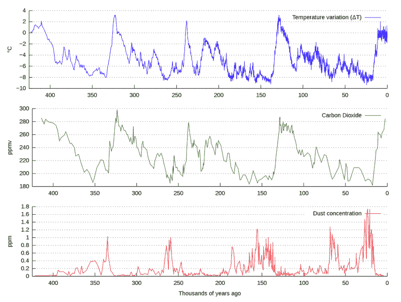
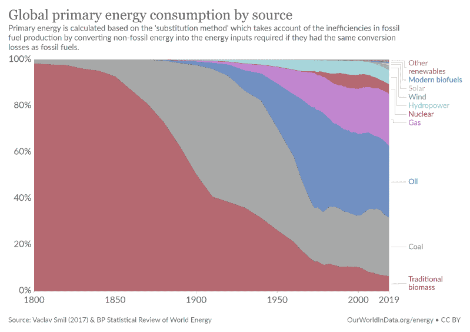
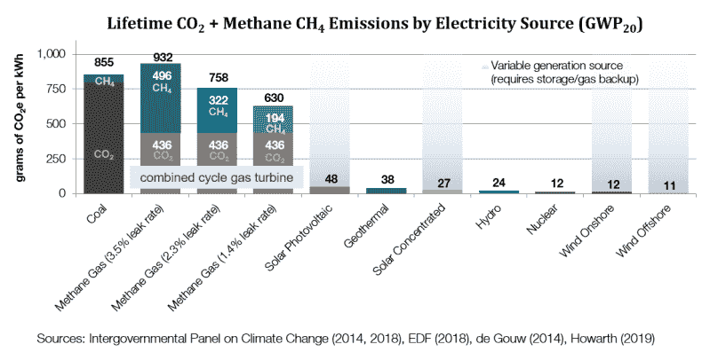

# 通过古气候学了解地球过去的气候及其对今天的启示

> 原文：<https://hackaday.com/2021/08/11/figuring-out-earths-past-climate-through-paleoclimatology-and-its-lessons-for-today/>

大约 46 亿年前，地球获得了它的第一个大气层，然而这是一个完全不同于我们今天所知的大气层。我们今天熟悉的富氧大气直到 2500 至 54100 万年前的元古代才形成，当时产氧细菌杀死了来自前太古代的大量先前繁荣的生命。

这一点，加上对大型昆虫的研究，如来自二叠纪的 75 厘米翼展 [*巨型神经虫*](https://en.wikipedia.org/wiki/Meganeura) 蜻蜓，以及通过[古气候学](https://en.wikipedia.org/wiki/Paleoclimatology)重建的温度、氧气和二氧化碳水平，表明在某些时期，地球的大气和伴随的气候对我们人类来说是不可识别的。

人类历史只涵盖了地球历史上极小的一部分，可以说是后者最寒冷、最少事件的时期之一，然而人类活动(人为的)气候变化现在有可能迅速改变这一点。但是等等，我们怎么知道这么长时间内的气候是怎样的呢？让我们来看看我们是如何设法重建地球古代气候的，以及这些发现对我们今天作为一个物种的前景意味着什么。

## 欢迎来到全新世

当前的地质时代被称为[新生代](https://en.wikipedia.org/wiki/Cenozoic)(也称为哺乳动物时代)，包含 6600 万年，分为三个时期:

*   古近纪:6600-2303 万年前
*   新近纪:23.03-2.58 百万年
*   第四纪:2.58 年至今

第四纪大致形成了可识别人类存在的时期，由两个时代组成:

*   更新世(2.58 百万年——11，700 百万年)
*   全新统(11，700–今天)

一些人建议我们承认一个新的地质时代，称为人类世(“人类时代”)，它将被定义为人类活动首次开始在地质记录中留下重要痕迹的时代。尽管仍然是激烈辩论的主题，但研究人员正在地质记录中寻找一个所谓的“金穗”，它可能由放射性核苷酸、重金属、粉煤灰和类似的发现组成，这将表明 20 世纪早期人类活动在 T2 的兴起。

如果人类世成为当前新的纪元，它的开始时间可能会在 20 世纪 50 年代左右。然而，就地球目前的气候和全球气温而言，全新世和某种程度上的更新世可能是我们最好的指标，可以说明什么是目前的“正常”，什么是所谓的“作用力”的结果。这些影响迫使全球温度高于或低于原本的温度，从火山爆发、流星撞击、太阳活动到人类活动。

Reconstructions of volcanic forcing and total solar irradiance from proxies. (Source: IPCC fifth assessment report)

正如美国国家海洋和大气管理局(NOAA)的国家环境信息中心(前身为 NCDC)所解释的那样，过去 1000 年的[营力模式相当清楚。当比较太阳活动(通过冰核和树木年轮中的放射性同位素 ^(14) C 和 ^(10) Be)以及火山爆发(通过硫酸盐(SO[4]2-)层)的影响时，在模拟中有很强的相关性，直到 20 世纪。](https://www.ncdc.noaa.gov/global-warming/last-1000-years)

基于十几项已发表的研究，这一点在下面的全球气温对比中更加明显:

A comparison of 11 different published reconstructions of changes during the last 2000 years. ([Source with references](https://en.wikipedia.org/wiki/File:2000_Year_Temperature_Comparison.png), CC BY SA 3.0)

## 代理气候

虽然前面的图表表明，在 20 世纪和当前的 21 世纪观察到的全球气温上升并不是由太阳活动增加或类似的积极影响造成的，但使用地球过去 5 亿年的[地质温度记录](https://en.wikipedia.org/wiki/Geologic_temperature_record)将这种急剧上升置于背景中是恰当的:

Global average temperature estimates for the last 540 My (Author: [Glen Fergus](https://en.wikipedia.org/wiki/File:All_palaeotemps.svg), CC BY SA 3.0)

就像过去的一千年一样，这些温度是通过[气候代理](https://en.wikipedia.org/wiki/Proxy_(climate))重建的:地质和其他标记以某种方式记录了特征，从这些特征可以推断出气象测量值(例如温度)。这些替代物中的每一个都有一个限制，它们可以带我们回到多远的时间，要么通过标记物的逐渐(放射性)衰变，要么因为有多少替代物存在(例如，冰盖的厚度和年龄)。

在这些替代物中，[冰芯](https://en.wikipedia.org/wiki/Ice_core)可能是最著名的。这些可以将我们带回到大约 80 万年前，并为我们提供来自被困气泡的特定时期的空气样本。此外，沙子和灰烬等杂质可以提供大气事件的线索——我们自己的 Jenny List 写了一篇关于[如何在高山冰川](https://hackaday.com/2020/04/17/how-can-heavy-metal-fly/)中发现 13 世纪人类冶炼活动产生的铅的文章。这使我们能够使用[东方站](https://en.wikipedia.org/wiki/Vostok_Station#Ice_core_drilling)冰芯构建如下图表:

Graph of CO2 (green), reconstructed temperature (blue) and dust (red) from the Vostok ice core for the past 420,000 years. (Source: Petit et al., 1999)

这张图表涵盖了过去 420，000 年，CO [2] 水平保持在远低于 300 ppm(百万分之一)。今天(截至 2021 年 6 月)的大气二氧化碳 [2] 测量值[远远超过 410 ppm](https://climate.nasa.gov/vital-signs/carbon-dioxide/) 。在没有其他强迫事件的情况下，这可能可以解释全球气温的快速上升。通过[辐射强迫](https://en.wikipedia.org/wiki/Radiative_forcing)CO[2]水平连同类似气体如甲烷(CH [4] )是一个明显的原因。这种效应通常被称为“温室效应”。

虽然地球的大气层以这种方式保持温暖，以维持生物圈和其中脆弱的生命，但通过改变辐射力的大小，这可能导致全球气温的急剧上升或下降。例如，这见证了寒武纪(541 Mya–485.4 Mya)的大气二氧化碳(T2)含量约为 4,500 ppm，全球温度比 19 世纪工业化前的温度高 7 摄氏度。

另一个这样的最大值是古新世-始新世极热期( [PETM](https://en.wikipedia.org/wiki/Paleocene-Eocene_Thermal_Maximum) )，在 55.5 Mya 左右，全球温度显著升高了 5–8°C。这与火山活动和地球碳循环的重大变化有关。这些变化的结果是许多物种的大灭绝。

很明显，地球的气候比今天要温暖得多，大气中的二氧化碳含量也比今天高得多，那么今天的变化到底是怎么回事，以及保持全球气温上升低于 3 摄氏度的目标是什么？这里的答案可以通过指出地质记录中发现的这些大灭绝和认识到人类仅在过去 30 万年中进化，给予或采取一千年来简洁地总结。

## 栖息地破坏

进化的标志之一是物种进化以适应特定的环境。随着地球气候在两个极端之间变化，某些物种会发现他们没有能力应对这些变化。这可能涉及温度的下降或上升，氧气水平的变化(这可能导致*巨型蜻蜓灭绝)，以及通过像[沙漠化](https://en.wikipedia.org/wiki/Desertification)这样的事件对栖息地的破坏。*

 *虽然人们可能会对气温上升嗤之以鼻，并考虑到我们拥有的空调等令人惊叹的技术，但要记住的是，40°C(104°F)的[体温](https://en.wikipedia.org/wiki/Human_body_temperature)被视为医疗紧急情况，当暴露在 35°C(95°F)的[湿球温度](https://en.wikipedia.org/wiki/Thermoregulation)下超过 6 小时时，人类的体温调节可能已经失效，从而导致致命的高热病例。

史蒂文·c·舍伍德(Steven C. Sherwood)等人发现，由于热应力，地球表面的许多地方[可能变得不适于居住](https://www.ncbi.nlm.nih.gov/pmc/articles/PMC2906879/)，甚至对人类是致命的。除了人类，其他动物和所有植物也会暴露在这些温度下。虽然我们可以把自己放在有空调的房间和汽车里，但我们不能对牲畜、庄稼和整个生态系统做同样的事情。最终，仅仅几百年后，这可能导致自 PETM 以来最严重的灭绝事件。

## 人类世的结束

有人可能会想，什么样的金色尖峰会预示着人类世(之前提到的激烈争论的“人类纪元”)的结束和一个新纪元的开始。悲观的观点认为，人类可能无法见证这一变化，因此这可能无关紧要。对于乐观的观点，有一种观点认为，这可能是人类找到了一种方法，避免产生最终会破坏人类赖以生存的栖息地和气候的作用力。

在这里，减少污染，特别是减少向大气中释放 CO [2] 和 CH [4] 等气体，通常被认为是防止 Steven C. Sherwood 等人所描述的最坏情况的最有效方法。然而，这种方法也被证明是极其困难的，正如人类持续使用化石燃料所证明的，化石燃料被认为是这些碳基气体的主要来源: 

显然，今天为人类社会提供动力的绝大多数能源来自化石燃料来源，在此之前，这些能源来自传统的生物质(即燃烧木材等)。每种能源都有自己的“碳预算”，当我们查看这些能源在电力生产中使用时的生命周期碳排放量时，我们可以看到:

如果我们希望迅速减少大气中一氧化碳和甲烷的含量，我们应该更多地使用右边的来源，而不是左边的来源。尽管我们作为一个物种不愿承认这一点，但此时此刻，在地质气候记录的边缘，人类是地球气候的主要驱动因素。

虽然改变气候是一个非常独特的特性，自从元古代细菌通过产生有毒氧气消灭了地球上的大部分生命以来，它还伴随着一定程度的责任。在这里，我们有一个极好的机会来证明人类实际上是智慧生命的顶峰。*