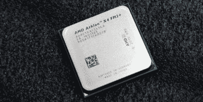
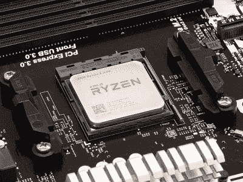

# AMD 平台安全处理器的缺陷影响了数百万台计算机

> 原文：<https://hackaday.com/2021/10/01/flaw-in-amd-platform-security-processor-affects-millions-of-computers/>

又一天，又一个弱点。这一次，轮到 AMD 了，它的大量现代 CPU 系列成为一个危险的驱动程序漏洞的受害者，该漏洞可能使个人电脑面临各种各样的攻击。

[据 TechSpot](https://www.techspot.com/news/91322-millions-amd-pcs-affected-new-cpu-flaw-need.html) 报道，该缺陷存在于 AMD 平台安全处理器(PSP)的驱动程序中，并可能通过允许攻击者从内存中窃取加密密钥、密码或其他数据而使系统易受攻击。今天，我们将看看 PSP 的作用是什么，以及这个漏洞如何被用来对付受影响的机器。

## 究竟什么是 PSP？

AMD 平台安全处理器在功能上相当于我们之前讨论过的英特尔管理引擎(ME)。 AMD 将 it 称为“负责创建、监控和维护安全环境”的子系统它由一个嵌入主 CPU 芯片的 ARM 微控制器内核组成，与主系统内存、IO 和 CPU 寄存器接口。

简而言之，它是一个协处理器，可以访问它所在的计算机的几乎每个部分。这使得它成为攻击的主要目标。在 2013 年左右推出，它也是完全封闭的源代码，作为现代 AMD CPUs 中的一个未知黑盒存在，这使得安全意识非常警惕。PSP 运行在底层，完全在主 CPU 和操作系统的权限之外，就像 IME 一样，通常被认为是机器的潜在后门。

多年来，CPU 一直在增加安全功能，其他技术包括 AMD 的安全内存加密和英特尔的系统防护扩展。这些子系统允许内存分区，并保证特殊用途。然而，这些特性也被证明容易受到攻击。

## 漏洞的工作原理

The now-ancient Athlon X4 is listed as one of the earliest chips affected by the vulnerability.

该漏洞存在于一系列 AMD 芯片组中。根据 AMD 自己的披露，它影响了从现代锐龙处理器到芯片的一切，至少可以追溯到 2013 年的 AMD Athlon X4。ZeroPeril 有限公司的[基里亚科斯·埃科诺穆]首先向该公司报告了这个问题，他为[准备了一份关于该漏洞的有用报告。](https://zeroperil.co.uk/wp-content/uploads/2021/09/AMD_PSP_Vulnerability_Report.pdf)

该漏洞允许低权限用户访问未初始化的内存。这听起来可能不重要，但未初始化的内存通常充满了先前进程留下的数据，即使计算机已经重新启动或重新通电。这是一种获取加密密钥、密码散列或未分配 RAM 中的所有其他数据的简单方法。

问题的第一部分是当用户使用 AMD PSP 调用 AMD 驱动程序来分配一些未初始化的内存时。当请求初始化一定量的存储器时，驱动程序将请求向上舍入到默认的存储器页面大小，通常大约为 4096 字节。

AMD’s latest Ryzen platforms are also affected. Image credit: [Ilya Plekhanov](https://commons.wikimedia.org/wiki/File:Ryzen_5_1600_CPU_on_a_motherboard.jpg#/media/File:Ryzen_5_1600_CPU_on_a_motherboard.jpg)

如果用户请求初始化 1 个字节，驱动程序会将其向上舍入到 4096 个字节，并分配给用户这么多的内存。然而，它将只初始化第一个字节，其余的保持其先前的状态。然后，用户可以访问未被触及的剩余 4095 字节，从而访问未初始化存储器的内容。

第二个问题涉及到调用驱动程序来释放先前已经分配的连续内存空间。当进行这种类型的某些调用时，驱动程序不会正确地释放分配的内存，而是将它与进行调用的原始进程保持私有关联。这会造成内存泄漏，并可能很快占用大量内存，使其对系统的其余部分不可用。

研究小组能够访问千兆字节的未初始化内存。恢复的数据包括从用户密码哈希到池地址的所有内容，这些内容可以帮助攻击者绕过内核地址空间布局随机化(KASLR)等安全功能，这些功能试图使黑客更难知道在内存中何处找到关键的系统区域。

## 尽早修补，经常修补

幸运的是，下载最新的 AMD 芯片组驱动程序应该足以抵御任何潜在的攻击。AMD 的建议是通过 Windows Update 升级到 ADM PSP 驱动 5.17.0.0，或者下载 AMD 芯片组驱动 3.08.17.735。据推测，这通过在分配期间适当地将内存清零，以及在不再需要时适当地释放内存来解决问题。

总的来说，一个软件补丁足以解决这个问题，它是一个漏洞，缺乏一些更大的发现[的可怕因素，如过去几年的 Meltdown 和 Spectre】。然而，这恰恰表明计算机安全是一个不断变化的目标。总有另一个漏洞潜伏在拐角处。](https://hackaday.com/2018/01/10/spectre-and-meltdown-attackers-always-have-the-advantage/)