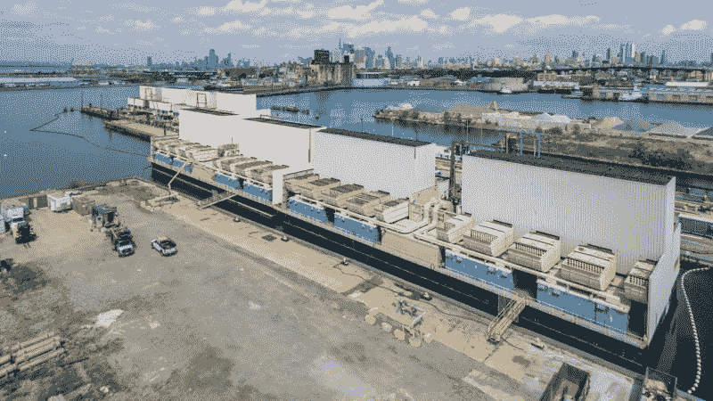
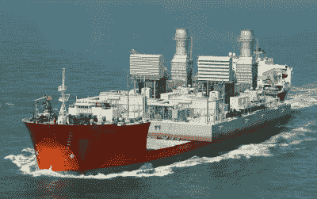
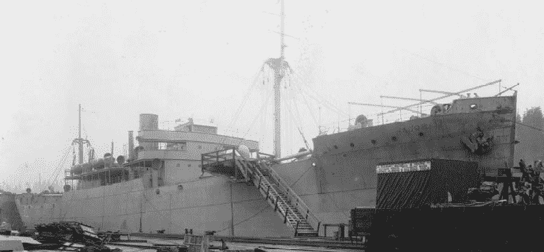
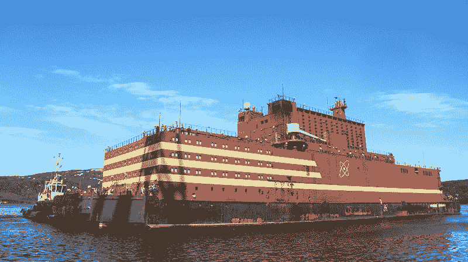

# 浮动发电厂；沿海城市解决方案肯定会越来越受欢迎

> 原文：<https://hackaday.com/2019/10/03/floating-power-plants-the-coastal-city-solution-sure-to-be-increasingly-popular/>

在现有的城市里建造新的东西是很困难的。通常，新的开发意味着拆除现有的结构。对公寓楼或新摩天大楼这样做是一回事，但基础设施要复杂得多，无论是从工程角度还是从经济角度。人们不仅不想为他们可能看不到直接好处的东西买单，而且在拥挤的城市地区很难找到更大的道路、更多的管道或地铁隧道的空间。对于被大多数人视为眼中钉的基础设施来说，比如发电厂或变电站，就更难了。毫不奇怪，世界上一些最大的城市一直在利用浮动发电厂，而不是在陆地上建造它们。

最近一个接受新浮动发电厂(FPP)投标的城市是纽约州(T1)，纽约州正寻求扩充其现有的已经投入运营的驳船发电站。它已经在布鲁克林的 Gowanus 运营了世界上最大的 FPP，能够输出 640 兆瓦的电力。附近还有一座 320 兆瓦的发电厂，新的发电厂将为纽约市的电网增加 8 台 76 兆瓦的发电机。

让我们来看看这些驳船式发电机的设计。

## 发电用航空级零件

Existing power plant barge at the Gowanus generating station in Brooklyn

新的发电厂由西门子生产，使用[“航改式”燃气轮机](https://www.turbomachinerymag.com/aeroderivative-gas-turbines/)发电。航改涡轮，顾名思义，是基于飞机技术，非常类似于喷气发动机。航空领域的高质量材料和高公差被用于制造动力，而不是推动飞机。它们也比柴油活塞发电机等其他类型的发电机更可靠，因为它们的运动部件相对较少。通常情况下，像这样的燃气轮机用于调峰发电，而不是基本负荷，例如在空调运行的夏季下午。它们可以快速开关，不像核电或联合循环涡轮机这样的基本负荷电厂。这些也是浮动的，这带来了半移动的优势，并且不占用城市中有价值的房地产。

这种特殊 FPP 的另一个好处是，它有助于纽约州发电能力的现代化。旧工厂使用几个燃烧燃油的涡轮机。这种燃料最近已经失宠，因为随着水力压裂的兴起，天然气的价格直线下降。据报道，天然气也比燃油更清洁、更高效，缓解了与燃烧化石燃料相关的少量环境问题。

## 码头发电

 也不是所有的浮动发电厂都浮动。一些公司提供类似的基于水的工厂，但实际上是建在永久码头上而不是驳船上。[沃勒海事建造了](https://www.wallermarine.com/floating-power)(除了 FPP 的其他几个设计)这样的自升式工厂，这也有利于液化天然气(LNG)油轮将燃料卸载到港口，而不需要管道或大型陆上储存设施。如果液化天然气是比天然气更受欢迎的燃料，这是一种更有效的方式来处理参与运输这种类型燃料的油轮。

向城市地区输送更多电力的其他一些想法也已经提出，但后勤方面的担忧使它们站不住脚。离岸发电厂已经提出，但是除了风力发电场之外，还没有建成，因为难以通过海底电缆传输电力，维护发电厂，以及其他一些考虑因素。然而，这些问题似乎大多是经济的，并且对风力发电有意义，但是对于化石燃料或核电厂，解决方案似乎是将工厂设在靠近海岸的驳船上，而不是更远的海上，以使物流更容易。输电线路可以简单地从陆地连接到船上，有足够的松弛度以适应潮汐，一些 fpp 实际上包括升压变压器，以直接连接到陆基电网。与架空线相比，海底电缆非常昂贵，而且在大多数情况下，驳船电厂的其他优势超过了海上发电能力。

## 移动中的浮动发电厂

当然，纽约的这些 fpp 并不是世界上唯一的。大型 fpp 在印度、委内瑞拉和许多其他沿海城市也很活跃。它们也不是第一个浮动发电设施。SS Jacona 建于 20 世纪初，在一场暴风雪摧毁了该地区的大部分输电基础设施后，它被改造成一个移动发电厂，以帮助为缅因州的一家当地公用事业公司提供电力。在第二次世界大战期间，它被用于各种目的。第一艘核动力船[号](https://en.wikipedia.org/wiki/MH-1A)建造于 20 世纪 60 年代，并在巴拿马运河投入使用，在 60 年代末到 70 年代，它提供了 10 兆瓦的电力。当缺水使运河部分地区的水电大坝无法运行时，它成为一种宝贵的资源，并允许船只通过运河船闸系统，而不会减少周围地区的可用电量。

阿卡德米克·罗蒙诺索夫浮动核电站【图片 via [现在创新](http://innovatenow.in/2019/04/30/russia-has-successfully-testsworlds-first-floating-nuclear-power-plant/)】

虽然任何核动力船只，如航空母舰或潜艇，都可以在必要时用作浮动电站，但一些专门建造的核动力浮动电站今天仍在建造中，主要由俄罗斯为陆路难以到达的城市提供电力和热量。阿卡德米克罗蒙诺索夫浮动核电站于去年建成，并被送往俄罗斯最东北部的港口小镇佩韦克。由于俄罗斯幅员辽阔，通过铁路运输所有材料并在陆地上建造工厂相对来说太困难了，所以这是一个首选方案。一些人对在海洋中建造核电站表示了合理的担忧，过去海洋中也发生过核事故，但希望核电站的工程师和设计者已经尽最大努力降低了风险。

## 地平线上更多的浮动力量

随着能源需求的增长，尤其是在拥有大型港口的发展中国家，这些核电厂和化石燃料电厂的建设似乎将会增加。从长远来看，即使建造这种类型的工厂的一些不利之处也可能成为优势，例如必须应对飓风和台风。只要它们能够相对快速地移动，它们就可以被带离风暴的路径，然后被带回来，而陆地上的植物可能会遭受更严重的损害。全球变暖导致的海平面上升也将在未来给沿海城市带来挑战，但只要周围的电网基础设施可用，电力驳船和 fpp 将不受这些风险的影响。可以肯定的是，期待在未来看到更多这样的单元。