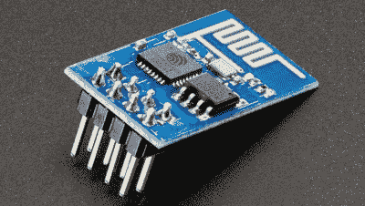
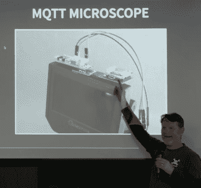
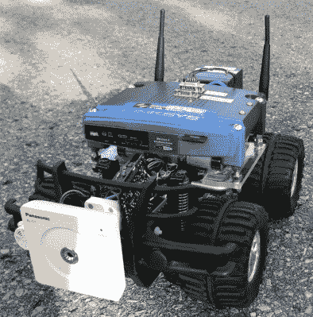

# 找到的镜头:埃利奥特·威廉姆斯谈论 Nexus 技术

> 原文：<https://hackaday.com/2019/11/07/found-footage-elliot-williams-talks-nexus-technologies/>

回到 2017 年超级大会，Hackaday 执行主编埃利奥特·威廉姆斯开始了他关于所谓的“物联网”的谈话，他解释说，他不喜欢这个想法的唯一部分是互联网……和物。这是一个我们大多数人今天仍然会同意的说法。如果说有什么不同的话，那就是在这几年中，情况变得更糟了。商业智能设备现在比以往任何时候都更便宜、更丰富，但似乎很少采取措施来改善它们固有的隐私和安全问题。

但他的讲话并没有抨击生产这些设备的公司，甚至没有抨击那些最终倒闭、留给消费者一堆无用设备的服务。那不是他的风格。*[Nexus Technologies:或者说我是如何学会爱上 WiFi 的](https://www.youtube.com/watch?v=cAHWXy12c54)* 的中心主题是，如果智能家居按照你想要的方式工作，它可以是很棒的东西。Elliot 认为，在低成本模块化硬件和开源软件之间，普通黑客拥有构建自己独立的家庭自动化生态系统所需的一切。一个不仅比他们在大盒子电子商店卖的便宜，而且不邀请任何公司巨头参加聚会的。

当然，并不总是如此。十年前，这几乎是不可能的，而五年前，这又太过昂贵，不切实际。Elliot 详细描述了他迈向真正个人智能家居的旅程，他解释了硬件和软件的进步，这些进步不仅使 DIY 成为可能，而且变得触手可及。真正的收获是，一旦更多的人意识到推出自己的智能家居设备是多么便宜和容易，他们最终可能会更愿意把老大哥踢到路边，按照自己的方式做物联网。

这段先前未发表的录音不知何故从编辑室地板的裂缝中滑落，但最近被发现后，它仍然和今天一样相关。看看 Elliot 对 Nexus Technologies 的看法，然后在休息后加入我们，进行更深入的探讨。请务必订阅 Hackaday 的 YouTube 频道，参加 11 月 16 日周六开始的 [2019 Hackaday 超级大会](https://hackaday.io/superconference/)直播。

 [https://www.youtube.com/embed/cAHWXy12c54?version=3&rel=1&showsearch=0&showinfo=1&iv_load_policy=1&fs=1&hl=en-US&autohide=2&wmode=transparent](https://www.youtube.com/embed/cAHWXy12c54?version=3&rel=1&showsearch=0&showinfo=1&iv_load_policy=1&fs=1&hl=en-US&autohide=2&wmode=transparent)

## 紧急救援

任何过去几年一直在阅读 Hackaday 的人可能都不会惊讶地发现，Elliot 将 Espressif 的 ESP8266 视为将物联网带入业余爱好者范围的关键元素之一。[回到 2012 年，我们对电动 Imp](https://hackaday.com/2012/05/17/electric-imp-connects-projects-to-the-internet/) 感到兴奋，因为支持 WiFi 的微控制器和相关的开发板意味着我们可以在互联网上以*仅*35 美元一个的价格获得我们的自制项目。今天，ESP8266 及其开发板的现行价格实际上是它的十分之一。

The face that launched a thousand Things

但新玩家可能没有意识到的是，ESP8266 从未被设计成支持互联网的微控制器的最新版本。事实上，情况恰恰相反。最初，Espressif 打算让 ESP 线路本质上成为其他设备的简单 WiFi“调制解调器”，并配有 AT 命令集。社区中几个专注的黑客的工作使他们成为我们今天拥有的一体化 Arduino 和 MicroPython 兼容物联网神奇芯片。

根据埃利奥特，超感能力的新发现的能力是一个混合的祝福。虽然很难夸大这些低成本 MCU 对 DIY 硬件的影响，但他认为保持简单有其优势。与其让小小的 ESP8266 运行网络服务器和处理十几个不同的任务，他宁愿给每个人一个简单的任务，并将所有这些结合在一起的物流推到一个更高的水平。虽然它们很便宜，但是多任务处理并没有太大的意义。

## MQTT 的崛起

碰巧的是，一堆支持 TCP/IP 的“哑”设备与 Elliot 家庭自动化系统的另一个主要组件 MQTT 完美匹配。这种轻量级的发布-订阅消息传递协议是我们大多数人都曾听说过的东西之一，但可能没有花时间真正仔细研究过。演讲期间的一项即兴调查显示，不到三分之一的与会者积极使用该协议，尽管我们敢打赌今天的数字会更高，但它仍然是相当小众的。

Elliot’s microscope is on the Internet of Things. Is yours?

对于那些对进入 MQTT 的奇妙世界持观望态度的人来说，Elliot 的演讲是将你推向边缘的最佳选择。他的大部分演讲讨论了他是如何部署他的系统的，从他如何使用 MQTT 主题的自由形式、层次性质来逻辑地将他家的区域组合在一起，到在 Raspberry Pi 上安装 Mosquitto 代理的逐步说明。您可能还记得[他关于使用 MQTT](https://hackaday.com/2016/05/09/minimal-mqtt-building-a-broker/) 的由四部分组成的优秀指南。

Elliot 继续解释他的满载 ESP8266 的家用电器和他的 MQTT 经纪人上不断扩大的主题列表之间的协同关系。由于硬件便宜到可以忽略不计，并且能够随时向代理添加新参数，将新设备插入系统成为第二天性。

他继续展示他在 MQTT 支持下建造的许多设备，从一个低调的木制信号器面板，显示他此刻关注的任何变量，到一个数字显微镜，因为按下一个物理按钮会引起太多的运动，所以增加了网络控制。所有这些都是用 ESP8266、一些组件和几行代码构建的。一旦你知道了舞步，跳舞就容易了。

## 黑客的黄金时代

They don’t make ’em like they used to.

几年后回过头来看，Elliot 的演讲是一个路标，大致标志着硬件黑客领域的一场小革命。至少在某些情况下，我们已经到了这样一个地步，构建自己的东西已经变得如此便宜和容易，这不仅仅是因为你在寻求智力挑战，而是因为它很有意义。如果 Arduino 是硬件黑客新时代的开端，那么 ESP8266、Raspberry Pi 和今天可用的大量开源软件已经把我们带上了高速公路；没有迹象表明事情会很快放缓。

事实上，我们有时会怀念硬件入侵的“旧日”时光，那时废弃的 Linksys 路由器笨重地安装在一辆被掏空了内脏的遥控卡车上，而这辆卡车是为令人羡慕的 Linux 机器人平台打造的。可能在座的很多人都有同样的感受。但是，如果我们因为一个项目没有使用石刀和熊皮的数字等价物而对它嗤之以鼻，那我们就是傻瓜。相反，我们应该庆祝这样一个事实，今天，不管他们决定使用什么工具，比以往任何时候都有更多的人有能力建造他们一直梦想的东西。