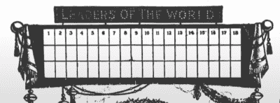

# 弗兰发现了 1910 年的四英尺字母数字显示器

> 原文：<https://hackaday.com/2020/11/13/fran-finds-four-foot-alphanumeric-displays-from-1910/>

视频博主和显示技术大师[Fran Blanche]发现了一个 1910 年的辉煌复古技术[字母数字显示器](https://www.youtube.com/watch?v=u0KZXsZWP0E)。(视频，嵌在下面。)

我们总是喜欢她对古老和不寻常的展示的尝试，包括她的项目[研究和逆向工程阿波罗 DSKY 单元](https://hackaday.com/2017/05/29/re-creating-the-apollo-dskys-display/)。这次[弗兰]挖出了一个 20 世纪早期的惊人广告牌。它是由俄亥俄州代顿市的赖斯电子显示公司建造的，在先驱广场运营了大约两年。这在 1910 年需要 400，000 美元来建造，这在当时显然是一个巨大的努力，毫无疑问是第一个在电脑控制广告牌上出售广告时间的例子。它拥有高约 1.3 米、宽 1 米的字符，可以显示字母、数字和各种标点符号。这些排列成一个 3 行 18 字符的矩阵，大约 27×4 米，这只是整个广告牌的三分之一，广告牌本身就是一个照明和动态的艺术作品。

Diagram Depicting the 3×18 Character Display

在视频中有很多引人入胜的细节，但有几个让我们印象深刻的是 20，000 个灯泡，40 赫兹的显示更新率，150 公里的电线和三个月的安装时间。我们真的很想了解这两个 7.5 千瓦的电动开关控制器，它们是如何编程的，字符片段是如何排列的，它们的形状是什么？

在视频中，你可以看到三角形以某种模式排列，这与更现代的 16 段显示器没有什么不同，尽管正如[弗兰]指出的那样，赖斯的角色更讨人喜欢。我们希望[弗兰]能为未来的视频梳理出更多的细节。如果你对这个展示有任何想法或知识，请写在下面的评论区。视频后的剧透警告…

 [https://www.youtube.com/embed/u0KZXsZWP0E?version=3&rel=1&showsearch=0&showinfo=1&iv_load_policy=1&fs=1&hl=en-US&autohide=2&wmode=transparent](https://www.youtube.com/embed/u0KZXsZWP0E?version=3&rel=1&showsearch=0&showinfo=1&iv_load_policy=1&fs=1&hl=en-US&autohide=2&wmode=transparent)

…这种展示不再存在。