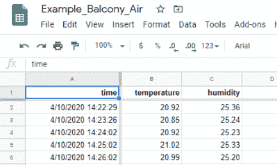

# 免费的云数据记录由谷歌提供

> 原文：<https://hackaday.com/2020/05/11/free-cloud-data-logging-courtesy-of-google/>

将你所有的数据推送到“云端”听起来很棒，直到你想起你真正谈论的是别人的电脑。这意味着，如果运营这项服务的公司破产或改变对你的规定，你所有辛苦处理的数据都可能变得无法访问；不幸的是，这种情况已经发生了。

这使得[Zoltan·多奇]和[罗伯特·萨洛基]的这个项目如此吸引人。它不仅展示了通过管道将你的数据传送到天空中的大数据中心是多么容易，而且它们还将数据发送给了少数几家似乎不会失去市场份额的公司之一:谷歌。但不要担心，这不是一些实验性的传感器 API，大 G 将决定在下周二关闭它，以支持一个名称不同但几乎相同的服务。你所有珍贵的比特和字节都将存储在谷歌的旗舰产品之一:Sheets 中。

 原来，Sheets 有一个“部署为 Web 应用程序”的功能，可以提供一个定制的 URL，客户可以用它来访问电子表格数据。该项目展示了如何在一点 Python 代码的帮助下利用该功能，将数据从 Raspberry Pi 或其他合适的小型计算机直接推送到 Google 的服务器。

这里他们使用的是温度和湿度传感器，但唯一的限制是你的想象力。作为一个额外的奖励，工作表中的图表和图形功能可以用来对您记录的数据进行高质量的可视化，而不需要额外的费用。

您可能想知道，如果全世界的一群黑客开始每隔几秒钟就将数据发送到工作表中，会发生什么。老实说，我们不知道。上一次我们展示了你如何以意想不到的方式与他们的服务互动， [Google 宣布他们在同一天](https://hackaday.com/2019/11/21/print-from-the-esp8266-courtesy-of-google/)让它退役。这可能只是一个巧合，但为了安全起见，我们建议保持相当低的更新频率。

早在 2012 年，在这项服务被称为 Google Sheets 之前，我们就报道过你如何通过手动组装包含你的数据的 HTTP 数据包来做一些非常类似的事情。我们会说这验证了长期数据存储的概念，但显然这种方法在这几年中已经发生了很大的变化。确实是别人的电脑。