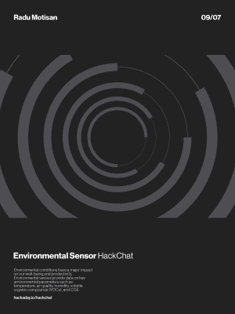

# 周五黑客聊天:环境传感器

> 原文：<https://hackaday.com/2018/09/05/friday-hack-chat-environmental-sensors/>

谈到物联网和机器人，游戏的名字是传感器。这些不仅仅是 IMU 和让机器人移动的东西——我们在这里谈论的是环境传感器。从测量温度、空气质量、湿度的传感器，到化学传感器和辐射传感器，一切都在这里。在本周的黑客聊天中，[我们将和一位硬件设计师一起讨论环境传感器](https://hackaday.io/event/160325-environmental-sensor-hack-chat)，这位设计师已经对它们进行了测试。

 我们本周黑客聊天的嘉宾是拉杜·莫蒂桑。他凭借 [uRad Monitor](https://hackaday.io/project/1662-global-radiation-monitoring-network) 入围了 2014 年 Hackaday 奖决赛，这是一个独立的辐射监测网络，可以将辐射测量结果发送到中央服务器，全世界都可以看到。这个项目的目标是建立一个辐射监测设备的全球网络，我们可以说 Radu 已经成功了。[在 40 多个国家有数百个这样的 uRad 监测器](https://www.uradmonitor.com/)，所有这些监测器都在大量生产关于他们所在地区辐射环境的数据。

通过培训，Radu 成为了一名拥有理科硕士学位的软件工程师。在业余时间，拉杜研究化学、物理和电子。正是这种背景促使 Radu 创建了有史以来最令人惊叹的 Hackaday 奖项目之一。

我们将从讨论 Radu 的 uRad 显示器开始，这意味着我们将涵盖:

*   辐射检测，为什么重要，意味着什么？
*   你如何检测辐射？
*   盖革-米勒管和闪烁体的区别

当然，我们鼓励你在讨论中提出自己的问题。您可以在[环境传感器黑客聊天事件页面](https://hackaday.io/event/160325-environmental-sensor-hack-chat)上发表评论，我们会将该评论放入黑客聊天讨论的队列中。【T2

我们的 Hack Chat 是在 [Hackaday.io Hack Chat 群发消息](https://hackaday.io/messages/room/2369)上的实时社区活动。本周和以往一样，我们将在太平洋时间 9 月 7 日星期五中午聚集在我们的视频终端前。需要倒计时器吗？[实际上，我们应该考虑在 hackaday.io 上托管这些倒计时器。](https://www.timeanddate.com/countdown/generic?iso=20180907T12&p0=137&font=cursive)

点击右边的语音气泡，你会被直接带到 Hackaday.io 上的黑客聊天群。

你不必等到星期五；随时加入，你可以看到社区在谈论什么。