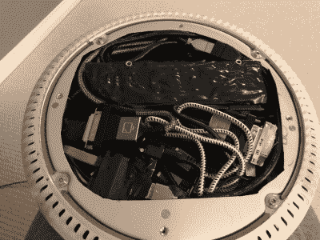

# G4 IMac 接受 M1 心脏移植

> 原文：<https://hackaday.com/2022/03/08/g4-imac-gets-an-m1-heart-transplant/>

第二代 iMac 与最初色彩鲜艳的版本大相径庭。笨重的 CRT 美学已经死亡，取而代之的是一个光滑的设计，在一个浮动臂上有一个超薄的液晶显示器。[Connor55]最近接触到了这样一台机器，并决定需要移植一些现代 M1 硬件。

There’s a lot going on in there.

他拥有的这台机器没有无线网络，并且有一个光盘驱动器很难打开自己的托盘，所以它是黑客攻击的一个很好的候选对象。原来的主板和驱动器出来了，为 Mac Mini 的主板留下了空间，以强大的新 M1 片上系统替代。

首先，屏幕必须被转换成使用 DVI 输入，来自[Dremel Junkie] [的指导帮助完成这个](http://www.dremeljunkie.com/2011/08/guide-step-by-step-17-imac-g4-tmds-to.html)。然后，Mac Mini 主板准备安装在 iMac 的圆顶形外壳中；值得注意的是，整个主板比 iMac G4 的硬盘还要小。它仍然需要大量的填鸭式训练，大量的适配器被欺骗和按摩，以适应原来的外壳。

这是一个非常完整的建筑；甚至像原来的电源按钮和光驱这样的功能仍然有效。它花了一些时间，但显示屏和背光也按照原来的功能正常工作。

事实证明，苹果有品位的工业设计一直很受改装者的欢迎。这些年来，我们已经看到过类似的构建，从 G4 iMacs 中的英特尔 nuc 到配备 iPad 硬件的 T2 经典 MAC。看到古老的硬件被现代的咕噜赋予新的生命总是令人满意的！