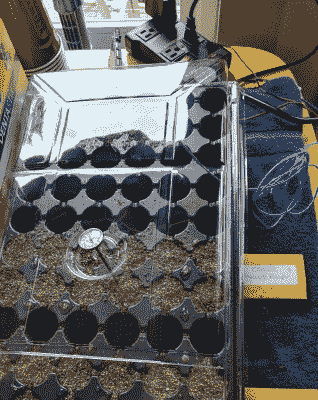

# 用 Arduino 实现自然园艺

> 原文：<https://hackaday.com/2019/04/12/gardening-as-nature-intended-with-an-arduino/>

在 Hackaday，我们并不完全是你所说的自然主义者，所以对我们来说，辣椒种子需要在炎热的条件下发芽的想法听起来像是一个笑话。有人可能会在试图向你出售电梯通行证或把你塞进储物柜之前告诉你这种事情。但我们不认为如果不是真的[【迪恩】会经历这么多麻烦。不过，你还是不会卖给我们电梯通行证。又来了。](https://imgur.com/a/o2EYmet)

 根据【迪恩】的说法，他从帕克巴特胡椒公司(一个真正值得信赖的名字)购买的卡罗莱纳收割者胡椒种子建议在华氏 80 到 85 度的温度下发芽长达八周。为了确保它们尽可能长时间地保持在最佳温度下，他决定弄一个加热垫放在种子下面给它们保暖。他只是需要一些方法来确保只有当土壤温度下降到最佳温度时才能加热。

为了获得准确的读数，[Dean]最终使用了一个防水的 K 型热电偶，连接到一个可以埋在种子中的 SainSmart MAX6675 模块。当土壤温度降至 82.5 华氏度以下时，它会通过数字记录器的物联网继电器启动加热垫。他甚至添加了一个电容式土壤湿度传感器和几个发光二极管，这样他就可以从房间的另一端知道他是否需要给他喜欢的“地狱浆果”浇水

回顾这些档案，我们发现黑客和园艺之间有相当大的重叠。由于成功需要对无数变量进行仔细的控制和监控，看来[这种过度设计自动化的时机已经成熟](https://hackaday.com/2013/09/12/fully-automated-watering-robot-takes-a-big-leap-forward-toward-greenhouse-automation/)。尤其是如果[你想让这些东西在外面发芽](https://hackaday.com/2019/01/23/the-short-and-tragic-story-of-life-on-the-moon/)。