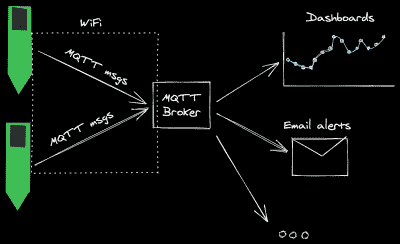
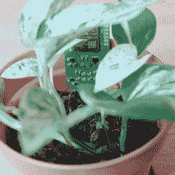

# 用 MQTT 让您的智能家居更环保

> 原文：<https://hackaday.com/2021/03/07/give-your-smart-home-a-green-thumb-with-mqtt/>

我们都被困在里面太久了，也许这就是为什么我们最近看到一些项目试图帮助人类更好地照顾他们来自植物王国的室友。为了生存，植物需要养分、光和水。最后一个似乎很难做对；不会太干，也不会淹没它们，所以[rbaron 的]绿色焊料掩蔽的[w-寄生虫无线土壤监测器](https://hackaday.io/project/178066-w-parasite)将这一责任移交给你现有的家庭自动化系统。

像这个[低功率土壤传感器项目](https://hackaday.com/2019/07/27/a-capacitive-soil-sensor-hack-for-lower-voltage-supplies/)和用于六个土壤传感器的[定制控制器](https://hackaday.com/2021/01/14/esp32-soil-monitors-tap-into-ultra-low-power-mode/)，【rbaron 的】w-寄生虫使用“寄生电容”水分传感器来确定是否该给植物浇水了。这意味着，与电阻式土壤湿度传感器不同，这里的铜走线受到阻焊膜的保护，不会受到腐蚀。对于那些想知道它们是如何工作的人来说，[【巴隆】的 Twitter 帖子](https://twitter.com/rbaron_/status/1367182824684544002)有一个很好的解释。

名称中的“w”代表 WiFi，因为内置的 ESP-32 模块会读取水分读数，并通过 MQTT 无线发送更新。根据智能家居设置的智商，你可以记录数据，向手机发送警报，点亮智能灯泡，甚至打开灌溉系统。

【r baron】分享了一系列无线黑客技术，[控制空调松弛](https://hackaday.com/2017/08/23/control-the-air-conditioning-with-slack/)和 [BLE 健身追踪器，激发了更多的焊接而不是慢跑](https://hackaday.com/2018/05/29/hacking-a-fitness-tracker/)。我们喜欢这种简化的解决方案，传感器、ESP-32 模块和电池都在紧凑的单板设计中。你是不是在问自己，“但是一台耗电的 ESP-32 怎么可能比我的天竺葵干枯的时间还要长？”[rbaron]正在使用深度睡眠，在非常快速的 500 毫秒检查之间仅消耗 15uA。这里显示的可充电 LIR2450 锂离子硬币电池可以在 90 天内每半小时传输一次读数。如果你需要持续时间更长的电池，使用[rbaron]的[便捷电子表格](https://docs.google.com/spreadsheets/d/1Lt3Obveo7YzpxWigAVeM2rHjrGED6iG8pZ1Y3q1cldg/edit#gid=0)来选择持续一整年的更大电池。不过，让我们希望我们不用再和我们的植物朋友在室内度过一整年。

我们可能永远不会知道为什么城市街道裂缝中的杂草比我们的室内植物长得更好，但希望我们可以通过一点点数字推动让我们的绿色室友活得更久。