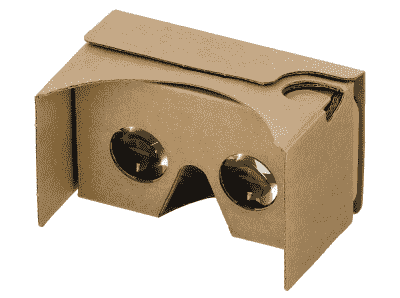
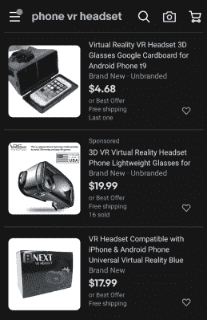

# 谷歌叫停了虚拟现实，但 Cardboard 继续存在

> 原文：<https://hackaday.com/2021/03/30/google-calls-it-quits-with-vr-but-cardboard-lives-on/>

谷歌放弃他们的一个项目，让它已经建立起来的用户群随风摇摆，这已经不算是新闻了。事实上，它已经成为一种迷因。众所周知，搜索巨头总是抛出一些想法来看看哪些是可行的，虽然这偶尔为他们赢得了一些巨大的成功，但也为那些不幸的人带来了很多心痛，当斧头落下时，他们仍然在使用一个掉队者。

因此，当搜索巨头在三月初承认他们将不再销售他们的纸板虚拟现实浏览器时，这并不令人震惊。成本极低的虚拟现实谷歌眼镜，实际上是由折叠纸板制成的，在 2014 年推出时引起了巨大的轰动。但是，尽管谷歌尽最大努力在两年后的 Daydream View 耳机中引入优质的纸板兼容硬件，但它未能发展成为一项有利可图的业务。

Google Cardboard

当然，如果你知道到哪里去找，这些文字已经在墙上挂了一段时间了。虽然 Daydream 硬件在 2017 年进行了第二次修订，谷歌甚至推出了一项认证计划，以确保手机可以在 100 美元的耳机上正常工作，但该设备在 2019 年停产。在软件方面，Android 7“牛轧糖”在 2016 年获得了烤熟的 VR 支持，但在 2020 年秋季 Android 11 发布时，它被悄悄移除了。

随着 Cardboard 不再出售，谷歌只是正式宣布了一个已经非常清楚的事实:他们不再对基于手机的虚拟现实感兴趣。在正常情况下，任何仍在使用这项服务的人都将被迫放弃。问问那些在被拔掉插头之前还活跃在 Google+或 Allo 上的人就知道了。

但是这一次，事情有点不同。在谷歌决定将其分拆为一个开源项目和市场上大量的第三方观众之间，Cardboard 不会不战而降。前方的道路可能与谷歌最初的设想不同，但故事肯定没有结束。

## 廉价虚拟现实的案例

显然，谷歌对基于手机的虚拟现实的想法冷却了一段时间，但 Oculus 等公司推出的新的独立虚拟现实耳机远远优于 Cardboard，进一步加速了他们退出市场的步伐。但并非所有消费者都认为这是一个进步。虽然新的 VR 头戴设备无疑令人印象深刻，但它们也很昂贵，并且[引入了许多用户不愿意购买的新软件生态系统。允许智能手机用于初级虚拟现实的廉价耳机仍有市场，但它的利润不足以吸引谷歌这样的公司。](https://hackaday.com/2020/11/03/as-facebook-tightens-their-grip-on-vr-jailbreaking-looks-more-likely/)

 当然不是所有的公司都有这么高的标准。[尽管智能手机虚拟现实](https://hackaday.com/2019/11/13/ask-hackaday-is-anyone-sad-phone-vr-is-dead/)有相当大的局限性，但可供消费者选择的纸板状耳机并不缺乏。他们从廉价的玩具店饲料到更先进的设备，试图提供谷歌为他们自己的白日梦观众提供的高端体验。

在亚马逊或易贝上快速搜索会返回一串看似无止境的虚拟现实耳机，每种可能的预算或应用都有；所有这些都只依赖于你已经购买并支付的智能手机。很容易看到这些耳机，其中许多来自不可靠的公司，并将其视为廉价的克隆产品，希望利用谷歌的想法。但事实是， [Cardboard viewer 规范一直是开源的](https://arvr.google.com/cardboard/manufacturers/)。

即使大多数制造商决定不走谷歌开创的字面硬纸板路线，浏览器的总体布局和随附文档中概述的最佳实践也是一个宝贵的工作基础。这些公司没有花很长时间就将基本的纸板前提改造成刚性塑料框架，并从那里开始增加新的功能和能力，使自己在竞争中脱颖而出。

一个装有劣质镜头的 5 美元塑料盒能在技术层面上与独立的 VR 头戴设备竞争吗，更不用说使用游戏 PC 提供视觉效果的模型了？当然不是。但这不是重点。这些低成本设备配有二手手机，可以以很低的价格提供身临其境的 360°视觉效果。这意味着将虚拟现实带给那些从未接触过该技术的人和地方。

## 复视软件

虽然最先进的技术可能不会比现在发展得更快，但纸板衍生的虚拟现实耳机不会很快消失。当然，硬件只是等式的一半。随着虚拟现实功能已经从最新版本的 Android 中剥离，用户实际上可以使用这些设备做什么？

 好消息是，虽然 Android 可能已经失去了其固有的虚拟现实功能，但它们从一开始就不是非常重要。实现基本的立体效果就像在屏幕上同时显示两个视点一样简单，让耳机的光学属性处理其余的事情。这是一个足够简单的技巧，甚至可以用一个`ffmpeg`过滤器来完成，当然不需要任何操作系统级的优化。尤其是考虑到普通智能手机的计算能力不断增强。

但是碰巧的是，谷歌也发布了 Cardboard SDK 作为开源项目。这使得开发人员可以为 Android 和 iOS 创建跨平台的 VR 体验，并提供运动跟踪和立体渲染的功能。官方路线图显示有计划继续开发 SDK，尽管值得注意的是自 2020 年 12 月以来没有做出任何承诺。也就是说，这个项目有许多活跃的分支，所以即使谷歌不再积极贡献，社区似乎愿意暂时继续推动 SDK 向前发展。

## 负责任地开拓

谷歌在过去理所当然地受到了很多批评，因为它放弃了产品，没有给他们成功的机会，或者更糟的是，在没有退出计划的情况下扼杀了一个产品，但是很难找到他们决定放弃 Cardboard 的错误。我们可以讨论为什么他们不能将基于手机的虚拟现实概念货币化，特别是在公众兴趣如此之高的情况下，但这是一个有争议的问题。重要的是，一旦谷歌认为他们无法从这个想法中赚钱，这个社区就可以不受约束地使用 Cardboard 硬件和软件。

最终，谷歌对 Cardboard 的处理是正确创新的一个极好例子。科技公司总是会从事这种投机性的开发，以追求下一个最好的东西，而且不可避免的是，这些想法中的许多都无法盈利。我们不应该把所有的研究和开发都锁在没人能接触到的地方，而是应该鼓励那些走高尚路线的公司开源他们轻率的计划。仅仅因为他们不知道如何让它盈利并不意味着我们不知道如何让它工作。