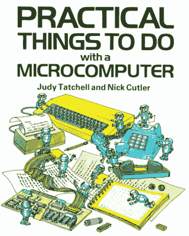

# 伴随着电脑成长

> 原文：<https://hackaday.com/2021/06/19/growing-up-with-computers/>

我的儿子伴随着电脑成长。他在一年级，必须列出所有他知道如何用它们做的事情。这份清单包括鼠标四处移动、用画图程序画鬼，以及——时代的标志——当他在开电话会议时，关掉或不关掉麦克风。哦对了，还有输入表情符号。他喜欢表情符号。

当我和他差不多大的时候，我也开始对电脑感兴趣。但是当时的家用电脑也处于早期阶段。如果我回头看，我在电脑方面变得越来越复杂，其速度与电脑自身变得越来越复杂的速度差不多。我在小学时，正值基本计算机的全盛时期 Apple II 和 C64 的时代。我在高中时看到了第一台 MAC 电脑和 Amiga 的诞生。到了大学，奔腾处理器疯狂的计算能力开始满足我解决数值微分方程的需要。在研究生院，可超频多核和 GPU 的兴起让我在一篇模拟繁重的论文中如鱼得水。

We were both so much younger then.

当我还是个孩子的时候，它们是玩具，而长大后，它们是强大的工具。正因为如此，计算机从来没有让人望而生畏。我是在电脑的陪伴下长大的。

但是回到我儿子身上。我不知道为了一个一年级学生而假装计算机不是非常复杂是否可取，甚至是可能的——反正他会看穿这个谎言。但是什么时候才是教孩子语音识别和人工神经网络的合适年龄呢？众所周知，我们必须教他某种“社交媒体能力”，但这与电脑无关，就像在我那个时代，学习如何使用 Word 与电脑无关一样。消费与创造，推特与黑客。你知道吗？

当然，每一代人都有自己的道路。当建造自己的电脑成为可能的时候，比我年长的黑客已经在高中或大学了，他们做到了。年轻的黑客是伴随着互联网成长起来的，这显然有其优势。那些比我年长的人制造了电脑，而那些年轻的人一直生活在一个电脑已经成熟并被视为理所当然的世界里。但是和我年龄相仿的人，我们是在电脑的陪伴下在 T2 长大的。

This article is part of the Hackaday.com newsletter, delivered every seven days for each of the last 200+ weeks. It also includes our favorite articles from the last seven days that you can see on [the web version of the newsletter](https://mailchi.mp/hackaday.com/hackaday-newsletter-649368). Want this type of article to hit your inbox every Friday morning? [You should sign up](http://eepurl.com/gTMxQf)!