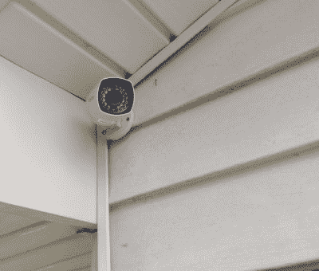

# 黑进我的房子:ZoneMinder 在监视这个地方

> 原文：<https://hackaday.com/2018/10/23/hack-my-house-zoneminders-keeping-an-eye-on-the-place/>

黑客通常诞生于不幸的环境中。我的不幸遭遇是一场抢劫——改造的后门被踢开了，一台发电机被拖走了。一旦警方提交了报告，门也关上了，就该订购相机了。哦，还要记下我所有工具的型号和序列号。



我们将使用以太网供电(POE)网络摄像头和 ZoneMinder 安装。ZoneMinder 具有网络触发功能，我们将把一些磁性开关连接到[我们的 PXE 启动 pi](http://hackaday.com/2018/10/08/hack-my-house-running-raspberry-pi-without-an-sd-card/)网络，使用这些开关通知 Zoneminder 服务器开门事件。除此之外，许多较新的摄像机支持开放网络视频接口论坛(ONVIF)协议，并可以进行板载运动检测。我们将使用在 Pi 上运行的相同脚本来转发这些事件。

你们中的许多人已经指出 Zoneminder 不是开源摄像机管理的唯一选择。MotionEyeOS、Pikrellcam 和 Shinobi 都是有效选项。我最熟悉 Zoneminder，甚至[在 FLOSS Weekly](http://twit.tv/shows/floss-weekly/episodes/496) 上采访过他们，所以这就是我在用的。也许在某个时候，我们可以重新考虑这个决定，并比较现有的视频监控系统。

## 摄像机和装置

Zoneminder 通常适用于任何符合现代标准的相机。我使用的是少数四百万像素的 Trendnet TV-IP314PI 相机，这似乎是成本和质量的最佳选择。这些相机有一个特别奇怪的怪癖，我花了几天时间才弄明白。为了在摄像机上运行运动检测，我需要更新摄像机固件，但是浏览器界面拒绝选择要上传的固件文件。许多 IP 摄像机使用浏览器插件来查看实时流，而 Trendnet 设备上的旧固件也需要该插件来上传固件更新。我最终转向了 Windows 7 虚拟机，安装了浏览器插件，并更新了固件。

摄像机的放置需要有效的计划。前门和后门的覆盖是必须的，看看你的车库门是否开着也很有用。我还决定遮住所有的窗户。如果可以的话，在房子外面拉一拉以太网电缆是很有用的，当你或你的朋友用手机拉相机的时候，把相机放在适当的位置，以便找到最佳的位置。总之，我挂了九个相机。

## 生动色彩的以太网


Ethernet, lots of Ethernet.

如果你一直记着，那就是许多以太网电缆的总数。为了帮助整理它们，我买了几种颜色的电缆:红色、绿色、黄色、蓝色和白色。我强烈推荐一个色码。我的是这样的:PoE 相机用黄色以太网，Raspberry Pis 用红色。房子的每个房间都多了两条电缆，白色的用于 VoIP 电话，蓝色的用于普通的网络连接。绿色电缆用于通过 Cat 5 运行除以太网之外的其他设备，如门或温度传感器。

当我完成内部装修后，我会使用颜色匹配的梯形插孔将这些以太网电缆端接在一组接线板上。这些颜色不仅仅是一种新奇——当你穿过一堆电缆时，很容易分不清哪根是哪根。

有些端口需要 PoE，有些不需要。我还计划使用 VLANs 来分隔不同的网络。完成所有工作后，我们可以更深入地选择和配置管理房屋的智能开关。尽可能保持以太网布线整洁将使最终的配置任务更易于管理。

## Zoneminder

Zoneminder 有一些关于如何启动和运行安装的[优秀文档](https://zoneminder.readthedocs.io/en/stable/installationguide/)，因此，与其再次讨论这个问题，我们将更仔细地研究如何使用 Raspberry Pi 网络将门传感器和 ONVIF 运动检测链接到环路中。为此，我将`zmhelper`服务、[整合在一起，并在 GitHub](http://github.com/jp-bennett/zmhelper) 上发布了代码。让我们看看下面更有趣的片段。

是我们将与之对话的 Zoneminder 组件，它监听 TCP 端口 6802。在 Zoneminder 服务器上，我们需要打开防火墙中的那个端口，然后通过 web 界面启用`OPT_TRIGGERS`选项。这允许我们运行在 Pi 上的服务通知 Zoneminder 发生了重要的事情，它应该开始记录。Zoneminder 可以在本地进行运动检测，但当试图运行多个摄像机时，卸载这项工作会很有帮助。

## 说 GPIO

门传感器只是安装在门框上的一个简单的磁性开关。当门关闭时，门内的磁铁将开关拉向闭合位置，从而接通电路。Pi 的 GPIO 端口非常适合对此进行监控。传感器的一条线接地，另一条线连接 GPIO 引脚。最好在该引脚和开关之间放置一个电阻，以防意外上电。一些 GPIO 引脚在启动过程中变高或变低，将热 GPIO 直接短路到地是一件坏事(tm)。有些人可能会考虑上拉电阻。Raspberry Pi 内置软件可配置的上拉和下拉电阻，因此我们不需要外部电阻。

GPIO 事件检测不仅限于门传感器。运动探测器是另一个有趣的可能性。我希望最终能更详细地了解这一点，将旧的安全系统改造成由 Pi 驱动。

我们设置了一个中断处理程序，而不是每隔几秒钟就轮询一次 GPIO 引脚。这允许事件报告代码更快地触发，并允许我们同时监视 ONVIF 事件。另一个神奇之处是去抖逻辑。当有合法的触发时，GPIO 库在过滤反弹方面做得很好，比如开门。它无法滤除开关闭合产生的反弹。为了克服这个问题，我们休眠一段时间，再次检查 GPIO 状态。

```

  GPIO.setmode(GPIO.BOARD)
  GPIO.setup(gpio_pinnum, GPIO.IN, pull_up_down=gpio_resistor)
  def handler(pin):
      time.sleep(gpio_bouncetime/1000)
      if GPIO.input(gpio_pinnum) == gpio_active_state: #Debounce check.  If we're still active, it's a real event.
          s = socket.socket(socket.AF_INET, socket.SOCK_STREAM)
          s.connect((zmip, zmport))
          s.send(gpio_mid +'|on+20|' + gpio_escore + '|' + gpio_ecause + '|' + gpio_etext)
          s.close()
          print(&quot;DOOR opened!&quot;)
  GPIO.add_event_detect(gpio_pinnum, gpio_edge, handler, bouncetime=gpio_bouncetime)

```

## ONVIF 事件

如果配置了 ONVIF，那么我们连接到摄像机，在提示中提取任何事件，并等待新的事件。这里的代码是阻塞的——它停止并等待摄像机的响应。该响应被故意延迟，直到新事件准备好。然后，代码扫描事件数据，查找是否检测到运动。

```

  mycam = ONVIFCamera(camIP, 80, username, password, wsdl_dir='/home/pi/.local/wsdl/')
  event_service = mycam.create_events_service()
  pullpoint = mycam.create_pullpoint_service()
  req = pullpoint.create_type('PullMessages')
  req.MessageLimit=100
  while True:
    messages = Client.dict(pullpoint.PullMessages(req))
    if 'NotificationMessage' in messages:
      try:
        messages = messages['NotificationMessage']
        for x in messages:
          message = Client.dict(Client.dict(Client.dict(Client.dict(Client.dict(x)['Message'])['Message'])['Data'])['SimpleItem'])
          if message['_Name'] == 'IsMotion' and message['_Value'] == 'true':
            if time.time() - last_trigger &gt; 15:
              print(&quot;Triggering!&quot;)
              last_trigger = time.time()
              s = socket.socket(socket.AF_INET, socket.SOCK_STREAM)
              s.connect((zmip, zmport))
              s.send(onvif_mid +'|on+20|' + onvif_escore+ '|' + onvif_ecause + '|' + onvif_etext)
              s.close()
            break
      except:
        print('Error fetching event')

```

我们已经看到了第一次真正使用 Raspberry Pi，将事件输入到 Zoneminder 实例中。未来还会有更多，比如破解车库门开启器的专有协议，构建触摸屏恒温器，以及研究如何安全地远程访问一切。像往常一样，说出你未来想看到什么。下次见，黑客快乐！