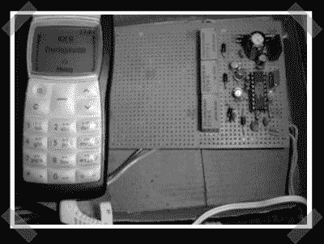
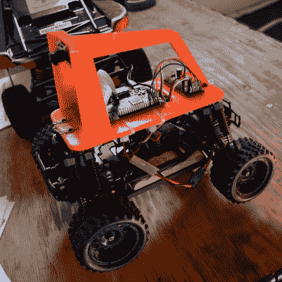
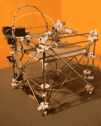
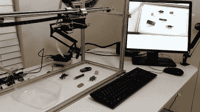
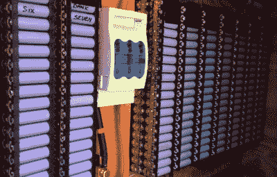

# Hackaday 庆祝 15 周年，硬件发生了多么大的变化

> 原文：<https://hackaday.com/2019/09/05/hackaday-celebrates-15-years-and-oh-how-the-hardware-has-changed/>

今天正好是 Hackaday 开始每天一次黑客攻击的 15 周年纪念日，从那以后我们一天都没有错过。在 5，477 天里，我们发布了 34，057 篇文章，Hackaday 社区记录了 903，114 条评论。这是我们的作家和编辑的惊人作品，我们的读者的谦逊参与，以及项目创作者对开放硬件的绝对不可思议的贡献，他们分享了他们的工作细节，给了我们所有人谈论和努力的东西。

最初的博客现在是一个全球性的虚拟黑客空间。第一篇 105 字的文章已经远远超出了项目功能，包括了引人注目的长篇原创内容。从 2014 年推出的我们的读者社区已经成长为 [Hackaday.io](https://hackaday.io/) ，你现在可以找到由 350，000 名成员发布的超过 30，000 个项目。同年，[黑客日奖](https://prize.supplyframe.com/)成立，作为一项全球工程倡议，旨在促进开放硬件，为伟大的想法(以及分享它们的意愿)提供大奖。我们的虚拟联系也有机会通过 [Hackaday 超级大会](https://hackaday.io/superconference/)、Hackaday Belgrade、无数次 Hackaday 非大会和世界各地的聚会活跃起来。

所有这些融为一体，成为一个巨大的支持结构，任何人都可以在“为什么”是错误问题的情况下，提出一个有趣的想法和概念证明。我们一起挑战事物的极限，共同筛选出最好的想法，并将其作为下一次迭代的基石。Hackaday 社区是集体大脑中的公共链接，是延续旧的伟大思想和编目新思想的验证点。

也许过去 15 年黑客日最令人印象深刻的事情是技术领域发生了多大的变化。Hackaday 仍然存在，因为我们所有人都积极地跟着它一起改变——总是在寻找尖端，在那里聪明地滥用某些东西成为下一次变革的基础。所以我们想回顾一下 15 年前的科技。让我们深入了解一个没有电子模块的时代，你不可能在一个下午就快速制造出一个塑料部件，设计你自己的硅片是闻所未闻的，你的部件经销商是你后屋的一大群坏掉的电子设备。

## 开放工具和开放知识

在过去的 15 年中，我们看到的最具变革性的事情是知识的免费获取，以及再次分享知识的平台的可用性(如果你愿意，可以付费)。回到千年之交，电子行业的工作方式仍然是获得大学学位，在工作中磨练自己的技能，并将这些知识作为商业秘密锁起来。当然，随着互联网的成熟，这种模式被打破了。

像 SourceForge 这样的工具——成立于 1999 年——是互联网繁荣的产物，提供了一个免费托管源代码的地方。这使得建立小型项目和团队合作变得更加容易。它提供了学习的代码，突然之间，任何有时间和兴趣的人都可以开始学习计算的秘密世界。

与此同时，利基社区开始活跃起来，使用 phpBB 这样的平台，这是 2002 年发布的开源论坛软件。现在我们可以打破街区里只有极客的孤立状态，开始互相支持。

这是黑客们团结起来的最佳时机，2004 年 9 月，Phillip Torrone 发表了第一篇关于“红盒子”硬件黑客的文章。

## 面向大众的硅

这些仍然是糟糕的旧时光；很难找到零件，即使你能买到，它们通常也很贵。这里谁记得零件经销商的印刷目录？嗯，这并不是世界末日，有些人仍然信誓旦旦地从枯树的书页中订购他们的零件。真正的问题是缺乏价格低廉、功能齐全的组件。

微控制器肯定是存在的，在 20 世纪 90 年代取得了巨大的进步，摆脱了紫外线的束缚，有利于 EEPROM。但是汽车和消费电子行业给了我们最大的帮助。更多的设备意味着更大规模的生产。随着需求的增加，工艺缩减以实现每晶片更多的器件。这使得生产成本下降，更多的玩家开始进入这个领域。到 2000 年中期，单次订购微控制器变得既便宜又容易。远远落在后面的是传感器——今天，从相对湿度到心电图，我们被廉价的 IMU 和传感器宠坏了——但这是最近的发展。

Connectivity back in the day… just add a Nokia to it. This is [a remote-controlled door lock](https://hackaday.com/2007/07/17/cell-phone-controlled-door-lock/).

手机在技术渗透方面的贡献超过了它应得的份额。我敢打赌，大多数阅读这篇文章的人都有在诺基亚 3310 上玩 snake 的美好回忆——他们似乎制造了数十亿部，但实际数字接近 1.25 亿部。我们看到了大量使用 3310 屏幕的黑客，无论你是从旧手机中回收还是购买替代品。从砖块到智能手机的黎明，对 MEMs 传感器和高质量相机的需求标志着由于规模经济而带来的廉价组件的黎明。

随着全球售出数十亿部手机，它们推动了无数芯片的开发和生产。从加速度计到 GPS 模块，从指纹识别器到蓝牙收音机，先进的设计很快变得廉价而实用。与此同时，工具也围绕着这些部分发展起来。ATMEL 的产品在 2004 年被纳入 avr-libc，在开源世界中形成了一个完整的工具链。没过多久，Arduino 就利用这种开放性来构建他们的硬件和软件平台，让人们更容易进来尝试一下。

## 电脑变得非常小，互联网变得非常容易

WiFi RC cars [featured on Hackaday in 2007](https://hackaday.com/2007/04/15/sunday-wifi-rc-car-extra/) all involved attaching a router to an RC chassis.

如果你在 2004 年需要的不仅仅是一个 8 位微控制器，你必须做一些愚蠢的事情，比如把一个装有奔腾 II(如果你幸运的话是 III)的米黄色盒子绑在你的项目上。勤劳的黑客意识到路由器是小型计算机，OpenWrt 项目是在黑客日开始的同一年建立的。这是 Linux，但由于这些主板上的可用资源，它大大精简了。但当然，最大的好处是，这为聚会带来了以太网和 WiFi，以及一个标准的串行端口，你可以挂更多的硬件。

路由器板发生了许多巧妙的事情——这很好，因为我们使用它们已经很多年了。人们渴望更好的 Linux 和更简单的连接。当然，你可以购买 WiFi 加密狗，但你需要一个 USB 堆栈来使用它们，而这在电脑之外是不存在的。在那段时间里，手机变成了智能手机，在这个过程中，硬件黑客攻击减少了，软件黑客攻击增加了。2008 年发布的 HTC Dream 是第一款 Android 手机——也是在引擎盖下运行 Linux，但更重要的是有一个诱人的开发环境，要求成为硬件黑客的前端。

By 2017, Raspberry Pi was powering not just RC cars, but [self-driving cars that use machine learning](https://hackaday.com/2018/11/30/buy-or-build-an-autonomous-race-car-to-take-the-checkered-flag/).

继第一代安卓手机之后， [BeagleBoard](https://en.wikipedia.org/wiki/BeagleBoard) 风靡一时，2012 年[Raspberry Pi](https://hackaday.com/2012/01/24/raspberry-pi-runs-xbmc-reliably-decodes-1080p/)突破了价格底线，迎来了单板电脑作为平台。这些变革性事件颠覆了我们以微控制器为主导的世界，因为实际的 Linux 机器在尺寸、功耗预算和成本方面面临挑战。以前锁定在智能手机中的计算能力现在发挥出来了。构建自己的具备计算能力的互联网连接设备变得完全正常。当你不需要所有这些计算能力时， [ESP8266 WiFi 芯片](https://hackaday.com/2014/08/26/new-chip-alert-the-esp8266-wifi-module-its-5/)于 2014 年问世，以低廉的价格提供无线连接。我们进入了一个真正的文明时代。

## 建造自己的数控机床是闻所未闻的

嘿，等等，所有这些都是关于比特的，但是原子呢？这里有一个类似的故事。虽然我们和下一个女孩一样热爱老铁，但 Hackaday 时代的机械工程故事也同样有趣。

“Darwin” was [version 1.0 of the RepRap program from 2007](https://reprap.org/wiki/RepRapOneDarwin) whose frame was threaded rod and printed connectors.

早在 20 世纪 90 年代，一些制造业巨头开始使用添加制造技术一次一层地制造塑料零件。一些聪明的黑客看到这种情况，问为什么不呢？[re rap 项目诞生于](https://hackaday.com/2006/02/15/reprap-the-replicating-rapid-prototyper/)2004 年，任何人只要花上几百美元，经人介绍，就可以打印出除螺杆、NEMA 发动机和皮带之外的零件。

但是如果没有固件和软件，3D 打印机什么都不是，社区编写了 g 代码解释器( [ReplicatorG](http://replicat.org/) 、 [Sprinter](https://github.com/kliment/Sprinter) ，然后是 [Marlin](http://marlinfw.org/docs/basics/introduction.html) )，适用于廉价的微控制器。在主机上， [Skeinforge](https://reprap.org/wiki/Skeinforge) 和后来的 [Cura](https://ultimaker.com/software/ultimaker-cura) 和 [Slic3r](https://slic3r.org/) 完成了从 3D 模型到打印塑料的工具链。与此同时，在 CNC 领域，EMC 项目(后来的 [LinuxCNC](http://linuxcnc.org/) )从 NIST 开发的用于大型计算机的 g 代码解释器中分离出来，Grbl 也为微控制器做了同样的事情。

The 3D Printing community drove the state of the art, benefitting all machine-tool projects. Here’s [a gantry that moves a robot arm](https://hackaday.com/2019/04/13/pick-and-place-for-toys/) and uses computer vision for sorting objects.

精密杆，顶点螺丝，铝挤压都存在，但好运得到他们在那些糟糕的日子。但是需求是存在的，精密硬件的价格下降到了肥沃的开源固件和软件生态系统中。3D 打印机、自制数控铣床，甚至像 Lasersaur 这样的 DIY 激光切割机在我们现在认为理所当然的世界里蓬勃发展，在那里你可以在计算机上建模的任何东西都可以很快变成实物。

## 电力技术:在空中，在口袋里

当我喃喃自语像 NiMH 和 NiCad 这样的化学公式时，某些年份的读者会退缩。每个 80 和 90 年代的孩子在他们的遥控车里的可充电电池是一个失望的堡垒——每次你把玩具从壁橱里拿出来就没电了，充满电后仅仅使用几分钟就没电了。

Fifteen years ago, who would have dreamt of [a 20 kWh DIY battery project](https://hackaday.com/2016/09/29/homebrew-powerwall-sitting-at-20kwh/)?

我们抱怨锂离子电池技术进步不够快，但它绝对改变了我们对便携式设备的看法。这里有两个主要领域，像手机这样的便携式技术已经将尺寸和重量限制推到了任何可以想象的范围之下，而高负载应用在一块砖大小的砖中封装了令人难以置信的功率密度。

对于黑客来说，这意味着我们不仅远离了内燃遥控飞机，而且以四轴飞行器(如果你必须的话，就是无人机)的形式重新发明了飞行车辆，它们受益于重量轻的电池，无刷 DC 电机(考虑到它们的小尺寸，它的功率大得惊人)，以及可用的功率场效应晶体管和电机控制器硅的革命，使它们都可以旋转。手机和玩具中采用锂离子电池导致廉价芯片处理所有充电和放电细节，所以你不必这样做。

## 定制芯片，我们来找你了！

很容易判断不久的将来会发生什么。我们正处于 ASICs 时代——为特定目的定制的芯片。黑客对此的介绍以 FPGAs 的形式出现。尽管它们已经存在了很长时间，但目前每美元的 lut 非常便宜，并且由于大规模的逆向工程努力，[开放工具链现在已经可用](https://hackaday.com/2015/03/29/reverse-engineering-lattices-ice40-fpga-bitstream/)。

至于设计本身，硅不再是一个黑盒子。RISC-V 是一种开源硬件指令集架构，基本上是微控制器的核心。“开放”项目的游戏是总有一个较低层是专有的，但我们尽最大努力将这个边界越推越低。看到了基于 RISC-V 设计的芯片的诞生，该生产线现在处于芯片制造水平，在这一点上，任何人都可以围绕该设计构建自己的定制处理器，并在 FPGA 中运行它作为概念验证。如果它真的很好，而且你真的很幸运，它甚至有一天会成为定制芯片，随着时间的推移，这个障碍可能会越来越低。

## Hackaday 万岁

我们生活在一个令人惊叹的时代，但它们当然是千变万化的。用几千字来概括 15 年的黑客生涯是不够的。这就是我们最初写这些文章的原因！

我们这样做是因为我们是黑客，我们都喜欢阅读黑客日报。所以，当你发现一个很棒的东西并想和别人分享时，[通过](https://hackaday.com/submit-a-tip/)发送它。无论是您的创造、他人的创造、有趣的新零件，还是一条值得深入研究的工程新闻，Hackaday 都是您开始搜索并加入对话的地方。谢谢你这些年来一直陪伴着我。在你们的帮助下，我们将继续成为黑客蜂巢大脑的每日新闻，持续 15 年！