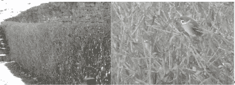

# 2022 年 Hackaday 奖:树篱守望者旨在拯救珍贵的鸟类生命

> 原文：<https://hackaday.com/2022/10/13/hackaday-prize-2022-hedge-watcher-aims-to-save-precious-bird-life/>

树篱不仅仅是漂亮的花园装饰。它们也是许多昆虫、鸟类和其他野生动物的主要栖息地。在一些地区，大量的树篱修剪发生在当地鸟类哺育幼鸟的时候，这在关键时刻造成了伤害。因此，[约翰·埃利亚斯·斯托泽尔]和他的同学们受到启发，创建了[树篱守望者。](https://hackaday.io/project/187685-hedge-watcher)

Birds can easily blend in with their surroundings, but thermal cameras are a great way to spot them.

这个概念很简单——利用热视觉发现树篱内的鸟类，否则它们可能不容易被发现。许多物种以视觉方式融入周围环境，所以热成像是一种解决这个问题的好方法。修剪树篱时，它可以帮助避免破坏鸟巢或伤害鸟类。这个想法源于大规模的农业操作，即在收割田地之前，定期使用安装在无人机上的热感相机来寻找野生动物。

然而，在修剪树篱的时候，每隔几秒钟盯着热感相机的读数是不太实际的。相反，学生们创造了一个增强现实(AR)单眼，让用户在修剪树篱的同时保持对热感相机馈送的关注。进一步的工作包括测试双目 ar 耳机和 VR 耳机。AR 设置被证明是最有用的，因为它们允许在工作时更好地了解情况。

这是一个保护当地鸟类的创造性解决方案，值得称赞。围绕增强现实的潜在用途有很多傲慢，但这是一个真实和实用的伟大例子。而且，如果你热衷于自己尝试 AR，请注意[它也不一定要倾家荡产](https://hackaday.com/2021/09/02/a-microcontroller-friendly-ar-headset-on-the-cheap/)！

The [HackadayPrize2022](https://prize.supplyframe.com) is Sponsored by: