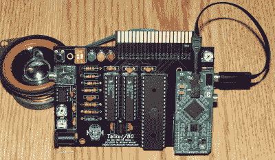

# 2022 年黑客日奖:现代插件让 TRS-80 重获声音

> 原文：<https://hackaday.com/2022/07/29/hackaday-prize-2022-modern-plug-in-gives-trs-80-its-voice-back/>

像人工智能一样，语音合成是那些有望在 20 世纪 80 年代彻底改变计算的应用之一，只是在人们意识到机器人语音朗读预定义的句子实际上并没有那么有用后，它就失败了。然而，计算机制造商不想错过宣传，语音合成器成为典型家用计算机的一个相对常见的附件。

这些附件通常是围绕定制的语音合成芯片构建的。如果那个芯片坏了，你就不走运了:很多都是小公司限量生产的，现在已经找不到了。因此，如果你有一个 Tandy TRS-80 语音合成器和一个不可靠的 SC-01-A 芯片，你肯定会想看看[【迈克尔·韦塞尔】的 Talker/80 项目](https://hackaday.io/project/186492-voices-of-the-past-speak-up)。它是 TRS-80 的一个插件模块，与原始的语音合成器软件兼容，但由现代组件构建而成。合成仍然由定制的 IC 执行，但现在它使用更常见的 Epson S1V30120 文本到语音芯片。

Talker/80 还有一个 ATmega644，一边连接 TRS-80 的扩展端口，另一边连接爱普生芯片。它可以模拟原始的 SC-01-A，在这种情况下，它希望文本被分成单独的音素，或者它可以被设置为“高级”模式，在这种模式下，它可以直接处理普通的英语文本。在这两种情况下，声音听起来都与原来的大不相同，尽管新的声音可以说更清晰一些。

我们已经看到了为几台经典计算机制造的现代语音合成器:你可以将同一个爱普生芯片连接到 Amstrad CPC 上，或者将 ESP8266 连接到 VIC-20 上。如果你有一台实际工作的 SC-01-A，但没有老式电脑可以使用，你也可以[用 Arduino](https://hackaday.com/2017/02/22/microvox-puts-the-80s-back-into-your-computers-voice/) 控制它。

 [https://www.youtube.com/embed/uVHz4YaPyKA?version=3&rel=1&showsearch=0&showinfo=1&iv_load_policy=1&fs=1&hl=en-US&autohide=2&wmode=transparent](https://www.youtube.com/embed/uVHz4YaPyKA?version=3&rel=1&showsearch=0&showinfo=1&iv_load_policy=1&fs=1&hl=en-US&autohide=2&wmode=transparent)

[hack adayprize 2022](https://prize.supplyframe.com)主办单位: