# Hackaday 参观电器城

> 原文：<https://hackaday.com/2018/12/04/hackaday-visits-the-electric-city/>

令当地历史学家懊恼的是，如今宾夕法尼亚州的斯克兰顿市以美国版《办公室》的背景而闻名。然而，虽然邓德米夫林最优秀、最聪明的人的功绩可能会让网飞成为一场狂欢，但这座历史名城不仅仅是一家虚构的纸业公司。从最初作为无烟煤的主要供应商，到美国第一个电动电车系统在街道上的引入，斯克兰顿因其从工业革命到第二次世界大战期间的主要技术中心而赢得了“电气城市”的绰号。

今天，斯克兰顿的矿井和熔炉静静地躺着，但没有被遗忘。20 世纪 80 年代，在州政府和联邦政府的资助下，这座城市开始将他们的工业遗址变成历史地标和博物馆。我最近有机会参观了这些地方，并留下了深刻的印象。它们是对帮助美国成为工业强国的早期技术和工艺的独特观察。

虽然不能代替亲自去参观这些博物馆和公园，但希望下面的图片和描述能让你了解现代电气城有什么样的景点在等着游客。

## 拉克万纳煤矿之旅

[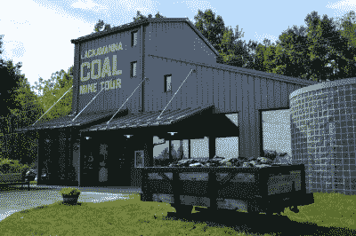](https://hackaday.com/wp-content/uploads/2018/11/scranton_mine1.jpg) 斯克兰顿因其无烟煤而闻名，从位于麦克达德公园的“拉克万纳煤矿之旅”开始似乎是合适的。这个废弃的矿井于 1985 年作为博物馆向公众开放，这样游客就可以看到在数百英尺深的煤矿矿脉中工作是什么样子。尽管应该说，从 1860 年到 1966 年一直在矿井工作的真正矿工的经历并不那么奢侈。为了游客的安全，增加了电灯照明和加固木材；真正的矿工在完全黑暗的环境中工作，没有头顶支架的存在。

从表面上看，这里展出了各种各样的设备，还有一个带有必备礼品店的小博物馆，但最吸引人的是所谓的“#190 斜坡”。游客们被发给安全帽，然后挤进一辆黄色的矮胖车辆，车辆沿着斜坡下降到地面下大约 76 米(250 英尺)的深度。大多数人从来没有机会在地球表面下这么深的地方旅行，所以说这是一次独特的经历有点轻描淡写。

在这个深度，温度总是在 12 摄氏度(54 华氏度)左右，水不断以惊人的速度沿着墙壁流下，发出令人不安的声音。尽管投入了数百万美元将该矿变成一个吸引公众的景点，但在蜿蜒的隧道中穿行并不总是那么容易。地面偶尔会不平整和松散，有时天花板很低。即使每隔一段时间安装一次照明设备，矿井的某些部分仍然非常黑暗，很难看到露出地面的低矮岩石。

 [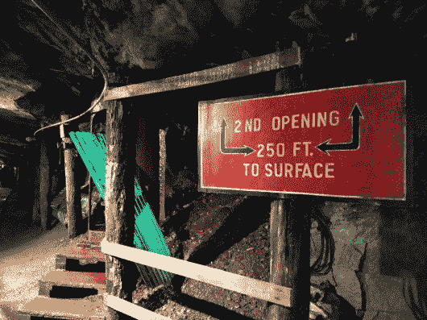](https://hackaday.com/2018/12/04/hackaday-visits-the-electric-city/scranton_mine3/) Vertical air shaft for ventilation. [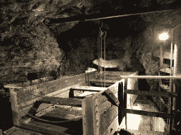](https://hackaday.com/2018/12/04/hackaday-visits-the-electric-city/scranton_mine5/)  [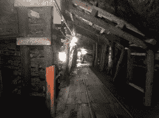](https://hackaday.com/2018/12/04/hackaday-visits-the-electric-city/scranton_mine4/)   Transition from coal to stone. [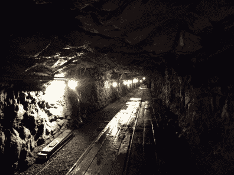](https://hackaday.com/2018/12/04/hackaday-visits-the-electric-city/scranton_mine1-2/) 

## **无烟煤文化博物馆**

同样位于麦克达德公园的“无烟煤遗产博物馆”展示了专门用于开采和利用煤炭的技术。展示了矿井内或矿井周围使用过的硬件，如钻头、破碎机和传送带。大多数设备都在 tableau 中展示，这让参观者可以看到这些机器是如何协同工作，将煤从地球上释放出来，并将其运出矿井的。

 [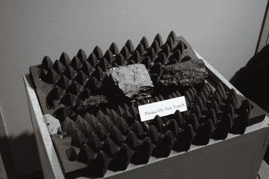](https://hackaday.com/2018/12/04/hackaday-visits-the-electric-city/scranton_coal5/)  [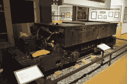](https://hackaday.com/2018/12/04/hackaday-visits-the-electric-city/scranton_coal4/)  [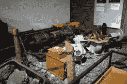](https://hackaday.com/2018/12/04/hackaday-visits-the-electric-city/scranton_coal3/)  [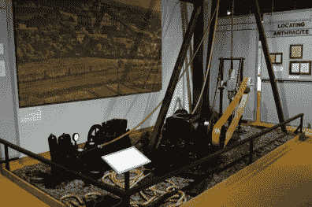](https://hackaday.com/2018/12/04/hackaday-visits-the-electric-city/scranton_coal2/)  [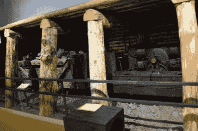](https://hackaday.com/2018/12/04/hackaday-visits-the-electric-city/scranton_coal1/) 

## 电动城市电车博物馆

顾名思义，该博物馆致力于展示帮助斯克兰顿在 19 世纪 80 年代闻名于世的电车系统。亮点包括修复的电车，其特点是切开，以便游客可以检查电机和传动系统，对当代电力处理设备的解释，以及展出的各种辅助设备，如继电器和变压器。

电车博物馆对于那些对高压或世纪之交的技术感兴趣的人来说是一个仙境，他们甚至提供(额外收费，视天气而定)乘坐 20 世纪早期电车的短途旅行。但应该说它是这个城市中较小的博物馆之一，如果你不是其中一个旅行，游客不应该期望在这里花费超过一两个小时。

 [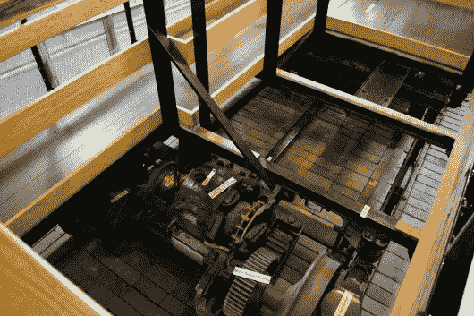](https://hackaday.com/2018/12/04/hackaday-visits-the-electric-city/scranton_trolley5/)    [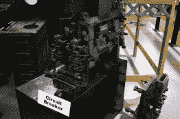](https://hackaday.com/2018/12/04/hackaday-visits-the-electric-city/scranton_trolley3/)  [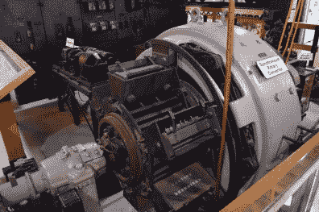](https://hackaday.com/2018/12/04/hackaday-visits-the-electric-city/scranton_trolley2/)  [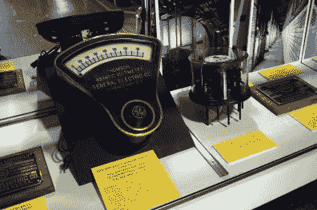](https://hackaday.com/2018/12/04/hackaday-visits-the-electric-city/scranton_trolley1/) 

## 蒸汽城国家历史遗址

说实话，一开始我并不太热衷于参观我认为是“火车博物馆”的东西。有很多人对火车和老式蒸汽机车的浪漫故事着迷，但我肯定不是其中之一。我认为“蒸汽城国家历史遗址”对我来说兴趣有限，但是被强烈推荐并且是国家公园服务的一部分，看起来我至少得给它一个机会。另外，入场是免费的。

最后，我很高兴我对铁马的普遍不感兴趣没有阻止我去参观。老实说，我不记得上次我对博物馆印象如此深刻是什么时候了。蒸汽城的展示和对细节的关注绝对是非凡的。我进来时对这些交通工具是如何运行的有一个模糊的了解，离开时对工程设计有着深深的敬意，这种工程设计不仅需要在它们的全盛时期建造这些庞然大物，而且需要在今天继续运行和维护它们。

“近距离和个人”这个词非常完美地描述了这里的体验。你不仅有机会乘坐近 100 年历史的燃煤蒸汽火车，还可以站在距离野兽仅几英尺远的地方，看它们蜿蜒穿过建筑群，汽笛呼啸，活塞砰砰作响。即使你对这些进入博物馆的机器毫无兴趣，当你能感觉到锅炉的热量和煤燃烧的味道时，不敬畏它们是非常困难的。

 [https://www.youtube.com/embed/8ZvcZ6r20yQ?version=3&rel=1&showsearch=0&showinfo=1&iv_load_policy=1&fs=1&hl=en-US&autohide=2&wmode=transparent](https://www.youtube.com/embed/8ZvcZ6r20yQ?version=3&rel=1&showsearch=0&showinfo=1&iv_load_policy=1&fs=1&hl=en-US&autohide=2&wmode=transparent)

虽然火车本身可能是最大的吸引力，但博物馆内的展品也很棒。其中很大一部分致力于 1900 年代美国铁路旅行的社会经济方面，但也有一整翼致力于火车技术。在这里，机车的每一个系统都被分解和解释，就像运行铁路服务的更实际的方面一样，比如信号。科技翼的一个主要亮点是一个完全修复的火车头，然后将其长度减半，因此游客可以看到它的主要部件，不仅可以更好地了解它们的内部工作原理，还可以了解它们的巨大规模。

 [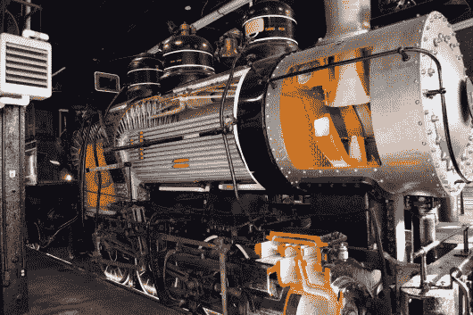](https://hackaday.com/2018/12/04/hackaday-visits-the-electric-city/scranton_train4/)    [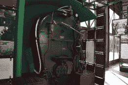](https://hackaday.com/2018/12/04/hackaday-visits-the-electric-city/scranton_train5/)  [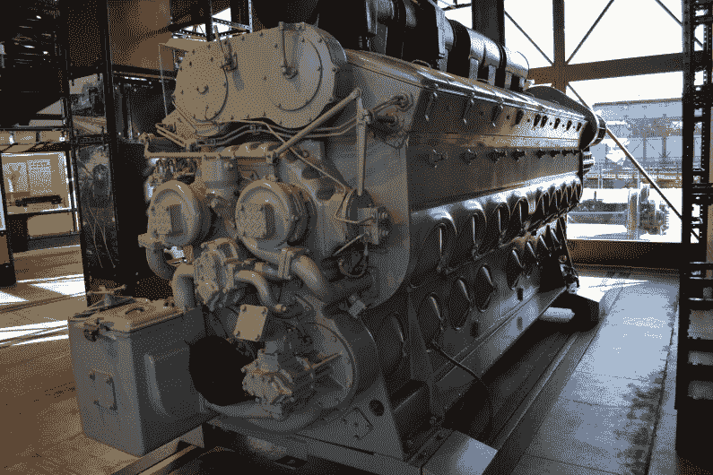](https://hackaday.com/2018/12/04/hackaday-visits-the-electric-city/scranton_train2/) 

## 值得一游

这些可以说是斯克兰顿及其周边最著名的博物馆，但绝不是唯一的。我只是在逗留期间时间不够，没有去参观其他一些吸引我眼球的博物馆或景点，特别是铁熔炉。为了充分探索我在这里列出的地点，你应该计划停留两三天，尤其是一些博物馆在傍晚关闭。如果你想乘火车或有轨电车旅行，每一项都会占用你一天的大部分时间。

除了历史和技术景点，我发现斯克兰顿是一个迷人的地方，在市中心有着令人惊讶的充满活力的夜生活。如果你的旅伴不一定喜欢整天探索煤矿，这是一个特别好的平衡。我非常希望将来能回到斯克兰顿，去游览一些我这次错过的景点，我会全心全意地向市场上的任何人推荐它，作为一个有点乡村度假的目的地，同时拥有一个世纪的古老技术。