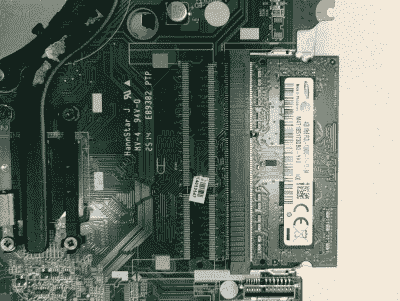

# 入侵 SO-DIMM 插槽值得一试

> 原文：<https://hackaday.com/2021/07/08/hacked-on-so-dimm-slot-was-worth-a-shot/>

在电路板上发现未填充的焊盘通常表明该器件有一些未开发的潜力。板上的这些空白点可能是从设计中删除的特性或功能遗留下来的，甚至可能代表一个没有安装在这个特定样本上的可选升级。所以我们当然理解为什么[dork]对他最近在一台笔记本电脑的主板上发现的空的 SO-DIMM 封装着迷。

廉价的赛扬机器在其单个插槽中安装了 4 GB 的 RAM，这种情况[d ork]希望他可以通过添加第二个模块来改善。但是，这真的像把插座从报废的主板上拔下来并焊接到位那么简单吗？需要在电路板上添加其他元件吗？BIOS 能应付意外的升级吗？只有一种方法可以找出…

Room to grow

起初，病人似乎没能挺过手术。但是仔细观察发现，电源按钮实际上已经在线路的某个地方损坏了。有一次[dork]修复了机器启动，可惜操作系统没看到多出来的 RAM 模块。即使在升级了 BIOS 之后，计算机仍然对额外的内存视而不见。

当他回去检查他的焊接工作的短路或不良接头时，灾难降临了。出于目前尚不清楚的原因，电脑不再启动。即使将移植的 SO-DIMM 插槽完全从主板上拔下，[dork]也表示它无法通过自检。显然，这是一个令人失望的结论，但我们尊重他为这一尝试所付出的努力。

虽然这次内存升级没有按照计划进行，但我们多年来已经看到了足够多的成功故事来平衡它。从老式的无线路由器到[尖端的视频卡](https://hackaday.com/2021/03/20/video-ram-transplant-doubles-rtx-3070-memory-to-16-gb/)，大量的小工具[由于烙铁](https://hackaday.com/2020/07/19/upgrading-the-ram-in-a-25-year-old-oscilloscope/)和稳定的手感而获得了内存提升。

【感谢蒂莫西的提示。]