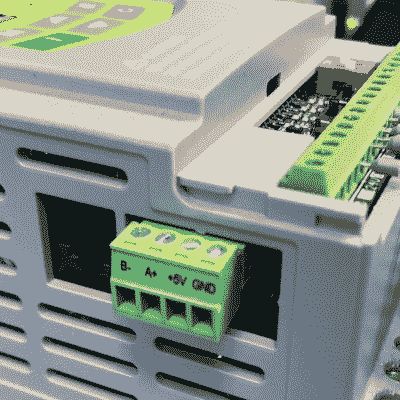
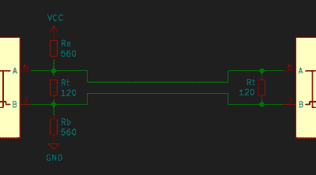
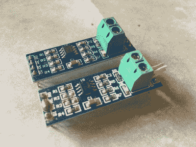

# 黑客词典:RS-485 将会走得更远

> 原文：<https://hackaday.com/2022/04/05/hacker-dictionary-rs-485-will-go-the-distance/>

RS485 是一种通信标准，应该是高级硬件黑客武器库中的一部分；这种情况并不常见，但是在你需要的时候却非常强大。它是一种用于有线通信的物理层接口，使用单个差分对来抑制噪声，具有良好的长距离特性，并允许多条连接到一条总线。正因为如此，你会在[安全系统](https://hackaday.com/2019/04/27/this-owner-took-control-of-their-proprietary-alarm-system/)和[甚至摄像机](https://hackaday.io/project/183986-controlling-a-cctv-camera-with-arduino)、有线传感器网络、 [DMX512 照明](https://hackaday.com/2021/10/15/learn-dmx512-basics/)和各种工业电子产品中遇到它。对于我们的业余爱好者目标，您完全可以使用 RS485 来构建您的家庭(或房间)自动化系统，或者一个相对较大的机器人，而无需担心无线带来的所有问题。

这个名字可能会让你想起 RS232，这是因为 RS232 和 RS485 都是来自 EIA(电子工业联盟)的标准。它还可能会让您想起 RS422，如果您曾经在网上看到过这个名称的话——RS 422 和 RS485 紧密交织在一起，共享大部分物理层，我将展示它们之间的确切关系。

# 物理层

最简单地说，RS485 链路类似于 UART 通信通道，但它是差分和半双工的，TX 和 RX 组合成一条通信线路。字节以预先安排的波特率作为非时钟数据发送，因此您的 USB-UART 适配器或 MCU 的 UART 外设将适用于大多数 RS485 目的。就像用 UART 一样，常用的波特率只有几个，应该很容易猜到。差分信号意味着您将需要使用特殊的发射器和接收器来处理 RS485 链接，它们并不昂贵，因此在您真正使用它的那天之前，最好储备一些。

RS485 的主要优势之一是您可以将多个设备放在一条链路上。这是与逻辑级 UART 或 RS232 的一个令人愉快的区别，特别是对于我们的传感器和其他智能设备网络构建需求。代价是 RS485 链路是半双工的，也就是说，两个或更多设备不能在同一时刻进行传输。

如果你真的需要一个全双工连接，设备 X 和 Y 可能想要发送而不考虑彼此，你会想要使用两个 RS485 链接——一个链接用于“X 发送，Y 接收”方向，另一个用于“Y 发送，X 接收”方向，点对点方式。恭喜你，你发明了 RS422，但你失去了 RS485 非常有用的总线特性。

信号以差分方式传输*。代替一个信号的是两个信号:一个总是与另一个相反——当传输高逻辑电平时，线路 A 变高，线路 B 变低；当传输低逻辑电平时，线路 A 变低，线路 B 变高。接收器不测量信号相对于地的绝对电平，而是测量它们之间的差异。在之前，我们已经[讨论过差分对，解释了它们的好处，比如高降噪。使用差分对可以实现数百米长的 RS485 链路，你会看到有人在网上吹嘘这种技术！](https://hackaday.com/2016/03/29/when-difference-matters/)*

 *

RS485 的一个有趣的部分是 A/B 命名约定。在上一段中，我将“A”和“B”分别用作“同相”和“反相”信号，即“A”上的电压与所传输信号的逻辑电平极性相同，但“B”上的电压则相反。

RS485 标准，正如它所写的，实际上对这两个有相反的含义——“A”是反相的,“B”是非反相的。然而，RS485 transciever 的制造商们都(一贯地)相对于标准来说颠倒了它们，以至于维基百科有相当多的段落抱怨它。谈到本文中使用的命名约定，我将使用 RS485 ICs 和器件实际使用的信号名称，而不是标准中定义的、但实际上不被您将遇到的器件使用的名称。如果世界像 USB 一样标准化“D+”和“D-”可能会更好，但那艘船已经启航了。

# 不同的含义

控制器真正关心的是两个信号之间的差异，而不是它们相对于公共地的电压。如果它们彼此靠近会发生什么——比方说，此时没有发射器驱动线路？如果 A 和 B 之间的差值在 200 mV 以内，则信号被视为无效，您的接收器可能会感到困惑，或者最多拒绝它。为了避免这种情况，通常使用偏置电阻——A 上拉，b 下拉。典型偏置电阻值的计算方法是，在考虑电缆阻抗和端接电阻后，在接收器输入端产生一个略高于 200 mV 的电压(考虑噪声),实质上是计算一个三电阻分压器。

通常的做法是将两个电阻放在一个点上，让它们完成所有的偏置工作。你完全可以估算出大约 500 欧姆的拉力，如果你想了解更多，可以参考第 4 页的简单公式，只需简单的电阻分压器计算即可。然而，总线还有更多，让我们深入了解一下布局和端接要求。

在这种差分链路中，尤其是随着速度的提高，[阻抗](https://hackaday.com/2015/07/29/say-it-with-me-input-impedance/)开始变得重要起来，这在很大程度上是您所用布线的一个要求。首先，它必须是双绞线。RS485 链路的推荐阻抗为 120 欧姆，这是 RS485 硬件的典型设计，但对于许多业余应用，您完全可以使用以太网电缆(100 欧姆)或像样的 USB 电缆(90 欧姆)中的一对，然后就到此为止。

出于阻抗匹配和反射抑制的原因，RS485 还要求在网络末端添加终端电阻，通常为 120 欧姆。您可以获得的典型 RS485 模块带有 120R 端接电阻，您可能不需要调整它们来匹配您的电缆阻抗，但您需要移除不在菊花链末端的端接电阻！有兴趣了解更多关于为什么终止很重要的解释，以及所有可能的不同类型的终止的漂亮图表和解释吗？这个应用笔记也会帮助你。

RS485 总线不适合短截线，尤其不适合星型拓扑网络——由于信号从多个不同分支的末端立即返回会引起反射，并且很难正确端接这种拓扑，因此非常不鼓励将同一链路拉向多个不同的方向。最好的网络是将器件以菊花链形式连接在一起，例如，将器件排成一条直线，RS485 器件串联在一起，短截线尽可能短，通常标准是 6 英寸以下，但越短越好。

# 好吧，好吧，我该怎么开始？

那么，作为一名业余爱好者，你是如何真正进入 RS485 的呢？如果你在你选择的在线零售商处查找“RS485 ”,你会看到这些便宜的细长蓝色模块，带有引脚接头和一个端子板——你可以随意购买。它们中的大多数都是 MAX485 IC 的克隆产品，max 485 IC 是用于 RS485 通话的众多 IC 设计之一，当然也是 RS485 硬件的主要部分，其他的则通常与相同的功能集引脚兼容，如 SN75176 和 SP485。

这些 PCB 配有 120ω端接电阻和 20kω偏置电阻，您可能需要更改这些电阻。移除不在链路末端的任何模块的端接电阻，并用那些使您达到稳定的总线空闲电压点的电阻替换偏置电阻——其中一个模块上的一对 560ω电阻将很好地用于偏置。

MAX485 使用单条 RS485 链路，所以它是半双工的:你必须在接收和发送之间切换。在 MAX485 上，发射器和接收器使能输入是两个不同的引脚，但基本上每个人都将它们连接到一个引脚上。这是可能的，因为 RE(接收器使能)信号是反相的，这使您可以通过一个 GPIO 在发送和接收之间切换。本质上，您可以用跳线或战术性放置的焊料滴将 MAX485 的引脚 2 和 3 短接在一起，然后将它们设置为低逻辑电平以接收，或设置为高逻辑电平以通过 GPIO 传输。如果您正在使用 USB-UART 或 UART 外设，请检查您是否有可用的 RTS 信号——它可以直接连接到 RS485 收发器的 re 和 DE，以实现无缝 RS485 链接操作！

你可以购买这些“MAX485”模块，大部分都已经设置好了，但它们上面的 IC 是克隆的，可能会时不时地烧坏你。如果你想让你的设置可靠，从一个声誉好的商店买一些合法的 MAX485 ICs 并用你选择的热风站替换它们是一个好主意。MAX485 的一个问题是，它需要 5 V 的电压，在 3.3 V 下可能无法工作，所以你不妨买一些 MAX3485 芯片，一次性解决这两个问题。否则，如果你一只手拿着一个树莓派，另一只手拿着一个便宜的“MAX485”模块，请随意使用任何电平转换选项，从使用一个常用的逻辑电平转换器到简单地用二极管拉低 MAX485 的 VCC[。](https://hackaday.com/2017/01/20/cheating-at-5v-ws2812-control-to-use-a-3-3v-data-line/)

有了这些定制和返工，您可能会想，您还不如设计自己的 RS485 接口。如果你已经承诺为项目进行 PCB 设计，你可能是对的。

# 添加更多设备

RS485 物理层允许您将许多设备放在同一个链路上，如 I2C。三个带 UART 的器件无法做到这一点。同样，要求是一次只能有一个发射器处于活动状态，因此，默认情况下，所有设备上的所有发射器都被禁用，只有在一个设备需要说话时才启用。

单条总线上可以放置的最大器件数量通过“单位负载”的概念来描述，单位负载是接收器输入阻抗和偏置的函数。换句话说，接收器会在传输线路上施加一定的负载，当线路负载过大时，信号电平会变得过低。IC 的单位负载值可在各自的数据手册中找到，典型值导致单条总线上最多 32 个接收器，而可用收发器 IC 的单位负载足够低，最多可达 256 个。

对于多点网络上的 RS485 通信，您可能需要某种考虑到共存和寻址的传输协议。有一个你想知道的流行且强大的选项，那就是 [Modbus RTU](https://en.wikipedia.org/wiki/Modbus#Modbus_RTU_frame_format_(primarily_used_on_asynchronous_serial_data_lines_like_RS-485/EIA-485)) ！这是一种可以在 RS485 上使用的数据协议，适用于与单个控制器和多个外设的链接。这是一个商业上成功但开放的协议——也就是说，你可以在你自己的设备之间使用 Modbus，但也可以对大范围的设备使用，如重型机械或[能量计](https://hackaday.com/2016/05/25/meter-all-the-phases-three-phase-energy-meter-with-openwrt/)。对于像 [Python](https://pymodbus.readthedocs.io/en/3.0.0/readme.html) 和 [Arduino](https://github.com/smarmengol/Modbus-Master-Slave-for-Arduino) 这样的环境，有很多不错的 Modbus 通信库可以帮你完成大部分工作。

你可能会注意到“单控制器，多外设”的原则类似于 I2C，这并不是 Modbus 和 I2C 唯一的相似之处。首先，Modbus 外设也有地址。在 Modbus 中访问数据的方式也类似于更先进的 I2C 设备所具有的基于寄存器的系统:每个 Modbus 设备都有可以读取或写入的寄存器。可写寄存器倾向于被称为线圈，只读寄存器倾向于被称为输入，通常有一个公认的寄存器地址范围，让你一目了然。然而，当构建临时的 Modbus 设备时，如果合适的话，你可以自由地打破这些惯例。

# 保持现状

![Quote saying "[...] lack of ground can result in high common-mode offset voltage on one of the ends. "](img/2942178d799ef5c33a5ef7877249ed01.png)“RS485 链路需要接地吗？”是一个激烈争论的问题，就像“我需要将我的 USB 端口屏蔽接地”一样。你会看到很多人说[技术上不需要接地参考](https://forum.arduino.cc/t/rs485-is-shared-ground-required/151514)——毕竟，它是一个差分信号，最多需要屏蔽。这通常会工作，甚至！然而，缺少接地[会导致其中一端的高共模(相对于地)失调电压](https://store.chipkin.com/articles/rs485-rs485-cables-why-you-need-3-wires-for-2-two-wire-rs485)，虽然 RS485 收发器 IC 可以处理相当多的这种情况，但它可能会导致问题，具体取决于网络中的设备类型。

如果您正在运行由未接地的壁式电源供电的设备之间的链接，拉一个公共电压参考可能是明智的。电池供电设备网络也是如此，因为网络一端感应的电压会很快进入其它设备的收发器输入端，进而可能容性耦合到其它地方。更不用说噪音*找到出路*。

但是，如果您在两侧使用接地的 PSU，运行单独的接地线[可能会产生接地回路](https://hackaday.com/2017/03/09/wtf-are-ground-loops/)。如果两个不同位置的“地”电位相差很大，则可能会在公共路径上产生相当大的不良电流。记住，两个收发器需要一个公共的中间基准电压源，但不需要“接地”。

如果 grounding 有直截了当的答案，我们黑客就不会对此有这么多相互矛盾的看法了。如果你的接地问题变得难以处理，你可以使用[隔离式 RS485 收发器](https://www.analog.com/en/technical-articles/isolated-rs485-transceiver-breaks-ground-loops.html)，或者在预算允许的情况下，使用几个 6N137 高速光耦合器，甚至是其中一个隔离式 DC DC。通常，对于你遇到的任何 RS485 问题，都有可用的[解决方案](https://www.ti.com/lit/pdf/snla049)，人们已经使 RS485 链路在相当严峻的环境下工作。

# 当它出错或正确时

如果你经历了大量的数据丢失或损坏，用示波器或万用表探测一下你的传输线是值得的。网络中不同点的总线空闲状态是否在电压裕度范围内？你的信号有响铃吗？相对于正常情况和你预期的信号水平，它有多“糟糕”?振铃是否根据设备在链中的距离而变化？将您的 Modbus(或其他协议)数据包回显到调试控制台——它们完好无损地到达了吗？

有了 RS485 的这些知识，你不仅能控制越来越多功能强大的设备，还能发现一些有趣的东西，在其他领域对你有所帮助。例如，您不必通过 RS485 收发器进行类似 UART 的通信，您可以简单地使用它在嘈杂的环境中传输 GPIO 的状态。或者，您可以使用 RS485 发射器[显著扩展 WS2812 LED 协议](https://www.teknynja.com/2014/02/driving-ws2812neopixels-rgb-leds-over.html)通信的范围和稳定性，尤其是当您的 LED 灯附近有高压线时。

有一种想法流传开来，你可以使用 RS485 驱动器 IC 的发射器部分来驱动小型振动电机，作为一个临时的廉价 H 桥，从而为自己带来一些新奇的支持触觉的硬件。小尺寸 H 桥，尤其是用于低功耗电子设备的 H 桥，可能会变得昂贵，芯片短缺也于事无补，但 RS485 收发器价格便宜，而且仍然充足。谁想打赌这会有用？

# 终止这些想法

RS485 是一个不受重视的话题，虽然无线链路很有吸引力，但仍有足够的空间用于老式的坚固差分通信。无论您是想要一个您能理解的协议、一个抗干扰的通信信道，还是您网络的固有安全物理层，RS485 都是为您准备的。你的武器库中又多了一个工具，愿你设计出前所未有的有线长途链路。*