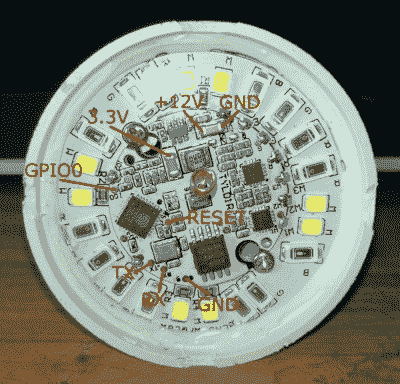

# 黑掉这个智能灯泡几乎太容易了

> 原文：<https://hackaday.com/2019/07/16/hacking-this-smart-bulb-is-almost-too-easy/>

普通的黑客读者不再需要被提醒 ESP8266 有多受欢迎；他们一天会看到好几次这样的证据。但可能不太明显的是，不仅仅是我们这些黑客喜欢廉价的物联网微控制器，它也越来越频繁地出现在商业产品中。

正如[Majenko]所展示的，[其中一个 ESP 供电的设备是 LOHAS 智能 LED 灯泡](https://majenko.co.uk/blog/more-esp8266-hacking-lohas-led)。打开一个灯泡后，他发现这些相对低成本的灯泡只不过是一个标准的 ESP8266 芯片和几个 LED 驱动器。他想看看让自己的代码在灯泡上运行有多难，从表面上看，打开它比加载自定义固件要花更长的时间。

 灯泡的 PCB 采用了前面提到的 ESP8266，1MB 的 25Q80 闪存芯片，以及 MY9231 LED 驱动器。无论是谁将电路板组装在一起，都很好地标记了 RX、TX 和 GPIO 测试点，尽管[Majenko]指出，标记为 3.3 V 的测试点似乎已经失效。有了连接到电路板的 ESP-01 编程器和适当的电路板设置(由他提供)，您可以使用 Arduino IDE 上传您喜欢的任何内容。

在智能灯泡上运行“Hello World”很有趣，但是打开那些发光二极管会怎么样呢？[Majenko]找到了一个与 MY9231 驱动程序一起工作的库，没用多长时间就弄清楚了 ESP 的哪个管脚是用来与它们通信的。总而言之，他说这比他想象的要容易得多。

你可能想在重新编程后把这个灯泡重新投入使用，所以[Majenko]建议打开外壳时要小心。扩散器上有夹子，他向我们保证，无论你做什么，它都会断裂，还有一些硅胶。他建议在你完成编程后用强力胶把它粘在一起，并使用 OTA 固件，这样你就不需要再回到那里了。

在过去，我们已经展示了一些黑客如何开发他们自己的智能灯泡硬件，但是由于廉价的商业产品很容易被黑客攻击，坦白地说，这似乎不值得。另一方面，[大量廉价的静电驱动灯泡也不全是好消息](https://hackaday.com/2019/01/29/dont-toss-that-bulb-it-knows-your-password/)。