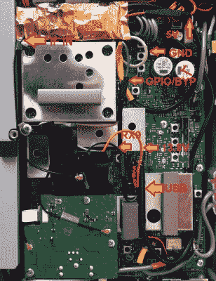

# 业余无线电获得嵌入式 RTL-SDR

> 原文：<https://hackaday.com/2019/09/03/ham-radio-gets-embedded-rtl-sdr/>

我们通常认为 RTL-SDR 是“真正”无线电的低成本替代品，但由[Rodrigo Freire]牵头的这个令人难以置信的项目表明，这两类设备并不一定相互排斥。经过近 6 个月的工作，他开发并记录了一种方法[将 RTL-SDR 博客 V3 接收机直接集成到八重洲 FT-991 收发器](https://github.com/rfrht/FT991A-PAT)中。

FT-991 一开始就已经具备 USB 功能，这一事实使得黑客攻击的专业成果成为可能。更具体地说，它有一个内部 USB 集线器，允许多个内部设备作为一种复合设备出现在计算机上。

不幸的是，内部 USB 集线器只支持两个设备，因此[Rodrigo]的第一项任务是用提供四个端口的 USB2514BI 替换原来的 USB2512BI 集线器 IC。交换完成后，他能够将 RTL-SDR 设备挂在新芯片的引脚上。

当然，这只是战斗的一半。从外部角度来看，他有一个很好的集成 RTL-SDR，但要真正有用，SDR 需要接入无线电信号。为了做到这一点，[Rodrigo]设计了一个定制的 PCB，从无线电中提取中频信号，将其馈入放大器，最终传递给 SDR。该板使用板载开关[，由 RTL-SDR 博客 V3](https://hackaday.com/2019/07/31/rtl-sdr-seven-years-later/) 上的 GPIO 端口控制，用于启用 tap 和前置放大器。

在休息后的视频中，你可以看到[罗德里戈]演示他改装的 FT-991。[这实际上不是第一次有人用软件定义的无线电接入他们的八重洲](https://hackaday.com/2017/12/10/tapping-into-a-ham-radios-potential-with-sdrplay/)，尽管这肯定是我们见过的最干净的安装。

 [https://www.youtube.com/embed/WfEJoV_u_B8?version=3&rel=1&showsearch=0&showinfo=1&iv_load_policy=1&fs=1&hl=en-US&autohide=2&wmode=transparent](https://www.youtube.com/embed/WfEJoV_u_B8?version=3&rel=1&showsearch=0&showinfo=1&iv_load_policy=1&fs=1&hl=en-US&autohide=2&wmode=transparent)

