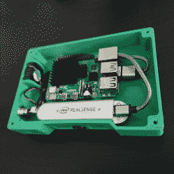
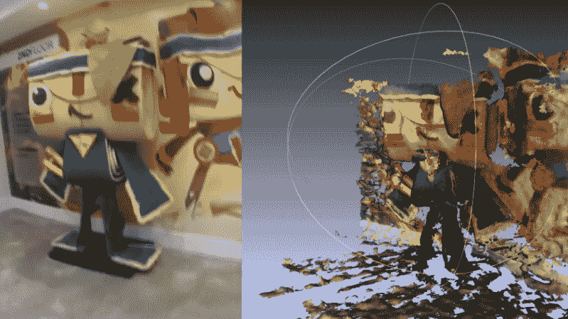

# 手持 3D 扫描，使用 Raspberry Pi 4 和英特尔实感摄像头

> 原文：<https://hackaday.com/2020/03/31/handheld-3d-scanning-using-raspberry-pi-4-and-intel-realsense-camera/>

Raspberry Pi 4 (with USB 3.0) and Intel RealSense D415 depth sensing camera.

当 Raspberry Pi 4 问世时，[Frank Zhao]看到了制造完全手持和独立的实时 3D 扫描仪的潜力。该设备有一个英特尔 RealSense D415 深度传感摄像头作为主传感器，它使用两个红外摄像头和一个 RGB 摄像头以及 Raspberry Pi 4。Pi 使用一款名为 [RTAB 地图](http://introlab.github.io/rtabmap/)的软件——旨在用于机器人应用——来使用来自相机的数据绘制 3D 环境地图，并在 3D 空间中定位自己。一切都被实时记录下来。

这种手持设备可以充当 3D 扫描仪，因为 RTAB 地图收集的数据由一个区域的点云以及深度信息组成。当与传感单元的原点(即该区域内摄像机的位置)结合时，它可以将点云导出到网格中，甚至应用从摄像机镜头中获得的纹理。断点下方显示了一个示例。
 

就 3D 扫描而言，如果你认为这些结果并不完美，那也没关系。确实，这些结果与摄影测量学不可同日而语。但是考虑到英特尔 RealSense 的 RGB 摄像头的低分辨率，以及 RTAB 地图是一个 [SLAM](https://en.wikipedia.org/wiki/Simultaneous_localization_and_mapping) (同步定位和地图)沙盒和*而不是* 3D 扫描软件的事实，这些结果从一个基本上在业余时间输出这些的手持设备上来看是惊人的。

虽然这个项目可能看起来只由几个组件和一些开放软件组成，但让所有组件协同工作是一个挑战。[查看该项目的 GitHub 资源库](https://github.com/frank26080115/HandHeld3DScanner)以利用[Frank]的辛勤工作，并观看下面嵌入的视频。

 [https://www.youtube.com/embed/E_22Ate_5nw?version=3&rel=1&showsearch=0&showinfo=1&iv_load_policy=1&fs=1&hl=en-US&autohide=2&wmode=transparent](https://www.youtube.com/embed/E_22Ate_5nw?version=3&rel=1&showsearch=0&showinfo=1&iv_load_policy=1&fs=1&hl=en-US&autohide=2&wmode=transparent)

