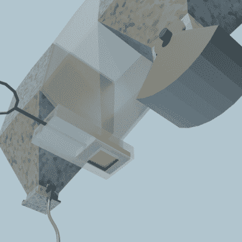
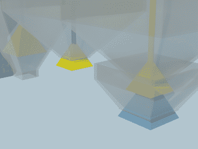

# 处理散装材料:香料必须流动！

> 原文：<https://hackaday.com/2022/06/08/handling-bulk-material-the-spice-must-flow/>

你的[博恩哈克]计划包括将柠檬留在图案中作为信息展示。你的松鼠喂食器只需要在松鼠应得的时候分发坚果。正如[上周](https://hackaday.com/2022/06/01/bulk-material-what-is-this-stuff-anyway/)所承诺的，介绍浇口、进料和移动散装材料。

## 盖茨

散装材料流需要控制。开始容易，停止难。

Dump Gate, Slide Gate, Clamshell Gate

如果你只是想把箱子里的东西全部倒出来，那么*倾倒门*就可以了——一个带插销的活板门。如果你需要在清空垃圾箱之前停下来，你可以使用一个*滑阀*——一个盒子里的扁平材料，可以滑入和滑出。压在其上的材料产生的摩擦力会产生很大的开启/关闭力。关闭时，材料可能会卡在挡板和外壳之间。

一种变体是蛤壳门——臂上圆柱体的一部分，像起重机的抓斗一样摆动到一边。它们往往会泄漏，但由于材料的重量压在铰链销上，用很大的力就可以很容易地关闭。

*向上的钟形*门有助于仓内的流动模式，并且密封良好。通过出口从上方拉动或从下方推动打开。在浇口周围移动的材料起到改善流动的作用，并且因为唇缘处的材料在倾斜的表面上，它们倾向于更好地密封。如果它仍然有泄漏问题，一个灵活的嘴唇可以治愈它。

漏斗出口下方的电缆上悬挂着一个锥形物*向下的钟形物*。降低电缆让物料在出口边缘和钟形件之间流动。当电缆升起时，如果有一个肿块粘在一个地方，钟就会移到一边。密封面是角形的，所以材料会滚落。垃圾箱比较浅，也没有出水管。这种设计确保了钟关闭时大颗粒不会楔入墙壁。

Upward Bell, Downward Bell, Double Bell

如果不是因为箱子里的材料，这些门都可以很好地关闭。*双门*利用了这一点。主箱有一个正常的门和出口。出口位于更小、更低的*控制仓*的唇部下方。如果控制箱装满，主箱停止。控制仓的门比主仓的门大。尽可能关闭主闸门会将通过控制闸门的流量减少到涓涓细流。控制闸门现在可以完全关闭，从而填充控制仓并阻塞主出口。

您可能不想在垃圾箱之间共享环境。也许一个有压力，讨厌的化学物质，或热气体。在这种情况下，旋转气闸闸门是一个紧密配合外壳中的桨轮装置。材料在转动时被计量出来。双浇口也可以(高炉使用双钟)。如果你需要计量一个设定的数量，一个像杂货店散装箱滑动腔工作。旋转气闸也是如此。

机车打磨系统将沙子撒在铁轨上以增加牵引力。沙子被一个“沙坑”挡住了。一根管子通过一个向上的 U 形弯向一个“阀门”输送沙子。当然这阻碍了。来自驾驶室中阀门的压缩空气管线进入 U 形弯管的上端。只要有空气流动，堵塞就不断被清除，沙子就会流动。它被收集并送到车轮上。

## 饲养员

如果你需要一个恒定的流量，不管箱子里有多少，你需要一个加料器。

旋转气闸可以是简单的进料器。输送给料机是料斗底部的一条皮带。一侧的箱和皮带之间有微小的间隙。材料覆盖了与间隙一样高的皮带。螺旋进料器是料斗底部的螺旋螺杆，将物料卸到旁边。螺杆需要一个变化的螺距，开始时缓慢增加，让它逐渐充满整个料斗。振动给料机是一种设计成拱形的斜槽，用振动器使其流动。

任何一种都可能有不良的进食模式，沿着它的入口从一个地方进食。箱中的鳍片和插入物可以有所帮助——刮刀可以调节最初几英寸传送带的深度，[或者防鼠洞型插入物](https://hackaday.com/2022/05/24/handling-bulk-material-why-does-my-catfood-get-stuck/)可以保持大流量。

## 传送机

与进料器不同，输送机依赖于向其输送的任何东西来控制进料速度。进料器用于控制进料速度。运送物品的传送带。当速度改变时，进料器将改变其输出。输送机可能会改变每个部分的数量(“装载”)，但产量与速度无关。

[螺旋输送机](https://hackaday.com/2022/06/04/ingenious-indigenous-artful-screw-conveyor/)应具有固定的螺距，并可倾斜至 45 度。皮带可以倾斜到材料静止的角度。最好在腰带上做一个轻微的“V”形，这样布料就不会滚落。边上的木板也可以工作，但是当材料在上面滑动时会给系统带来摩擦。

不要忽视跳跃——一个被拉上斜坡的桶。前轮在比后轮稍窄的轨道上行驶。在末端将内侧履带向下倾斜以进行倾卸。

如果以正确的顺序启动，由长条制成的移动地板将移动一堆材料。把顺序想象成‘123123123123’:突然向后推 1，上面的材料会和质量在一起，做 2 和 3，然后慢慢全部向前移动。他们还移动固体物体，所以许多卡车都有这样的地板。

最后，你总是可以流化材料，用空气或水吹它，然后在另一端去除流体。想想过去伐木的时候，木头顺流而下。

祝你黑客愉快。我们希望我们已经给了你一些处理[核桃](https://hackaday.com/2022/04/26/fort-knutz-squirrels-go-all-mission-impossible/)的选择。