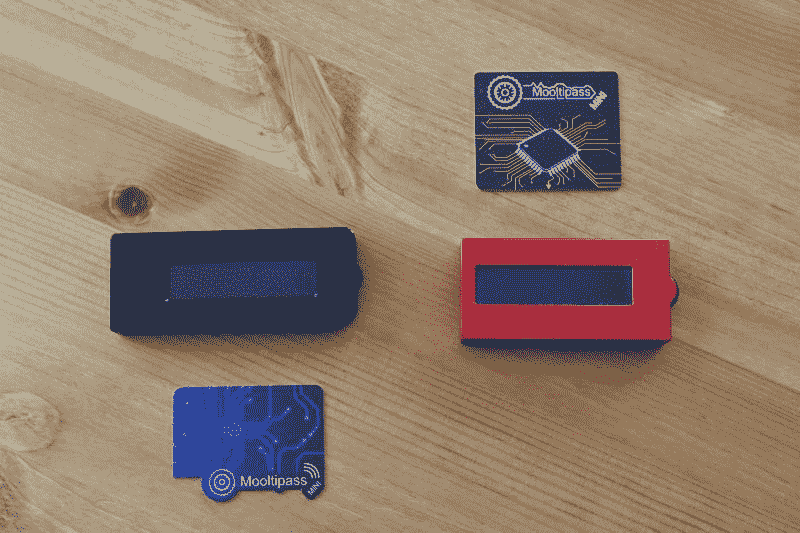
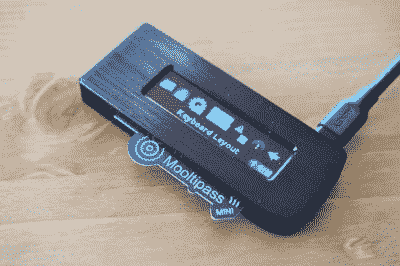
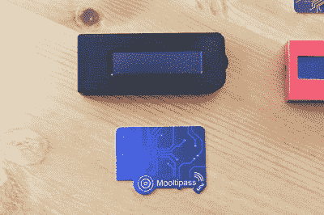
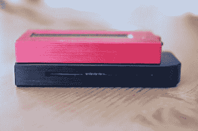
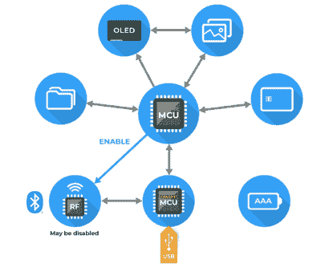
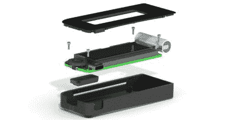

# 动手操作:使用新的 Mooltipass 迷你 BLE 安全密码管理器进行无线登录

> 原文：<https://hackaday.com/2020/07/23/hands-on-wireless-login-with-the-new-mooltipass-mini-ble-secure-password-keeper/>

记住密码是一个人似乎无法逃避的事情之一。至少，我们都需要记住一个密码:即解锁密码管理器的密码。这些密码管理器有各种各样的形式，从软件程序到随身携带的小设备。Mooltipass 迷你 BLE 属于后一种类型:它足够小，可以舒适地放在手中或口袋里，但能够记住你的所有密码。

进入众筹活动，[Mooltipass 迷你 BLE](https://www.kickstarter.com/projects/limpkin/mooltipass-mini-ble-security-on-the-go) 是由 [Mooltipass](https://www.themooltipass.com/) 迷你设备演变而来，默认情况下，它充当 USB 键盘，为你输入登录凭证。安装了所需的浏览器扩展后，在浏览已知网站时，此过程也可以自动进行。任何新的凭证也可以通过这种方式自动保存。

Mooltipass Mini BLE 与最初的不同之处在于，它还增加了蓝牙(BLE)模式，使其能够轻松地与任何支持 BLE 的设备配合使用，包括笔记本电脑和智能手机，而不必四处寻找 USB 电缆和/或 OTG 适配器。

我已经使用最初的 Mooltipass Mini 有一段时间了，Mooltipass 团队非常友好地给我发了一个 Mooltipass Mini BLE 原型进行评估和比较。让我们来看看。

## 硬件密码管理器基础知识

有时候，人们感觉需要记住 56 个密码似乎是最近的事情，但自从有人在计算机系统上提出“用户账户”的概念以来，这几乎就是一项要求。然而，处理个人电脑操作系统、24 个在线商店、银行和社交媒体账户的密码确实需要更多的争论。尤其是如果一个人以正确的方式登录，并且每次登录都使用不同的密码。

虽然写在便利贴上的密码只要没人偷看就能保证安全，但这种方法很笨拙，而且很容易丢失一点纸。基于软件的密码管理器是一个明显的进步，也是我过去几年一直在使用的。他们使用主密钥来加密包含凭证以及其他敏感信息的数据库。人们可以将这个加密的数据库文件放在在线驱动器或 u 盘上，安全地随身携带。

The new and the old.

像 Mooltipass Mini (BLE)这样的硬件密码管理器与该概念类似，只是 Mooltipass 设备本质上是物理形式的数据库，而不是加密的数据库文件。凭证存储在本地防篡改存储设备中。要解锁设备，你需要两样东西:

*   您拥有的东西(带有 AES 密钥的智能卡)。
*   你知道的东西(PIN 码)。

这种双因素身份验证可确保如果有人拿着您的智能卡逃跑，他们仍然无法解锁您的 Mooltipass 设备。这种方法的另一个有趣之处在于，多人可以共享同一个 Mooltipass 设备，只能看到他们的个人智能卡和 PIN 码解锁的凭证。这与最近另一款名为 [BeamU](https://www.beamu.io/) 的硬件密码管理器非常不同，后者仅通过指纹解锁(“你是谁”)，理论上允许任何人提取你的指纹来获取你的 BeamU 卡上的所有凭证。

Higher-res OLED display.

Card slots have swapped sides.

Mini BLE with a smartcard.

Thickness has remained basically unchanged.

也就是说，Mooltipass 迷你 BLE 仍然允许你将它用作网络认证(FIDO2)设备，缺乏生物识别是一个明智的选择，正如我在最近一篇关于 FIDO2 的文章中提到的。这与我们在 [SoloKey](https://solokeys.com/) 中发现的硬件令牌功能相同，但在单个设备中结合了密码保存和 FIDO2。到目前为止，Mooltipass 迷你 BLE 看起来不错。

## 进入低能量牙科

蓝牙低能量( [BLE](https://en.wikipedia.org/wiki/Bluetooth_Low_Energy) )已经成为仅次于常规蓝牙协议的最受欢迎的并行协议。它能够实现与常规蓝牙类似的通信范围，而功耗却大大降低。这对 Mooltipass Mini BLE 来说是一件好事，因为与它的前辈不同，它现在必须依靠电池供电。默认情况下，BLE 是禁用的，但可以在仪器的设置中启用。

在启用 BLE 的情况下，一次电池充电应该可以持续大约一个月，这取决于屏幕打开的频率。因为每当用户必须确认添加新凭证或手动将凭证发送到登录字段时都会发生这种情况。

USB 端口从 Micro-USB 移至 USB-C，但其他基于 USB 的功能保持不变。在 Mooltipass 迷你 BLE 中，该线缆既可用于基于 USB 的通信，也可用于为内部电池充电。

安装了[附带的软件](https://www.themooltipass.com/setup/index.php?page_allbrowsers)(在 GutHub 上有[源，被称为 moolticute)，人们可以调整设备的各种设置，例如当它模拟 USB 或 ble 键盘时使用的键盘布局。访问凭证列表也是通过应用程序完成的，允许手动添加和维护凭证。按照顺序，你只需要安装一个浏览器扩展，或者通过 USB 或 BLE(或两者)连接 Mooltipass 迷你 BLE，然后选择证书发送到连接的设备。如果 BLE 和 USB 当前都已连接，设备将使用其显示屏要求用户在两种连接之间进行选择。](https://github.com/mooltipass/moolticute)

当通过 BLE 在 Windows 10 笔记本电脑上尝试这一功能时，它成功地使用“模拟 BLE 键盘”功能填写了 Github 等网站的登录字段。不需要特殊的软件，这使得它在使用基于软件的密码管理器不可行的情况下非常有用，比如使用公共或工作计算机。

## 我的 Beta 体验

在收到 Mooltipass Mini BLE 设备的早期版本后，我被告知第二台设备也在来我这里的路上，因为第一台设备可能有固件缺陷。虽然我没有遇到这个 bug，但由于 Beta 级硬件的性质，拥有第二个设备非常有用。在某个时候，第一个设备的显示屏停止打开，尽管设备的其余部分仍在工作。这已被确认为早期设备的已知问题。

Scrollwheel looks slightly different.

到目前为止，第二台设备没有给我带来任何重大问题。在探索新功能之前，我能够以类似于 Mooltipass Mini 的方式使用它。就手感和外观而言，两款设备都非常相似。它们仍然被包裹在类似的金属外壳中，右手边的 clicky 滚轮非常相似，显示屏是熟悉的单色外观，尽管比原来的屏幕分辨率更高的有机发光二极管屏幕。

当我收到第一个设备时，我可以插入一个提供的智能卡并创建一个新的密钥(“用户”)。通过菜单选项克隆智能卡的能力也很有用。这样，你就有了密钥的备份，以防丢失原始智能卡。在 Moolticute 应用程序中，还会不断提醒您备份凭证数据库。所有这一切应该会使一个人的账户很难被锁定，因为数据库永远不会局限于一台设备。

在我的笔记本电脑上，看到各种网站的登录字段像变魔术一样被填满，也是一种有趣的体验。我遇到的唯一问题是迷你 BLE 的 USB 接口目前不能很好地处理我常用的 USB 集线器，我的小米 5 智能手机上的 BLE HID 不能工作。USB 集线器在最初的 Mini 上没有问题，所以这似乎是一个暂时的故障，Mooltipass 团队已经意识到了这个问题。

## 早期判决

Mooltipass 迷你 BLE 似乎是一个硬件密码管理器，我并没有真正意识到我需要它。我不太喜欢网络认证，也不相信生物识别技术能保护我的数据。这就是 Mooltipass Mini BLE 提供非生物识别双因素认证来解锁的原因，甚至允许不同类别的加密数据(使用不同的智能卡和 PIN 解锁)。拥有 FIDO2 支持是一个额外的好处，万一我想使用它，需要一个令牌。

 和最初的 Mini 一样，Mini BLE 是[一个开源项目](https://github.com/mooltipass)，硬件和软件都是。这一点对你是否重要，多半是个人的选择。对我来说，它确实增加了一定程度的信心，因为我可以随时查看原理图和源代码。

因为我有早期的原型硬件可以使用，所以过分强调一些剩余的硬件和固件问题似乎是不公平的。然而，我真的希望这些最后的问题在最终的硬件准备好之前得到解决。一旦发生这种情况，我可能会忍不住让 Mooltipass Mini 退役，代之以 BLE 的继任者。