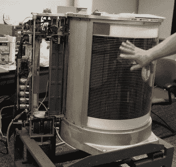
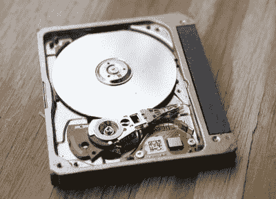
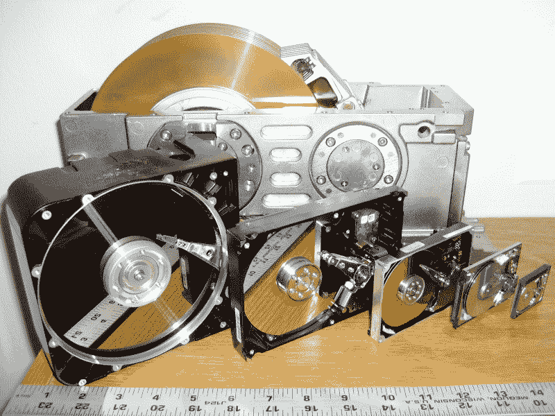
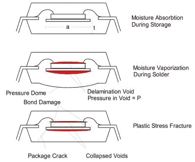
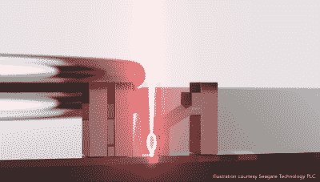

# 硬盘驱动器让精密工程变得司空见惯

> 原文：<https://hackaday.com/2020/09/23/hard-disk-drives-have-made-precision-engineering-commonplace/>

现代硬盘驱动器(HDD)有趣地同时成为大规模生产、高精度机械工程的巅峰，也是最受鄙视的存储技术。尽管被称为“旋转的铁锈”等贬义词，但这些驱动器中的大多数都可以管理终身旋转的超光滑磁存储盘片，距离记录和读取头仅几纳米，读取臂使用致动器在几毫秒内将磁头精确定位在正确的微观磁迹上方。

尽管几十年过去了，越来越多的磁迹被塞在这些盘片的一平方毫米上，简单的读写头每隔几年就被越来越复杂的读写头取代，但硬盘驱动器的可靠性还是提高了。存储公司 Backblaze 关于其硬盘的第二季度报告显示，与去年相比，年度故障率大幅下降。

问题是，这是否意味着硬盘只会随着时间的推移变得更加可靠，以及 MAMR 和 HAMR 等即将到来的技术在未来几十年将如何影响这些指标。

## 从兆到兆

The internal mechanism and its fifty 610 mm platters of the IBM 350 hard drive (DSU).

第一批硬盘是在 20 世纪 50 年代销售的，IBM 的 IBM 350 在 50 张 24 英寸(610 毫米)的光盘上总共存储了 3.75 兆字节，放在一个 152x172x74 厘米的柜子里。快进到今天，一个 3.5 英寸(约 14.7×10.2×2.6 厘米)的顶级硬盘可以存储大约 18 TB 的[和传统(非重叠)记录。](https://www.seagate.com/gb/en/internal-hard-drives/hdd/ironwolf/)

IBM 350 以 1，200 RPM 的速度旋转其盘片，而 HDD 在过去几十年中一直专注于减小盘片的大小，提高主轴速度(5，400–15，000 RPM)。其他改进集中在将读写头移近盘片表面。

1961 年的 IBM 1301 DSU(磁盘存储单元)是一项重大创新，因为它使用了一个单独的臂，每个盘片都有读写头。它还通过使用空气动力进行创新，让手臂在气垫上飞过盘片表面，从而大大缩短磁头和盘片表面之间的距离。

经过 46 年的发展，IBM 于 2003 年将其硬盘业务出售给日立。到那时，在一个小得多的卷中，存储容量增加了 48，000 倍。比它小 29161 倍。功耗从 2.3 千瓦以上降至 10 瓦左右(台式机型号)，而每兆字节的价格从 68，000 美元降至 0.002 美元。与此同时，盘片的数量从几十个减少到最多只有几个。

## 用更少的空间储存更多东西

Inside of 1″ Seagate MicroDrive.

小型化一直是游戏的名称，无论是关于机械构造、电子还是计算机技术。20 世纪 40 年代和 50 年代笨重的真空管或继电器供电的计算机怪物，在变成今天光滑的 ASIC 供电的奇迹之前，演变成不那么笨重的晶体管供电的计算机系统。与此同时，硬盘存储技术也经历了类似的变化。

随着越来越精确和低功率的伺服技术，硬盘驱动器的控制电子设备经历了 VLSI 电路使用增加的所有好处。随着材料科学的进步使得更轻、更光滑(玻璃或铝)的盘片具有改进的磁性涂层，面密度不断上升。所有单个组件的属性(ASIC 封装、焊料合金、致动器、HDD 臂的空气动力学等。)更好理解的是，重大变革变成了渐进式改进。

六开硬盘，从 8 寸降到 1 寸。[保罗·r·波茨](https://commons.wikimedia.org/wiki/File:SixHardDriveFormFactors.jpg)拍摄【CC-BY-SA 3.0】

虽然硬盘的极致小型化已经尝试了至少两次，分别是 1992 年的[惠普 Kittyhawk](https://en.wikipedia.org/wiki/HP_Kittyhawk_microdrive) microdrive (1.3 英寸)和 1999 年的 [1 英寸 Microdrive](https://en.wikipedia.org/wiki/Microdrive) ，但最终市场还是会选择 3.5 英寸和 2.5 英寸。Microdrive 外形是作为基于 NAND 闪存的 CompactFlash 卡的替代产品上市的，具有更高的容量和基本上无限制的写入，使其适用于嵌入式系统。

正如在其他领域发生的情况一样，对写入速度和随机存取时间的物理限制最终意味着硬盘驱动器在低成本大容量存储和高耐用性至关重要的情况下最有用。这使得硬盘市场能够针对台式机和服务器系统以及监控和备份(与磁带竞争)进行优化。

## 了解硬盘故障

虽然硬盘的机械部件通常被认为是最薄弱的地方，但有许多可能的原因，包括:

*   人为错误。
*   硬件故障(机械、电子)。
*   固件损坏。
*   环境因素(高温、潮湿)。
*   权力。

硬盘在断电或运行时(盘片旋转且磁头未停放)会有一个冲击等级。如果超过这些额定值，可能会损坏移动臂的致动器，或者导致磁头撞到盘片表面。如果没有超过这些公差，那么正常磨损很可能是故障的主要原因，这是由制造商的 [MTBF](https://en.wikipedia.org/wiki/Mean_time_between_failures) (平均故障间隔时间)数字指定的。

这个 MTBF 值是根据一段时间后观察到的磨损情况推断出来的，这是行业标准。由于硬盘的 MTBF 通常在 100，000 到 100 万小时之间，测试整个周期需要硬盘运行 10 到 100 年。因此，这个数字假设驱动器在推荐的操作条件下运行，就像 Backblaze 这样的存储公司所发生的那样。

显然，将硬盘暴露在极端冲击(例如，将其摔在混凝土地板上)或极端电源事件(电涌、ESD 等)下。)会限制它们的寿命。不太明显的是任何产品都可能出现的制造缺陷，这也是大多数产品都有“可接受的故障率”的原因。

## 不是你，是生产线

 尽管硬盘的 MTBF 数字很高，Backblaze 也做出了明显的努力，让他们的近 130，000 个硬盘快乐地运转，直到它们被淘汰到硬盘天堂(通常以机械粉碎机的形式)，[他们报告说，2020 年第一季度的年化故障率](https://www.backblaze.com/blog/backblaze-hard-drive-stats-q1-2020/) (AFR)为 1.07%。令人高兴的是，这是他们自 2013 年开始发布这些报告以来的最低失败率。例如，Q1 2019 年 AFR 为 1.56%。

正如我们之前所述，在集成电路(IC)的制造和处理过程中，[缺陷可能会被引入](https://hackaday.com/2019/05/03/get-to-know-the-physics-behind-soldering-and-the-packaging-of-ics/)，这些缺陷只会在产品生命周期的后期变得明显。随着时间的推移，像[电迁移、热应力和机械应力](https://hackaday.com/2020/01/28/lead-free-solder-alloys-their-properties-and-best-types-for-daily-use/)这样的问题会导致电路故障，从 IC 封装内部的键合线断裂、电迁移破坏焊点以及 IC 封装内部的电路(特别是在 ESD 事件之后)。

硬盘驱动器的机械元件取决于精确的制造公差以及适当的润滑。在过去，磁头卡住([静摩擦](https://burgessforensics.com/data-recovery-myths-and-misconceptions/)’)可能是一个问题，因为润滑剂的性质会随着时间的推移而改变，直到机械臂无法再离开其停放位置。到目前为止，改进的润滑类型或多或少地解决了这个问题。

然而，制造过程中的每一步都有一定的机会引入缺陷，这些缺陷最终会破坏漂亮、闪亮的 MTBF 数字，而不是使产品成为故障率“浴缸曲线”的错误一侧。该曲线的特点是，由于严重的制造缺陷，产品故障的早期峰值，此后缺陷减少，直到 MTBF 寿命结束。

## 展望未来

It’s HAMR time.

我们今天所知的硬盘代表着一种成熟的制造工艺，过去五年来困扰它们的许多老问题都得到了解决或缓解。到目前为止，相对较大的变化，如[转向充氦](https://www.backblaze.com/blog/helium-filled-hard-drive-failure-rates/)驱动器，在故障率方面没有明显的表现。其他变化，如从[垂直记录](https://en.wikipedia.org/wiki/Perpendicular_recording) (PMR，或 CMR)到热辅助磁记录( [HAMR](https://en.wikipedia.org/wiki/Heat-assisted_magnetic_recording) )的转变，应该不会对硬盘寿命产生明显影响，除非新技术本身存在任何问题。

基本上，对于那些喜欢花很少的钱拥有大量存储容量，并且至少可以持续十年的人来说，硬盘技术的未来似乎很无聊。硬盘背后的基本原理，即在磁盘上存储磁取向，恰好可以归结为单一分子。有了像 HAMR 这样的添加剂，这些磁取向的长期稳定性也会得到显著改善。

与 NAND 闪存相比，这是一个巨大的优势，NAND 闪存使用小电容器来存储电荷，并使用物理损坏这些电容器的写入方法。这里的物理限制要严重得多，这导致了更复杂的结构，例如四级(QLC)闪存，它必须在每个单元中区分 16 种可能的电压状态。这种复杂性导致在许多情况下，基于 QLC 的存储驱动器[比 5,400 RPM 的硬盘驱动器](https://www.anandtech.com/show/15887/the-samsung-870-qvo-1tb-4tb-ssd-review-qlc-refreshed/3)快不了多少，尤其是在延迟方面。

## 旋转下降

我在自己的系统中使用的第一个硬盘可能是 IBM PS/2 (386SX)中的 20 或 30 MB 希捷硬盘，这是我父亲在他的工作转向新的个人电脑后给我的，他可能想在他们的存储区域中释放一些空间。回到 MS DOS 时代，这对于 DOS、一堆游戏、WordPerfect 5.1 等等来说已经足够了。到 90 年代末，这当然是一个可笑的数字，那时我们谈论的是千兆字节，而不是谈到硬盘时的兆字节。

尽管从那以后我经历了许多个人电脑和笔记本电脑，讽刺的是，我只有一个 SSD 彻底放弃了，并在我身上死去。这一点，加上来自行业的数据——如这些 Backblaze 报告——让我非常有信心，最后一个硬盘暂时不会停止旋转。也许当像 3D XPoint T1 这样的内存变得可以负担得起并且足够大时，这种情况可能会改变。

在那之前，继续旋转。