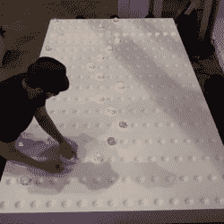

# 硬件 Vs 软件:拼了！

> 原文：<https://hackaday.com/2020/10/10/hardware-vs-software-fight/>

这是黑客世界中的一个伟大的陈词滥调:硬件类型和软件类型。你可以很容易地分辨出你是这两个人中的哪一个。当一个项目实际上完成了 20%，但你认为它完成了 90%，你对自己说“剩下的只是软件的简单问题”，你是硬件型的。问任何读过我代码的人，他们都会告诉你，我是硬件型的。

随着我对正确编写代码的困难视而不见，我也不得不承认对黑暗的打字艺术中蕴藏的力量的低估。但是当我看到一个令人敬畏的软件应用时，我不会太骄傲地脱帽致敬。例子:[我们上周运行的这个围棋程序](https://hackaday.com/2020/10/05/go-board-step-sequencer-lets-go-make-some-music/)。一个头顶上的网络摄像头解析玩家在玩围棋时放下黑白棋子的动作，并将其转化为音乐。

纯软件类型会说“但是有一个网络摄像头和一个围棋板”。事实上，这是真的。这个项目有*物理元素，将它锚定在两个人游戏的共享现实中。但这不是一个硬件项目。是 OpenCV 和 Max/MSP 让它发挥作用。*

 为了比较，看看[这个类似物理音序器的复杂程度](https://hackaday.com/2016/07/12/orbs-light-to-billie-jean-on-this-huge-sequencer/)。它有一个 16 x 16 的 led 和开关阵列，以及一个数控铣削，涂底漆和油漆的表面，大小相当于一张双人床。锯屑和手工焊接:那是一个硬件项目。

我喜欢 Go sequencer 的一点是，它使用的软件*恰到好处*。这件作品仍然是实物。这很容易成为一个虚拟世界，两个人只能通过护目镜进行互动。但不知何故，这不太像*人类*把石头放在木板上，坐在你的对手对面，甚至可能看着你的对手。玩家不会被迫去考虑软件。他们不觉得自己在玩电子游戏。

但与此同时，软件方面的东西让所有可怕的硬件问题消失了。没有人焊接一个由 169 个开关组成的老鼠窝。笔记本电脑的 USB 接口上插着一个网络摄像头。那里有一种深深的简单。

你应该总是把街机按钮换成 OpenCV 吗？绝对不行！但是，当用硬件来做太难的时候，是否值得考虑软的一面呢？我是开放的。

This article is part of the Hackaday.com newsletter, delivered every seven days for each of the last 200+ weeks. It also includes our favorite articles from the last seven days that you can see on [the web version of the newsletter](https://mailchi.mp/hackaday.com/hackaday-newsletter-649368). Want this type of article to hit your inbox every Friday morning? [You should sign up](http://eepurl.com/gTMxQf)!