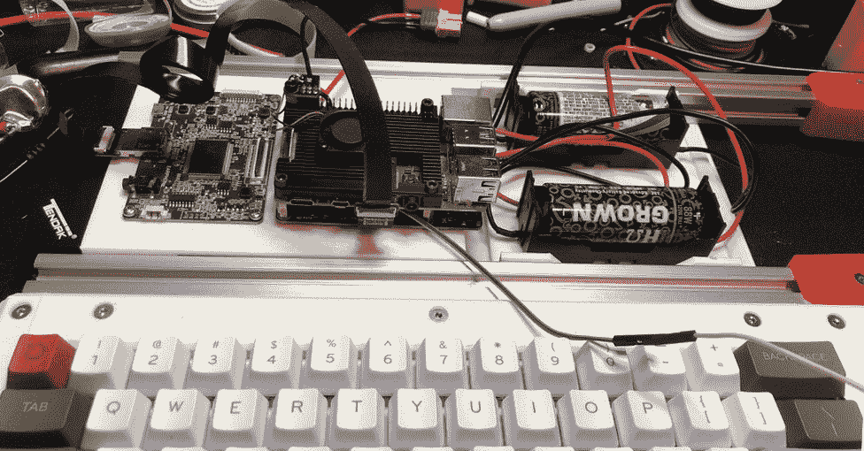
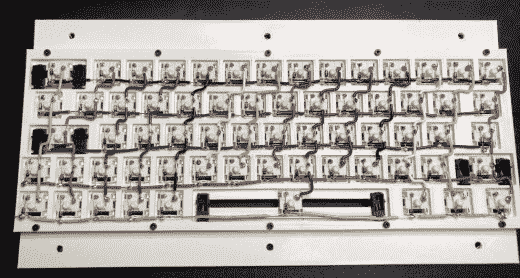
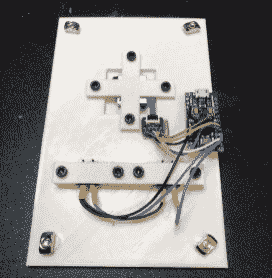

# 重金属网络平台着眼于扩张

> 原文：<https://hackaday.com/2021/04/15/heavy-metal-cyberdeck-has-an-eye-towards-expansion/>

无论我们谈论的是吉布森的蔓延还是我们日益反乌托邦的现实，网络甲板的一个定义性特征是它可以随着时间的推移轻松定制和升级。虽然我们在过去几年中报道的一些构建更多地关注于风格而不是实质，但我们真的很欣赏那些拥抱模块化概念的设计，以确保系统可以不断发展，以满足不断变化的黑客需求。

为此，来自[BlastoSupreme]的 [M3TAL 是一个完美的网络平台应该是什么样的](https://cyberdeck.cafe/mix/m3tal)的例子。自然，它拥有我们期待的赛博朋克美学，但更重要的是，它的设计使得修改和修理尽可能地快速和无痛。诀窍是使用 2020 铝挤压框架，允许外部面板和组件使用 T 型螺母连接到甲板长度的任何地方。类似地，通过将内部组件安装在挤压件之间的“雪橇”上，电子器件可以作为完整的模块轻松移除或更换。

The M3TAL is currently outfitted with a Raspberry Pi 4 and a pair of 26650 batteries.

为了进一步增强可扩展性，[BlastoSupreme]在 M3TAL 上配备了一个真正的 3.5 软盘驱动器，使他能够在每个坚固的便携式磁盘上存储令人难以置信的 1.44 MB。好吧，也许与 2021 年的技术相比，软驱并不令人印象深刻，但它似乎非常适合网络平台。在甲板的对面有一个 RetroCART 插槽，[将现代 USB 设备隐藏在笨重的人造盒子里](https://hackaday.com/2021/03/13/its-not-a-computer-if-it-doesnt-have-a-cartridge-slot/)。这为从可移动存储到微控制器和软件定义的无线电接收机的一切提供了统一的物理格式。

【BlastoSupreme】也在 M3TAL 上的输入设备上投入了相当多的时间和精力。船上有一个机械键盘，这是 cyberdecks 的传统，但这一个值得注意的是细致的手工布线和隐藏在下面的 Teensy 2.0 微控制器。旁边是一个用于任天堂 Switch 的小操纵杆，已经通过 Arduino Pro Micro 转换为 USB。

    

看看 M3TAL，你可能不会惊讶这不是[BlastoSupreme]建造的第一个定制 cyberdeck。去年我们报道了他巨大的*NX-Yamato*T3，看到他技术的演变很有趣。显然，这不是一个满足于吃老本的制造者，所以我们渴望看到他为下一个项目准备了什么。