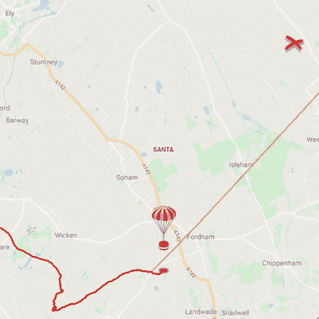

# 高空气球跟踪器使用 Pi Pico 进行着陆预测

> 原文：<https://hackaday.com/2021/03/10/high-altitude-balloon-tracker-does-landing-prediction-with-pi-pico/>

[戴夫·阿克曼]正在进行的高空气球(HAB)工作非常出色，我们都因他像这样记录自己的工作而受益匪浅。最近，[Dave]写了一篇关于他基于 Raspberry Pi Pico 的气球追踪器的文章，它的功能带来了一些有趣的特性。

在某种程度上，HAB 追踪器的工作相当简单:读取 GPS 等传感器，并不断将数据传递给地面上的人，以便跟踪气球的位置，当它最终返回地球时，硬件会恢复。有很多不同的方法来做这种跟踪，其中一件事[戴夫]喜欢的是把他的手放在一个新的板上，并用它制作一个 HAB 跟踪器。这正是他对覆盆子酱所做的。

 没有什么比实际使用一个零件更让人熟悉的了，Pico 为 HAB 追踪器应用提供了一些有用的东西。首先，Pico 具有板载降压-升压转换器，允许它在相对较宽的电压范围内供电(约 1.8 V 至 5.5 V)，因此从跟踪器的角度来看，直接使用电池运行它是可能的，也是可取的。但多亏了 Pico 上的大量内存，一个真正有用的功能成为可能:动态着陆预测。

[戴夫]在发射前根据环境条件进行着陆预测，但如果 HAB 跟踪器也能根据实际观察到的事件和条件计算出自己的预测，那就更好了。像 Arduino 这样的典型微控制器板没有足够的内存来存储进行此类计算所需的数据，但 Pico 很容易做到这一点。[戴夫]的新电路板传输更新的着陆点预测以及所有其他遥测数据，使回收过程更加可靠。

想看看一个完全不同的方法来恢复 HAB 吗？[检查由可控降落伞引导的有效载荷](https://hackaday.com/2021/01/07/gps-guided-parachutes-for-high-altitude-balloons/)。