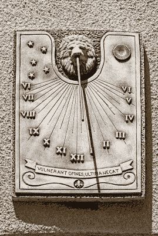
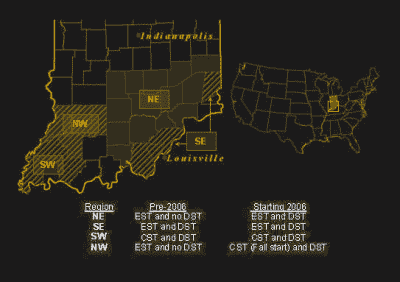

# 夏令时正午

> 原文：<https://hackaday.com/2022/03/25/high-noon-for-daylight-savings-time/>

美国参议院已经批准了“阳光保护法案”,一项将夏令时设为默认时间并取消年度时间变更的法案。虽然我可以支持这项动议的后半部分，但在我看来，将夏令时重新定义为标准时间是毫无意义的。

这是一个特别有趣的时机，在春分左右，当太阳在标准时间中午站在最高点的时候，争论着永远把这个时间称为“下午一点”。

## 正确的想法，错误的时间

让我们快速回顾一下这个好主意——消除时间变化。众所周知，这些物质会导致睡眠障碍，这不仅会导致周一早上昏昏欲睡，还会增加心脏病发作和 T4 事故的风险。当研究人员研究数据时，是“向前跳跃”带来了麻烦。多睡一小时的人似乎没有少睡一小时的人痛苦。去想想。

所以也许停止改变时间是有意义的。如果我们要确定一个标准时间，我们是选择标准时间还是夏令时？诚然，这是一种完全不公平的提问方式，但有许多很好的理由来支持全年标准时间。最大的是冬天。基本上，在一月的一个寒冷的早晨起床已经够难的了，因为太阳还需要一两个小时才能升起。再加上一小时的黑暗，你就知道为什么前两次实行全年夏令时的尝试都是短暂的了。为什么瑞典人喝这么多咖啡。

“[France-002886 – Sundial](https://www.flickr.com/photos/22490717@N02/16064051871)” by [archer10 (Dennis)](https://www.flickr.com/photos/22490717@N02) CC BY-SA 2.0.

我们对时间的测量背后也有一个基本的逻辑，这个逻辑已经存在了几个世纪，并且根植于我们对时间的大多数文化参考中。前子午线和后子午线。正午，时钟上的时针指向正上方，代表太阳本身。但即使在钟表出现之前，太阳每天行程的中点就标志着一天的中点。这不仅是我们吃午饭的原因，也是人类计时的起源。

如果我们永久地改变了中午的定义，我们就把时间和太阳分开了。我们将如何向未来的孩子解释时间？当我们开始重新印刷顶部带有 1 点钟的模拟手表，并开始将上午 12 点称为太阳到达顶峰之前的时间时，我会接受夏令时。“中午一点”一取代“中午十二点”，我就上船。午夜，当钟敲一点的时候，我的脊柱不再颤抖。抱歉，德古拉。

如果文化和物理都指向标准时间，为什么你会希望夏令时成为新常态？当人们想到夏令时，他们自然会想到那些延伸到夜晚的美好的漫长夏日。我个人打赌，许多人把夏季和夏季混淆了。见鬼，就连法案的名字都提议保护阳光本身，而不仅仅是移动时钟的指针。这些都不是很好的理由。

## 经济学

夏令时提案背后的充分理由——事实上，也是最初的理由——是为了节约能源。这在 20 世纪 50 年代可能有直观的意义，当时大量的能源都花在照明上。但是现在，当不睡觉的人开着空调，即使他们的灯还关着，这就不那么清楚了。在很长一段时间里，没有关于日光节约的实证经济研究，直到 2008 年，有了这种研究，而当时情况还不完全明朗。

2007 年，2005 年能源政策法案[生效，美国的夏令时一方面延长了几周，另一方面延长了几天。虽然对于普通人来说，记住新的日期有点不方便，但这种制度上的改变是经济学家的梦想。在一个禁止进行国家规模实验的领域，这些外部变化提供了下一个最好的机会来弄清楚事情是如何运作的。系统中发生了一些变化，结果是什么？](https://en.wikipedia.org/wiki/Energy_Policy_Act_of_2005)

2008 年，美国能源部向国会提交了一份报告，分析了这一变化对全国的影响。他们注意到，在夏季，夜间的节约略多于早晨的能源需求增长。他们还注意到，与 11 月份相比，3 月份的储蓄有所增加。他们的结论是，由于日光节约，每天可以节约 0.5%的能源。总而言之，新政策为美国节省了 0.03%的年度能源需求。不完全是压倒性的，但也不是什么都没有。

 另一项关于夏令时的[实证经济研究](https://www.nber.org/papers/w14429)于 2008 年问世。这篇论文是基于印第安纳州的家庭层面的证据，其特点是夏令时在 2007 年国家改革前后都是在每个县的基础上实施的。有的县转 DST，有的从 DST 转，有的根本不转。这让研究人员可以更直接地比较各县的“治疗组”和“对照组”;他们选择了印第安纳州，因为这是一个完美的自然实验。他们的精细数据集还允许他们将整体能耗分成几个类别。他们发现能源消耗每天增加 1%。正如你所料，照明用电下降了，但通过加热和冷却得到了补偿。

这两项研究都认为夏令时实际上会增加能源消耗，从初秋开始。虽然这些研究都不是为了回答正确的问题——如果我们把夏令时延长到冬天，会发生什么？——他们都认为这将是储蓄的对立面。将夏令时永久化不会节约能源。取决于你相信这两项研究中的哪一项，完全摆脱它是可能的。

## 怎么办？

所以如果你问亚里士多德，他会站在我这边。正午是太阳最高的时候，行星以正圆轨道运行。(好吧，那就算了。)如果医学只指向运行一个时间标准，那么天文学以及语言学、钟表学和文化传统都指向标准时间作为正确的选择。无论如何，经济影响可能并不那么显著，而且可能取决于未来照明相对于空调的相对效率。(祝你好运预测*那个*。)我只知道现在夏令时打乱了我的日晷。

但是，我该如何向那些认为自己实际上是在“节约日光”或“保护阳光”的人推销取消夏令时呢？对于那些一生都听说夏令时节约能源的人来说，不管这是不是真的？对于那些用关于时钟上有趣数字的谎言来混淆夏季较长白天的人来说？徒劳无功。