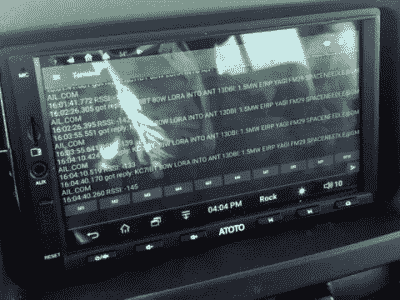

# 高功率 LoRa 和对流层反射实验

> 原文：<https://hackaday.com/2020/03/21/high-power-lora-and-tropospheric-reflection-experiments/>

我们习惯于将 LoRa 作为一种免费使用的数字无线电协议，允许在几英里的距离上进行不是很高的数据速率通信。这使得各种分布式传感器系统变得轻而易举，一些实验者已经创造了一种实现数百英里通信的艺术。但是，如果你对 LoRa 采取暴力手段，只是简单地关闭电源，会发生什么呢？

为了测试它在正常情况下从对流层反弹的效率，【感应树枝】[将一个 70 厘米的 HamShield LoRa 屏蔽罩连接到一个 80 瓦的功率放大器和一个高增益八木天线，该天线巧妙地安装在一把铲子上](https://inductivetwig.com/blogs/news/1500-watts-of-lora-on-the-440mhz-band)，并开车四处查看接收到的结果。有效辐射功率为 1500W，这不是普通的 LoRa，而是作为业余无线电模式的 LoRa。

 对于那些不熟悉无线电传播的人来说，无线电波会反射出一些令人惊讶的东西。在这种情况下，目的是将它们从对流层反弹回来，但当业余无线电爱好者和 LoRa 距离追逐者等到天气条件提供所谓的“升力”时，对流层的反射性特别强，这里的实验是在正常的平坦条件下进行的。这个结果描述了劳拉日常极限模式的可能性，而不是追逐记录，在这方面有一些有趣的结果。反射信号是以低但稳定的信号强度突发接收的，在测试期间的限制因素是他们在新泽西州最南端的半岛用完了可以行驶的土地。我们听说过开放 WiFi 的战争驾驶…这种汽车仪表盘设置算 LoRa 驾驶吗？

LoRa 被设计为一种容忍低信号电平和一些分组丢失的协议，因此，当在许可传输下以较高功率使用时，该实验是其可能性的有趣演示。在无升力条件下，使用 70 厘米波段进行可靠的对流层传播应该是不可能的，但这表明这是可以做到的。与此同时，让我们看看之前用气球推劳拉的尝试。