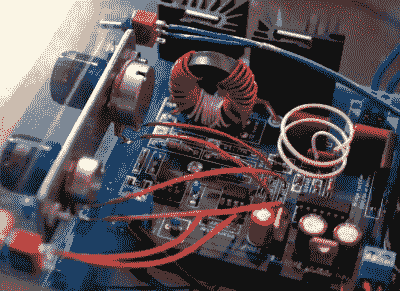

# 高科技扁平特斯拉线圈带来闪电

> 原文：<https://hackaday.com/2022/03/18/high-tech-pancake-tesla-coil-brings-the-lightning/>

几年来，我们一直在跟踪[杰伊·鲍尔斯]在他的*等离子频道*YouTube 频道上把高压带回到地球。从由铜管制成的火花隙到由强大的 555 定时器驱动的汽车点火线圈，他有一个真正的诀窍来保持他的产品价格合理且平易近人。但偶尔你必须走出你的舒适区，尽管这位专注的 DIY 者仍然可以复制他在最新视频中记录的[固态“煎饼”特斯拉线圈，但我们要说这种线圈最好留给专业人士。](https://www.youtube.com/watch?v=wWIeUsnqkRk)

故事开始于大约九个月前，当时同事[YouTuber【lab coatz】](https://www.youtube.com/c/LabCoatz_Science)找到[Jay]合作设计固态特斯拉线圈(SSTC)的 PCB。SSTC 使用由振荡器触发的绝缘栅双极晶体管(IGBTs ),而不是传统的火花隙，这不仅更有效，而且允许对初级线圈进行精细控制。这个想法是开发一个紧凑的交流供电线圈，易于维修，只需通过前面板上的几个转盘就可以控制。该设备还将利用天线反馈系统，该系统将拾取次级线圈的共振频率，并自动调整 IGBT 驱动以匹配。

 比*等离子频道*上的许多前作要复杂得多，解决所有的问题花了一些时间。事实上，视频的大部分是[Jay]带领观众经历他在开发 SSTC 时遇到的各种故障模式。即使对于有高压经验的人来说，也有许多难题需要解决。

例如，该设计的第一个版本使用金属螺栓来连接初级和次级线圈，直到他意识到这会导致电容耦合，于是用丙烯酸块代替了它们。如果他之前的视频让你感到惊讶，展示了高压实验是多么容易，这一个提醒你，它并不总是那么简单。

但是最后[Jay]确实解决了所有的问题，而且结果是惊人的。即使在较低的功率水平下，它也会发出一些令人印象深刻的火花，但当曲柄开到最大时，它提供了一些我们迄今为止从*等离子体频道*看到的最令人印象深刻的视觉效果。工作量很大，但肯定没有白费力气。

对结果着迷，但还没有准备好投入到深水区？早在 2020 年的*等离子体频道*上，这种负担得起且[易于制造的高压发生器是一种很好的开始方式。如果你还需要更多的灵感，](https://hackaday.com/2020/08/23/a-miniature-power-supply-for-high-voltage-hacking/)[可以看看 2021 年【Remoticon 上【杰伊】的精彩展示。](https://hackaday.com/2022/03/03/remoticon-2021-jay-bowles-takes-a-dip-into-the-plasmaverse/)

 [https://www.youtube.com/embed/wWIeUsnqkRk?version=3&rel=1&showsearch=0&showinfo=1&iv_load_policy=1&fs=1&hl=en-US&autohide=2&wmode=transparent](https://www.youtube.com/embed/wWIeUsnqkRk?version=3&rel=1&showsearch=0&showinfo=1&iv_load_policy=1&fs=1&hl=en-US&autohide=2&wmode=transparent)

