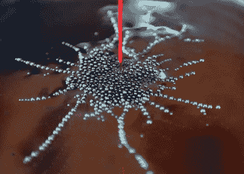

# 高电压让金属球有了自己的思想

> 原文：<https://hackaday.com/2021/05/25/high-voltage-gives-metal-balls-a-mind-of-their-own/>

你有没有见过如此迷人的东西，以至于你确信它一定有某种实际应用，但你就是想不出来是什么？这就是我们在[Jay Bowles] 的最新*等离子体频道*视频中看到微小的滚珠轴承在高压[的影响下组装成类似外星人的结构时的感受。](https://www.youtube.com/watch?v=2NKJ3x-iOAU)

现在要澄清的是，[杰伊]并不是想把这个想法归功于自己。他解释说，斯坦福大学的研究人员在 2015 年首次记录了这一现象，他的目标是重建他们的初始结果作为基线，并从那里开始。过程非常简单:将小金属滚珠轴承放入盛油的托盘中，施加高电压，看着它们自我组装成“电线”，分支寻找接地端子，就像植物的根寻找水一样。[在他的 500，000 伏范德格拉夫发电机](https://hackaday.com/2021/04/27/supersized-van-de-graaff-generator-packs-a-punch/)的激励下，滚珠轴承开始运转，创造出了与斯坦福研究中一样的结构。

 基础工作就绪后，[杰伊]开始挑战极限。他用各种油做实验，看看它们的粘度如何影响球的组装能力，发现橄榄油似乎是理想的候选物(至少是他迄今为止尝试过的那些)。他还改变了托盘的大小和形状，试图发现球可以自己伸展多远。

最终，我们并没有比 2015 年斯坦福的好人们更接近于找到这种疯狂效应的实际应用，但至少我们看到了这些小家伙在光荣的 4K 做他们的事情，以及我们期待从*等离子频道*获得的非凡生产价值。也就是说，[杰伊]确实暗示了他正在进行的努力，即通过用透明树脂将这些建筑“冷冻”起来，将它们变成艺术作品，所以请留意这一点。

 [https://www.youtube.com/embed/2NKJ3x-iOAU?version=3&rel=1&showsearch=0&showinfo=1&iv_load_policy=1&fs=1&hl=en-US&autohide=2&wmode=transparent](https://www.youtube.com/embed/2NKJ3x-iOAU?version=3&rel=1&showsearch=0&showinfo=1&iv_load_policy=1&fs=1&hl=en-US&autohide=2&wmode=transparent)

