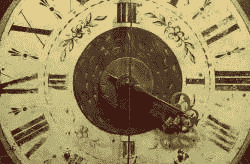
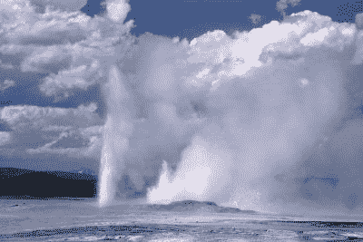
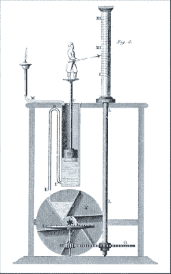

# 历史黑客:克特西比乌斯告诉时代

> 原文：<https://hackaday.com/2021/06/09/historical-hackers-ctesibius-tells-time/>

人们痴迷于时间和天气。自从我们都是穴居人用长矛打猎以来，我们就一直在谈论天气。但是时间是另一回事。当然，人们总是有时间流逝的想法。太阳的升起和落下给人一种自然的感觉，但是白天和黑夜随着一年的时间而变化，要获得时间的准确和线性表示是相当困难的。除非你是公元前 250 年左右生活在亚历山大的希腊工程师。

 传说，在他父亲理发店工作的一名工程师不仅发现了第一个工作钟，还发现了管风琴，并在此过程中开创了气动领域。这位工程师名叫克特西比乌斯，虽然他的故事几乎被遗忘，但这表明他是一名历史黑客。

你可能认为在公元前 250 年之前就有计时装置了，这是事实。然而，克特西比乌斯之前的设备有许多局限性。例如，日晷可以显示时间，但前提是阳光充足。在晚上或暴风雨期间，它是没有价值的。

## 水钟的问题是

一种早期测量时间的方法是漏壶。这基本上是一个底部有壶嘴的罐子，你可以用塞子塞住。除了其他用途之外，希腊人用这些来给辩论双方的律师同等的时间。计时员会将漏壶灌满至刻度，然后拔掉塞子。当不再有水从壶嘴流出来时，你的时间就到了。如果有休息时间，塞子可以暂停计时器。

If you visit Yellowstone park, you might see a geyser named the Clepsydra Geyser. It was named after the Greek water clock because, prior to a 1959 earthquake, it erupted every three minutes.

这种钟已经存在很多年了，在很多古代文化中都有。中国可能早在公元前 4000 年就有了它们，印度可能在公元前 2500 年左右。埃及在公元前 1400 年左右发展了它们。

漏壶的问题是，当壶满时，流出的水比壶快空时多。因此，虽然它可以确保每个人获得相同的时间，但你不能，例如，通过让一个漏壶装满水来为三个人计时。由于容器中水压的变化，第一个杯子会比上一个杯子装得更快。

克特西比乌斯在他父亲的理发店工作——这是现代的说法，因为我们不知道公元前 200 年亚历山大城的理发店真正叫什么。显然，商店里有很多滴水。滴落的水给了他一个想法，结果是一系列的时钟，这些时钟一直是世界上最精确的时钟，直到 1656 年钟摆出现。

## 它是如何工作的

 正常的漏壶有固定的水量，而克特西比乌斯版本的漏壶上面有更大的水源。它会比喷嘴排水更快地注满下部容器。此外，较低的容器有一个溢流闸，使多余的水将径流。

因为上面的容器装满下面的容器的速度比水流出的速度快，所以下面的容器一直是满的——至少只要上面的容器不是空的。因为下部容器的压力保持不变，所以从喷口流出的水也保持不变，这意味着你可以线性地测量时间。例如，用一个浮子从第三个容器的壶嘴收集水，将会告诉你时钟已经运行了多长时间。如果浮子上升 1 英寸需要 10 分钟，那么 1 小时就是 6 英寸。

虽然这些钟在当时被认为是准确的，但按照现代标准，它们并不准确。特别是水的粘性会影响时钟的准确性。温度每变化一度，水的粘度就会变化几个百分点。冰水根本不管用。没有证据表明古代的水钟调节它们的温度，所以这些钟可能不是很准确。然而，这些时钟在重新装满时会被重置——这是常有的事——所以至少误差不会累积。你可以假设它们被重置为类似日出或日晷的东西。

## 迷失在时间中

Ctesibus 显然对水压有所了解，也研究过压缩空气。但是他的理解深度和由此产生的发明是一个谜。我们对 Ctesibus 所知甚少，是通过 Vitruvius，Athenaeus，Hero 和其他人的其他作品中提到他。他的作品大部分丢失了，可能是在亚历山大的火灾中。

想尝试制作古钟吗？试试下面的视频。或者试试更现代的水钟。如果你想看看我们已经走了多远，[比尔]有一个关于[原子钟](https://hackaday.com/2012/06/12/how-do-atomic-clocks-work/)的很好的解释，这是你所能到达的离漏壶最远的地方。

 [https://www.youtube.com/embed/AeKCKeqUA64?version=3&rel=1&showsearch=0&showinfo=1&iv_load_policy=1&fs=1&hl=en-US&autohide=2&wmode=transparent](https://www.youtube.com/embed/AeKCKeqUA64?version=3&rel=1&showsearch=0&showinfo=1&iv_load_policy=1&fs=1&hl=en-US&autohide=2&wmode=transparent)

