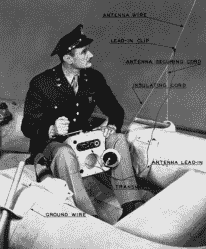
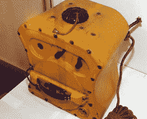
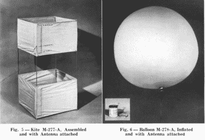

# 历史黑客:风筝发射的应急天线

> 原文：<https://hackaday.com/2021/05/12/historical-hackers-emergency-antennas-launched-by-kite/>

你的飞机在海上坠毁了。你在一艘救生艇上，你需要呼救。今天你可能会伸手去拿一部卫星电话，但在第二次世界大战中，你更有可能会打开一个特殊的救生无线电。

这些收音机起源于德国，但很快被英国和美国仿制。除了一点历史之外，我们还可以从这些收音机中学到一些东西。设计者清楚地考虑了被困人员将面临的挑战，并提出了新颖的解决方案。例如，如何将一根 300 英尺长的电线抬高用作天线？你会相信风筝甚至气球吗？

## 为什么要这么大的天线？

Operating the emergency radio from a life raft.

当年的国际救援频率是 500 kHz。甚至在 20 世纪 20 年代，这就允许简单的火花隙发射器被放置在救生艇上。可惜那是 600 米波长！该频率的四分之一波长天线有 150 米长，或接近 500 英尺。

泰坦尼克号沉没后，船只保持在 500 千赫上观察，地波传播确保了良好的范围。即使在火花隙失宠后，由于其简单性，它们仍然被允许在救生艇上使用。所以到战争开始时，500 千赫是每个人监控遇险通信的频率

## 历史

German NS2 Set

德国 NS2(或 NSG2)是一个双管 500 kHz 发射机，带有一个晶体振荡器。1941 年，英国俘获了一架，并创造了他们自己的版本，T-1333。第二个被俘单位去了美国，产生了 SCR-578 和它的发射机 BC-778。一架 SCR-578 有一个折叠的金属框架，用于制作一个盒子风筝和一个带有氢气发生器的气球。水将使发电机产生气体，气球将天线的一端带到高空。这个 4.8W 的发射器可以将 300 英尺长的天线发射到 200 英里以外的地方。你需要至少 175 英尺的天线才能让收音机工作。

The American set could use a kite or a balloon to lift the antenna.

设计者知道你不可能在救生筏上架设那么多电线。风筝或气球是可行的解决方案，可以从安装在无线电中的卷轴上展开天线(你可以在下面的视频中观看现代的风筝发射)。不仅如此，他们显然可以想象在一个上下浮动的小木筏上的情形。这些收音机都有一个设计好的形状，可以在操作时夹在你的双膝之间。沙漏状的外形产生了“吉普森女孩”的昵称，这个昵称源自查尔斯·达纳·吉布森的插图。它们也是防水的，可以漂浮。

有变化。NSG2 使用晶体振荡器产生 8 瓦的输出，而美国版本没有使用晶体——他们供应短缺——产生的功率更少。T1333 使用信号枪发射折叠起来的风筝，它将在 200 英尺处展开。它也是长方形的，有垫子让操作者在操作中抓住盒子，没有气球。

整套装备重约 33 磅，包括一个信号灯、两个气球、两个水激活氢气发生器、两卷天线导线和一个降落伞，这样你就可以从飞机上扔下整个包。

 [https://www.youtube.com/embed/AWJ5qvfPj_I?version=3&rel=1&showsearch=0&showinfo=1&iv_load_policy=1&fs=1&hl=en-US&autohide=2&wmode=transparent](https://www.youtube.com/embed/AWJ5qvfPj_I?version=3&rel=1&showsearch=0&showinfo=1&iv_load_policy=1&fs=1&hl=en-US&autohide=2&wmode=transparent)

## 真正的生命线

如果你在需要的时候拿出你的救生无线电，却发现电池没电了，这将是一个非常糟糕的情况。这就是为什么这些收音机通常有曲柄来发电。没有电池更换或磨损。如果你有足够的力气转动曲柄，你就在空中了。曲柄也可以自动发送求救信号。

如果你想了解更多关于这些老式收音机的信息，请查看军事手册的扫描图。这里有很多细节。例如，它解释说，氢气发生器使用氢化锂在接触水时产生氢气。发送 SOS、AA 或破折号的自动化系统很聪明，是我们今天用微控制器做的事情，但在 20 世纪 40 年代，需要机械工程。电路描述也很有趣。

这种设计经久耐用。直到 20 世纪 70 年代，军用和民用飞机都使用 SCR-578 或它的直接后代 AN/CRT-3。新的收音机和旧的一样，但也能以 8，364 千赫传输。俄罗斯人从 1945 年开始复制原始发射机。除了表壳上的字母，很难将 AVRA-45 与美国的同类产品区分开来。

## 后见之明

我不知道 Frieseke & HPF ner GmBH 的哪些德国工程师设计了 NS2，但他们显然是为用户着想，并愿意以真正的黑客方式解决问题。这种形状易于抓握，曲柄解决了电池问题，收音机适合其预期用途。你不得不怀疑，在他们满足于气球和风筝组合之前，他们还有什么提升天线的想法。我也想知道为什么英国的风筝如此不同，需要非常手枪发射。

当然，这并不是风筝天线的第一个例子。1898 年，一个气象气球将天线升到了马萨诸塞州上空。1901 年，马可尼在纽芬兰的天线连接到一个载人的观察风筝上，就可以与英国进行通信。军事使用至少可以追溯到 1905 年，美国军队使用它们直到 1920 年。英国人和德国人也在世纪之交使用它们，1922 年美国海军在水上飞机上使用了风筝天线。尽管如此，NS2 在包装和实用性方面仍是一个奇迹。

NS2 是更重的 NS1 的继任者。虽然它有一个风筝，但它也有一个笨拙的铝天线，在无风的情况下使用，而且它也依靠电池。你可以假设，通过对 NS1 进行诚实的反馈，工程师们能够构建 NS2，并且他们真的达到了目标。毕竟，模仿不就是最真诚的奉承吗？我怀疑那些工程师是否认为自己是黑客——那个术语当时还没有使用——但我认为是。

令人惊讶的是，如果你有足够的动力，收音机可以变得如此简单。不要以为[火腿以前也没用过气球](https://hackaday.com/2016/07/14/ham-antenna-rises-to-the-occasion/)。

【主要图片来源:[德国二战应急风筝](https://www.youtube.com/watch?v=nCZU0HBKTUE)作者:胡庆炉·费克斯】